# ERD — 校園活動配對 App（派生自 SPEC v1.7）

> 本文件由 [SPEC.md](SPEC.md) 推導，不得與其衝突；若有衝突，先改 SPEC 再改這裡。
>
> **enum 完整性說明**：所有 `status` 類欄位的值域在本文件即為**定案**，直接對應 migration 的 `CREATE TYPE`。[STATE_MACHINE.md](STATE_MACHINE.md) 不新增狀態，只補「轉移條件」（誰觸發、什麼時候觸發）。

---

## 1. 實體關聯圖（15 張表）

```mermaid
erDiagram
    app_user ||--o{ match_request : "owner_id 發起"
    app_user ||--o{ request_member : "參加"
    match_request ||--o{ request_member : "成員（取代 member_ids[]）"
    activity_type ||--o{ match_request : ""
    location ||--o{ match_request : "campus_location_id"
    app_user ||--o{ activity_type : "created_by 提案"

    activity_type ||--o{ activity : ""
    location ||--o{ activity : ""
    activity ||--o{ activity_member : "成員（取代 final_member_ids[]）"
    app_user ||--o{ activity_member : ""
    match_request ||--o{ activity_member : "source_request_id 來源追溯"

    match_request ||--o{ downgrade_request : ""
    downgrade_request ||--o{ downgrade_consent : ""
    app_user ||--o{ downgrade_consent : ""

    match_request ||--o{ pending_confirmation : "request_a_id / request_b_id 候選配對雙方"
    app_user ||--o{ match_history_avoidance : "user_a_id / user_b_id"
    pending_confirmation ||--o{ match_history_avoidance : "source_pending_confirmation_id"

    activity ||--o{ completion_report : ""
    app_user ||--o{ completion_report : "reporter_id"

    app_user ||--o{ user_reliability_event : ""
    activity ||--o{ user_reliability_event : ""

    activity ||--o{ rematch_vote : ""
    app_user ||--o{ rematch_vote : "from_user_id / to_user_id"

    app_user ||--o{ notification : ""

    app_user {
        uuid id PK "= auth.users.id"
        text email "CHECK：完整比對 @nycu.edu.tw / @nthu.edu.tw 雙校網域"
        enum school "NYCU | NTHU，由 email 網域自動判定，非使用者自選（v1.2）"
        text display_name
        text avatar_url "註冊硬性門檻，NOT NULL"
        text gender "nullable，僅展示，不進配對邏輯"
        text bio "nullable，選填自我介紹，僅展示、不進配對邏輯（v1.3）"
        text department "nullable，選填科系，僅展示、不進配對邏輯（v1.4）"
        enum degree_level "UNDERGRAD | MASTER | PHD，NOT NULL，註冊時強制下拉，僅展示、不進配對邏輯（v1.4）"
        text contact_ig "nullable"
        text contact_line "nullable"
        text contact_discord "nullable，CHECK：三者至少一項 NOT NULL"
        timestamptz suspended_until "nullable，連續 3 次 No-show 停權 7 天"
        timestamptz next_request_allowed_at "nullable，拒絕候選配對/LATE_CANCEL 觸發 30 分鐘冷卻（v1.7，SPEC §6.3）"
        timestamptz created_at
    }

    activity_type {
        uuid id PK
        text name "模糊比對防重複（羽球 vs 羽毛球）"
        int default_duration_minutes "nullable，null 時 fallback 60"
        int default_min_participants "nullable，null 時 fallback 2（v1.5）"
        int default_max_participants "nullable，null 時 fallback 6（v1.5）"
        int group_size_step "nullable，非 null 時離散化人數選項間隔；null = 連續區間（v1.6）"
        enum status "PENDING | APPROVED | REJECTED"
        uuid created_by FK
        timestamptz created_at
    }

    location {
        uuid id PK
        enum school "NYCU | NTHU，地點清單依校分列（v1.2）"
        text name "固定下拉清單，不開放自由輸入；UNIQUE(school, name)"
        bool is_active
        timestamptz created_at
    }

    match_request {
        uuid id PK
        uuid owner_id FK
        uuid activity_type_id FK
        uuid campus_location_id FK
        uuid_array acceptable_location_ids "v1 只填 1 個，欄位預留多選"
        timestamptz earliest_start
        timestamptz latest_start "CHECK：<= created_at + 24h"
        int flexible_minutes "v1 固定 0，欄位預留"
        int min_participants "CHECK：>= 2，含 owner 本人的活動總人數下限（v1.5，取代 required_total）"
        int max_participants "nullable，CHECK：>= min_participants，含 owner 本人；NULL = 不設上限，fallback 至 activity_type.default_max_participants（v1.5）"
        text invite_token "nullable，UNIQUE；生命週期依附本列 status/24h 邊界，不另存到期時間（v1.5）"
        timestamptz revoked_at "nullable，owner 主動撤銷邀請連結的時間（v1.5）"
        bool allow_downgrade
        enum status "DRAFT | REQUESTING | PENDING_CONFIRMATION | MATCHED | EXPIRED | CANCELLED（v1.4 新增 PENDING_CONFIRMATION）"
        timestamptz created_at
    }

    request_member {
        uuid id PK
        uuid request_id FK
        uuid user_id FK "UNIQUE(request_id, user_id)"
        enum role "OWNER | MEMBER"
        enum status "JOINED | LEFT"
        timestamptz created_at
    }

    activity {
        uuid id PK
        uuid activity_type_id FK
        uuid campus_location_id FK
        timestamptz start_time
        timestamptz estimated_end_time "= start_time + default_duration"
        enum status "MATCHED | ONGOING | COMPLETED | CANCELLED"
        timestamptz contact_visible_until "= 本表 created_at + 24h，非 Request 的"
        timestamptz created_at
    }

    activity_member {
        uuid activity_id PK, FK "複合 PK (activity_id, user_id)"
        uuid user_id PK, FK
        uuid source_request_id FK "從哪個 Request 併進來"
        enum status "JOINED | CANCELLED"
    }

    downgrade_request {
        uuid id PK
        uuid request_id FK
        int target_size
        timestamptz expire_at "= created_at + 10 分鐘 CONSENT_WINDOW"
        enum status "PENDING | APPROVED | REJECTED | TIMEOUT"
        timestamptz created_at
    }

    downgrade_consent {
        uuid downgrade_request_id PK, FK "複合 PK (downgrade_request_id, user_id)"
        uuid user_id PK, FK "名單來源 = request_member"
        enum response "AGREE | DISAGREE | NO_RESPONSE"
        timestamptz responded_at "nullable"
    }

    completion_report {
        uuid id PK
        uuid activity_id FK "UNIQUE(activity_id, reporter_id)"
        uuid reporter_id FK "限定 activity_member 名單內"
        enum result "WENT_WELL | REPORTED_ABSENT | SELF_CANCELLED"
        uuid_array absent_user_ids "限定 activity_member 名單內"
        timestamptz created_at
    }

    user_reliability_event {
        uuid id PK
        uuid user_id FK
        uuid activity_id FK
        enum event_type "ATTENDED | EARLY_CANCEL | LATE_CANCEL | NO_SHOW"
        timestamptz created_at
    }

    pending_confirmation {
        uuid id PK
        uuid request_a_id FK "候選配對其中一方的 match_request"
        uuid request_b_id FK "候選配對另一方的 match_request，CHECK：request_a_id != request_b_id"
        timestamptz confirm_window_expire_at "= created_at + 10 分鐘 CONFIRM_WINDOW"
        enum user_a_response "CONFIRMED | DECLINED | NO_RESPONSE"
        enum user_b_response "CONFIRMED | DECLINED | NO_RESPONSE"
        enum status "PENDING | CONFIRMED | DECLINED | TIMEOUT"
        timestamptz created_at
    }

    match_history_avoidance {
        uuid id PK
        uuid user_a_id FK "正規化：pair 中較小的 UUID"
        uuid user_b_id FK "正規化：pair 中較大的 UUID，CHECK：user_a_id < user_b_id"
        uuid source_pending_confirmation_id FK "來源：哪次未成立的 PENDING_CONFIRMATION"
        timestamptz failed_at
        timestamptz expire_at "= failed_at + 7 天，過期後降權失效"
    }

    rematch_vote {
        uuid activity_id PK, FK "複合 PK (activity_id, from_user_id, to_user_id)"
        uuid from_user_id PK, FK
        uuid to_user_id PK, FK "CHECK：from != to"
        timestamptz voted_at
    }

    notification {
        uuid id PK
        uuid user_id FK
        enum event_type "MATCH_SUCCESS | DOWNGRADE_REQUEST | DOWNGRADE_RESULT | ACTIVITY_REMINDER | COMPLETE_CONFIRMATION"
        jsonb payload
        timestamptz read_at "nullable"
        timestamptz created_at
    }
```

---

## 2. enum 定案總表（migration 直接引用）

| enum 名稱 | 值 | 來源（SPEC 章節） |
|---|---|---|
| `school` | `NYCU` `NTHU` | §2（v1.2；由 email 網域 mapping 判定） |
| `activity_type_status` | `PENDING` `APPROVED` `REJECTED` | §5 |
| `request_status` | `DRAFT` `REQUESTING` `PENDING_CONFIRMATION` `MATCHED` `EXPIRED` `CANCELLED` | §6、§9、§12.1（v1.4 新增 `PENDING_CONFIRMATION`） |
| `request_member_role` | `OWNER` `MEMBER` | §6 |
| `request_member_status` | `JOINED` `LEFT` | §6（値域為本文件補定，見下方註記） |
| `degree_level` | `UNDERGRAD` `MASTER` `PHD` | §2（v1.4） |
| `activity_status` | `MATCHED` `ONGOING` `COMPLETED` `CANCELLED` | §9 |
| `activity_member_status` | `JOINED` `CANCELLED` | §9（値域為本文件補定，見下方註記） |
| `downgrade_status` | `PENDING` `APPROVED` `REJECTED` `TIMEOUT` | §8 |
| `downgrade_response` | `AGREE` `DISAGREE` `NO_RESPONSE` | §8 |
| `pending_confirmation_status` | `PENDING` `CONFIRMED` `DECLINED` `TIMEOUT` | §12.1（v1.4） |
| `pending_confirmation_response` | `CONFIRMED` `DECLINED` `NO_RESPONSE` | §12.1（v1.4） |
| `completion_result` | `WENT_WELL` `REPORTED_ABSENT` `SELF_CANCELLED` | §10 |
| `reliability_event_type` | `ATTENDED` `EARLY_CANCEL` `LATE_CANCEL` `NO_SHOW` | §12 |
| `notification_event_type` | `MATCH_SUCCESS` `DOWNGRADE_REQUEST` `DOWNGRADE_RESULT` `ACTIVITY_REMINDER` `COMPLETE_CONFIRMATION` | §16 開放問題 5（清單可能擴充） |

> **註記**：`request_member_status` 與 `activity_member_status` 兩個欄位 SPEC 只寫了「status」沒列值域，此處補定為最小可用集合（成員可在配對前退出 Request → `LEFT`；成員可個別取消已成立的活動 → `CANCELLED`，活動本身可能照常進行）。這是 schema 層補完，不是產品邏輯變更。

---

## 3. 設計備註（陷阱與取捨的落地方式）

1. **兩張 join table 取代三個 array**（SPEC v1.1 變更 1、2）：`request_member` 取代 `member_ids[]`；`activity_member` 取代 `matched_request_ids[]` + `final_member_ids[]`，且 `source_request_id` 直接回答「小明從哪個 Request 併進來」。
2. **仍保留的兩個 array 欄位**（皆 SPEC 明文保留，非遺漏）：
   - `match_request.acceptable_location_ids[]` — v1 只填 1 個，純預留位，不參與查詢。
   - `completion_report.absent_user_ids[]` — 一次性寫入的回報 payload，只在結算當下讀取做多數決運算，不做關聯查詢，array 成本可接受。
3. **Reliability 不存分數欄位**（SPEC v1.1 變更 4）：`app_user` 上**沒有** `reliability_score` / `tier` 欄位，等級由近 30 天 `user_reliability_event` 即時 query 算出。「New 等級」的判定 = 該 user 沒有任何 `ATTENDED` 事件。
4. **`contact_visible_until` 掛在 activity 上**（SPEC v1.1 變更 5）：以 `activity.created_at` 起算 +24h，與來源 Request 無關。
5. **單一 REQUESTING 限制**（SPEC §6）：用 partial unique index 落地——`UNIQUE (owner_id) WHERE status = 'REQUESTING'`，DB 層直接擋住，不依賴應用層自律。
6. **停權欄位**：`app_user.suspended_until` 是「連續 3 次 No-show 停權 7 天」的落地欄位；「連續 3 次」由 `user_reliability_event` query 判定，欄位只存結果（停權到期時間是行政決定的產物，非可推導狀態，故可存）。
7. **User 表命名為 `app_user`**：`user` 是 PostgreSQL 保留字；`id` 直接引用 `auth.users(id)`（Supabase Auth），不另存密碼/OTP 相關欄位。
8. **`school` 用 enum、不開第 14 張 School 表**（v1.2）：學校清單由 email domain mapping 硬編碼決定（`nycu.edu.tw → NYCU`、`nthu.edu.tw → NTHU`），新增一間學校本來就得改 migration（新增網域規則），開表得不到任何彈性，enum 就夠。`app_user.school` 與 `location.school` 用同一個 enum；DB 層另加 CHECK 保證 `school` 與 email 網域一致（「不讓 user 自選」直接由 DB 保證，不只靠應用層）。
9. **同校隔離不在 Matching Engine 加條件**（SPEC §7）：Request 建立時檢查 `campus_location_id` 屬於 owner 的 `school`，加上「地點必須完全相同才可 merge」，同校隔離天然成立；跨校 fallback matching 留 future，屆時才需要動引擎。
10. **`bio` 選填、不做 CHECK**（v1.3）：跟 `gender` 同等級，純展示欄位。不像 `avatar_url`/`contact_*` 有 NOT NULL / at-least-one 約束——沒有值就是 `NULL`，不卡任何流程。
11. **`degree_level` 用 enum、`department` 用純文字**（v1.4）：`degree_level` 是註冊時強制下拉的固定選項，enum 天然合適；`department` 各校系所清單龐雜且會變動，不值得為此開一張表或做 enum，純文字欄位即可，僅展示、不進查詢邏輯。
12. **明確不新增 `grade_year`**（v1.4）：SPEC §2 已說明理由（階級感/圈層比較心態，與產品平等出發點衝突）；schema 層的落地就是 `app_user` 上不存在、也不會存在這個欄位。
13. **`PENDING_CONFIRMATION` 選擇進 `request_status` enum，不做成 Downgrade 式的子流程表**（v1.4）：核心工程理由是查詢成本——Matching Engine 抓候選池時只需要 `WHERE status = 'REQUESTING'` 就能自然排除掉正卡在候選配對中的 Request；若做成子流程表（`match_request.status` 仍停在 `REQUESTING`，另外查 `pending_confirmation` 是否有進行中記錄），Matching Engine 每次掃描都要多 join 一層排除邏輯，容易漏寫，未來新增查詢路徑時也容易再次漏寫。這點與 Downgrade（SPEC §8）不同：Downgrade 是「原地詢問，不論成功與否都留在同一個 `required_total` 繼續撮合」的暫時性旁支決策；`PENDING_CONFIRMATION` 則是「配對本體是否成立」的核心狀態，值得佔一個 status 值。
14. **`pending_confirmation` 表結構固定雙方（`request_a_id`/`request_b_id`），不做成泛化的 `CandidateMatch`**（v1.4）：MVP 階段 `required_total ≤ 2` 場景下候選配對就是恰好兩個 Request 對上，沒有「多個候選同時競爭」的需求，不預先為「未來可能擴展成多方候選」做抽象；等真的出現該場景再重構表結構與命名。
15. **`match_history_avoidance` 的 pair 正規化**（v1.4）：`user_a_id < user_b_id` 的 CHECK 約束確保同一對使用者不論誰是 request owner，都寫入同一筆 pair 記錄，Matching Engine 查詢降權只需查一次、不用 OR 兩種順序。
16. **對稱不歸因設計的落地**（v1.4）：`pending_confirmation.user_a_response`/`user_b_response` 各自獨立存，但 API 層讀取規則是雙方都只查得到 `status`（`PENDING`/`CONFIRMED`/`DECLINED`/`TIMEOUT`），查不到對方的 response 明細——避免任一方知道「是不是我造成配對失敗」，落實 SPEC §12.1.2 的不歸因原則。
17. **`min_participants`/`max_participants` 取代 `required_total`（v1.5）**：拆成上下限是為了讓 UI 選項卡（SPEC §6.1）能表達「2-3 人」「4-6 人」這種區間，而不是單一數字；`max_participants` 允許 NULL 表示「不設上限」，讀取端 fallback 到 `activity_type.default_max_participants`（是否在寫入當下就展開成具體數字，還是保留 NULL 由讀取端 fallback，見 SPEC §16 開放問題）。兩欄位皆以「含 owner 本人」為計數基準，這點只在 SPEC 文字定義，schema 本身無法用型別強制表達，需要靠 API 層驗證與文件約定。
18. **`invite_token` 不另存到期時間、也不存 `used_at`（v1.5）**：到期邏輯依附 `match_request.status` 離開 `REQUESTING` 或 `revoked_at` 被設定，不需要獨立的 `expire_at`，因為 Request 本身已經有 24 小時邊界與狀態機管理生命週期，重複一份到期時間只會製造兩份真相不同步的風險；不存 `used_at` 是因為連結設計上允許多人各自重複使用，單一時間戳無法表達「多人各自使用」，需要追蹤才開 per-use 日誌表（MVP 不開）。
19. **`PENDING_CONFIRMATION` 觸發判準無法用 CHECK 常數表達（v1.5）**：觸發依據是 Matching Engine 撮合當下的**實際人數**，不是 `min_participants`/`max_participants` 這兩個靜態欄位，因此這條規則只能落在應用層（Matching Engine 邏輯），DB 層沒有對應的 CHECK 或 trigger 可以完整表達「本次撮合人數 ≤ 2」這件事——這是設計上刻意的取捨，不是遺漏。
20. **`known_member_count` 不是欄位（v1.5）**：這是查詢時算出的值，SQL 概念上等同 `SELECT count(*) FROM activity_member WHERE activity_id = :aid AND source_request_id = (SELECT source_request_id FROM activity_member WHERE activity_id = :aid AND user_id = :uid) AND user_id != :uid`，不落地成 `activity_member` 或 `activity` 上的任何欄位。
21. **`downgrade_request.target_size` 沒有 DB 層 CHECK 約束（v1.5 補充）**：業務規則是「必須低於原 `min_participants`」，但 `min_participants` 存在 `match_request` 另一張表，PostgreSQL 的 CHECK 不能跨表引用，這條驗證留在應用層（或未來視需要補 trigger），schema 只存數值本身。
22. **`activity_type` 新增 `group_size_step`（nullable int，v1.6）**：不做成 `allowed_group_sizes[]` 陣列——若用陣列，admin 審核連續模式類型時要手動列舉每個可選人數，徒增管理負擔；用 `group_size_step` + `default_min_participants`/`default_max_participants` 三者，由前端動態算出離散選項即可，admin 只需設定三個數字。🟢 **`group_size_step` 只要被設定為非 null 值（包含 1），前端一律按離散選項渲染；null 才代表連續區間。不存在「連續區間但同時設了 step」的中間狀態，避免 `step=1` 這類邊界值造成解讀歧義。** 明確不新增 `group_size_mode` 欄位——`group_size_step` 的 nullability 已完整表達離散/連續兩種模式，另開欄位會造成兩欄位需彼此保持一致的重複真相問題，與第 18 點 `invite_token` 不另存 `expire_at`、第 20 點 `known_member_count` 不額外儲存同一精神。
23. **`app_user.next_request_allowed_at`（nullable timestamptz，v1.7）**：拒絕候選配對／`LATE_CANCEL` 觸發的 30 分鐘冷卻期落地欄位（SPEC §6.3）。放在 `app_user` 而非另開一張冷卻記錄表，理由與第 6 點 `suspended_until` 相同：一人同時只需要一個生效中的「解鎖時間點」，不需要保留歷史紀錄，用單一欄位覆寫即可；若未來需要追蹤冷卻觸發的歷史（例如統計濫用行為），應另開 per-event 日誌表，v1.7 不做。
24. **「活動進行中鎖定」不新增欄位（v1.7）**：`submit_request` 檢查「呼叫者名下是否有 `MATCHED`/`ONGOING` 的 Activity」直接查詢 `activity_member` join `activity` 即可，不需要在 `app_user` 或其他表存一個快取旗標——這類「當下狀態」的判定與第 3、20 點 Reliability 分數、`known_member_count` 不落地存欄位同一精神：查詢即時算出，避免資料跟來源事實不同步。
