# ERD — 校園活動配對 App（派生自 SPEC v1.3）

> 本文件由 [SPEC.md](SPEC.md) 推導，不得與其衝突；若有衝突，先改 SPEC 再改這裡。
>
> **enum 完整性說明**：所有 `status` 類欄位的值域在本文件即為**定案**，直接對應 migration 的 `CREATE TYPE`。[STATE_MACHINE.md](STATE_MACHINE.md) 不新增狀態，只補「轉移條件」（誰觸發、什麼時候觸發）。

---

## 1. 實體關聯圖（13 張表）

```mermaid
erDiagram
    app_user ||--o{ match_request : "owner_id 發起"
    app_user ||--o{ request_member : "參加"
    match_request ||--o{ request_member : "成員（取代 member_ids[]）"
    activity_type ||--o{ match_request : ""
    location ||--o{ match_request : "campus_location_id"
    app_user ||--o{ activity_type : "created_by 提案"

    activity_type ||--o{ activity : ""
    location ||--o{ activity : ""
    activity ||--o{ activity_member : "成員（取代 final_member_ids[]）"
    app_user ||--o{ activity_member : ""
    match_request ||--o{ activity_member : "source_request_id 來源追溯"

    match_request ||--o{ downgrade_request : ""
    downgrade_request ||--o{ downgrade_consent : ""
    app_user ||--o{ downgrade_consent : ""

    activity ||--o{ completion_report : ""
    app_user ||--o{ completion_report : "reporter_id"

    app_user ||--o{ user_reliability_event : ""
    activity ||--o{ user_reliability_event : ""

    activity ||--o{ rematch_vote : ""
    app_user ||--o{ rematch_vote : "from_user_id / to_user_id"

    app_user ||--o{ notification : ""

    app_user {
        uuid id PK "= auth.users.id"
        text email "CHECK：完整比對 @nycu.edu.tw / @nthu.edu.tw 雙校網域"
        enum school "NYCU | NTHU，由 email 網域自動判定，非使用者自選（v1.2）"
        text display_name
        text avatar_url "註冊硬性門檻，NOT NULL"
        text gender "nullable，僅展示，不進配對邏輯"
        text bio "nullable，選填自我介紹，僅展示、不進配對邏輯（v1.3）"
        text contact_ig "nullable"
        text contact_line "nullable"
        text contact_discord "nullable，CHECK：三者至少一項 NOT NULL"
        timestamptz suspended_until "nullable，連續 3 次 No-show 停權 7 天"
        timestamptz created_at
    }

    activity_type {
        uuid id PK
        text name "模糊比對防重複（羽球 vs 羽毛球）"
        int default_duration_minutes "nullable，null 時 fallback 60"
        enum status "PENDING | APPROVED | REJECTED"
        uuid created_by FK
        timestamptz created_at
    }

    location {
        uuid id PK
        enum school "NYCU | NTHU，地點清單依校分列（v1.2）"
        text name "固定下拉清單，不開放自由輸入；UNIQUE(school, name)"
        bool is_active
        timestamptz created_at
    }

    match_request {
        uuid id PK
        uuid owner_id FK
        uuid activity_type_id FK
        uuid campus_location_id FK
        uuid_array acceptable_location_ids "v1 只填 1 個，欄位預留多選"
        timestamptz earliest_start
        timestamptz latest_start "CHECK：<= created_at + 24h"
        int flexible_minutes "v1 固定 0，欄位預留"
        int required_total "CHECK：>= 2"
        bool allow_downgrade
        enum status "DRAFT | REQUESTING | MATCHED | EXPIRED | CANCELLED"
        timestamptz created_at
    }

    request_member {
        uuid id PK
        uuid request_id FK
        uuid user_id FK "UNIQUE(request_id, user_id)"
        enum role "OWNER | MEMBER"
        enum status "JOINED | LEFT"
        timestamptz created_at
    }

    activity {
        uuid id PK
        uuid activity_type_id FK
        uuid campus_location_id FK
        timestamptz start_time
        timestamptz estimated_end_time "= start_time + default_duration"
        enum status "MATCHED | ONGOING | COMPLETED | CANCELLED"
        timestamptz contact_visible_until "= 本表 created_at + 24h，非 Request 的"
        timestamptz created_at
    }

    activity_member {
        uuid activity_id PK, FK "複合 PK (activity_id, user_id)"
        uuid user_id PK, FK
        uuid source_request_id FK "從哪個 Request 併進來"
        enum status "JOINED | CANCELLED"
    }

    downgrade_request {
        uuid id PK
        uuid request_id FK
        int target_size
        timestamptz expire_at "= created_at + 10 分鐘 CONSENT_WINDOW"
        enum status "PENDING | APPROVED | REJECTED | TIMEOUT"
        timestamptz created_at
    }

    downgrade_consent {
        uuid downgrade_request_id PK, FK "複合 PK (downgrade_request_id, user_id)"
        uuid user_id PK, FK "名單來源 = request_member"
        enum response "AGREE | DISAGREE | NO_RESPONSE"
        timestamptz responded_at "nullable"
    }

    completion_report {
        uuid id PK
        uuid activity_id FK "UNIQUE(activity_id, reporter_id)"
        uuid reporter_id FK "限定 activity_member 名單內"
        enum result "WENT_WELL | REPORTED_ABSENT | SELF_CANCELLED"
        uuid_array absent_user_ids "限定 activity_member 名單內"
        timestamptz created_at
    }

    user_reliability_event {
        uuid id PK
        uuid user_id FK
        uuid activity_id FK
        enum event_type "ATTENDED | EARLY_CANCEL | LATE_CANCEL | NO_SHOW"
        timestamptz created_at
    }

    rematch_vote {
        uuid activity_id PK, FK "複合 PK (activity_id, from_user_id, to_user_id)"
        uuid from_user_id PK, FK
        uuid to_user_id PK, FK "CHECK：from != to"
        timestamptz voted_at
    }

    notification {
        uuid id PK
        uuid user_id FK
        enum event_type "MATCH_SUCCESS | DOWNGRADE_REQUEST | DOWNGRADE_RESULT | ACTIVITY_REMINDER | COMPLETE_CONFIRMATION"
        jsonb payload
        timestamptz read_at "nullable"
        timestamptz created_at
    }
```

---

## 2. enum 定案總表（migration 直接引用）

| enum 名稱 | 值 | 來源（SPEC 章節） |
|---|---|---|
| `school` | `NYCU` `NTHU` | §2（v1.2；由 email 網域 mapping 判定） |
| `activity_type_status` | `PENDING` `APPROVED` `REJECTED` | §5 |
| `request_status` | `DRAFT` `REQUESTING` `MATCHED` `EXPIRED` `CANCELLED` | §6、§9 |
| `request_member_role` | `OWNER` `MEMBER` | §6 |
| `request_member_status` | `JOINED` `LEFT` | §6（値域為本文件補定，見下方註記） |
| `activity_status` | `MATCHED` `ONGOING` `COMPLETED` `CANCELLED` | §9 |
| `activity_member_status` | `JOINED` `CANCELLED` | §9（値域為本文件補定，見下方註記） |
| `downgrade_status` | `PENDING` `APPROVED` `REJECTED` `TIMEOUT` | §8 |
| `downgrade_response` | `AGREE` `DISAGREE` `NO_RESPONSE` | §8 |
| `completion_result` | `WENT_WELL` `REPORTED_ABSENT` `SELF_CANCELLED` | §10 |
| `reliability_event_type` | `ATTENDED` `EARLY_CANCEL` `LATE_CANCEL` `NO_SHOW` | §12 |
| `notification_event_type` | `MATCH_SUCCESS` `DOWNGRADE_REQUEST` `DOWNGRADE_RESULT` `ACTIVITY_REMINDER` `COMPLETE_CONFIRMATION` | §16 開放問題 5（清單可能擴充） |

> **註記**：`request_member_status` 與 `activity_member_status` 兩個欄位 SPEC 只寫了「status」沒列值域，此處補定為最小可用集合（成員可在配對前退出 Request → `LEFT`；成員可個別取消已成立的活動 → `CANCELLED`，活動本身可能照常進行）。這是 schema 層補完，不是產品邏輯變更。

---

## 3. 設計備註（陷阱與取捨的落地方式）

1. **兩張 join table 取代三個 array**（SPEC v1.1 變更 1、2）：`request_member` 取代 `member_ids[]`；`activity_member` 取代 `matched_request_ids[]` + `final_member_ids[]`，且 `source_request_id` 直接回答「小明從哪個 Request 併進來」。
2. **仍保留的兩個 array 欄位**（皆 SPEC 明文保留，非遺漏）：
   - `match_request.acceptable_location_ids[]` — v1 只填 1 個，純預留位，不參與查詢。
   - `completion_report.absent_user_ids[]` — 一次性寫入的回報 payload，只在結算當下讀取做多數決運算，不做關聯查詢，array 成本可接受。
3. **Reliability 不存分數欄位**（SPEC v1.1 變更 4）：`app_user` 上**沒有** `reliability_score` / `tier` 欄位，等級由近 30 天 `user_reliability_event` 即時 query 算出。「New 等級」的判定 = 該 user 沒有任何 `ATTENDED` 事件。
4. **`contact_visible_until` 掛在 activity 上**（SPEC v1.1 變更 5）：以 `activity.created_at` 起算 +24h，與來源 Request 無關。
5. **單一 REQUESTING 限制**（SPEC §6）：用 partial unique index 落地——`UNIQUE (owner_id) WHERE status = 'REQUESTING'`，DB 層直接擋住，不依賴應用層自律。
6. **停權欄位**：`app_user.suspended_until` 是「連續 3 次 No-show 停權 7 天」的落地欄位；「連續 3 次」由 `user_reliability_event` query 判定，欄位只存結果（停權到期時間是行政決定的產物，非可推導狀態，故可存）。
7. **User 表命名為 `app_user`**：`user` 是 PostgreSQL 保留字；`id` 直接引用 `auth.users(id)`（Supabase Auth），不另存密碼/OTP 相關欄位。
8. **`school` 用 enum、不開第 14 張 School 表**（v1.2）：學校清單由 email domain mapping 硬編碼決定（`nycu.edu.tw → NYCU`、`nthu.edu.tw → NTHU`），新增一間學校本來就得改 migration（新增網域規則），開表得不到任何彈性，enum 就夠。`app_user.school` 與 `location.school` 用同一個 enum；DB 層另加 CHECK 保證 `school` 與 email 網域一致（「不讓 user 自選」直接由 DB 保證，不只靠應用層）。
9. **同校隔離不在 Matching Engine 加條件**（SPEC §7）：Request 建立時檢查 `campus_location_id` 屬於 owner 的 `school`，加上「地點必須完全相同才可 merge」，同校隔離天然成立；跨校 fallback matching 留 future，屆時才需要動引擎。
10. **`bio` 選填、不做 CHECK**（v1.3）：跟 `gender` 同等級，純展示欄位。不像 `avatar_url`/`contact_*` 有 NOT NULL / at-least-one 約束——沒有值就是 `NULL`，不卡任何流程。
