# ERD — 校園活動配對 App（派生自 SPEC v1.13）

> 本文件由 [SPEC.md](SPEC.md) 推導，不得與其衝突；若有衝突，先改 SPEC 再改這裡。
>
> **enum 完整性說明**：所有 `status` 類欄位的值域在本文件即為**定案**，直接對應 migration 的 `CREATE TYPE`。[STATE_MACHINE.md](STATE_MACHINE.md) 不新增狀態，只補「轉移條件」（誰觸發、什麼時候觸發）。

---

## 1. 實體關聯圖（19 張表）

```mermaid
erDiagram
    app_user ||--o{ match_request : "owner_id 發起"
    app_user ||--o{ request_member : "參加"
    match_request ||--o{ request_member : "成員（取代 member_ids[]）"
    activity_type ||--o{ match_request : ""
    app_user ||--o{ activity_type : "created_by 提案"
    app_user ||--o{ location : "created_by 提案（v1.10）"

    activity_type ||--o{ activity : ""
    activity ||--o{ activity_member : "成員（取代 final_member_ids[]）"
    app_user ||--o{ activity_member : ""
    match_request ||--o{ activity_member : "source_request_id 來源追溯"

    activity ||--o{ activity_location_option : "候選地點提案（v1.11）"
    location ||--o{ activity_location_option : "location_id"
    app_user ||--o{ activity_location_option : "proposed_by"
    activity ||--o{ activity_location_vote : "得票（v1.11）"
    location ||--o{ activity_location_vote : "location_id"
    app_user ||--o{ activity_location_vote : "user_id"
    location ||--o{ activity : "activity_location_id（nullable，鎖定後才有，v1.11）"

    activity ||--o{ activity_meeting_point_update : "集合點更新記錄，append-only（v1.11.1）"
    app_user ||--o{ activity_meeting_point_update : "updated_by"

    match_request ||--o{ downgrade_request : ""
    downgrade_request ||--o{ downgrade_consent : ""
    app_user ||--o{ downgrade_consent : ""

    match_request ||--o{ pending_confirmation : "request_a_id / request_b_id 候選配對雙方"
    app_user ||--o{ match_history_avoidance : "user_a_id / user_b_id"
    pending_confirmation ||--o{ match_history_avoidance : "source_pending_confirmation_id"

    activity ||--o{ completion_report : ""
    app_user ||--o{ completion_report : "reporter_id"

    app_user ||--o{ user_reliability_event : ""
    activity ||--o{ user_reliability_event : ""

    activity ||--o{ rematch_vote : ""
    app_user ||--o{ rematch_vote : "from_user_id / to_user_id"

    app_user ||--o{ notification : ""

    app_user {
        uuid id PK "= auth.users.id"
        text email "CHECK：完整比對 @nycu.edu.tw / @nthu.edu.tw 雙校網域"
        enum school "NYCU | NTHU，由 email 網域自動判定，非使用者自選（v1.2）"
        text display_name
        text avatar_url "註冊硬性門檻，NOT NULL"
        text gender "nullable，僅展示，不進配對邏輯"
        text bio "nullable，選填自我介紹，僅展示、不進配對邏輯（v1.3）"
        text department "nullable，選填科系，僅展示、不進配對邏輯（v1.4）"
        enum degree_level "UNDERGRAD | MASTER | PHD，NOT NULL，註冊時強制下拉，僅展示、不進配對邏輯（v1.4）"
        text contact_ig "nullable"
        text contact_line "nullable"
        text contact_discord "nullable，CHECK：三者至少一項 NOT NULL"
        timestamptz suspended_until "nullable，連續 3 次 No-show 停權 7 天"
        timestamptz next_request_allowed_at "nullable，拒絕候選配對/LATE_CANCEL 觸發 30 分鐘冷卻（v1.7，SPEC §6.3）"
        timestamptz created_at
    }

    activity_type {
        uuid id PK
        text name "模糊比對防重複（羽球 vs 羽毛球）"
        int default_duration_minutes "nullable，null 時 fallback 60"
        int default_min_participants "nullable，null 時 fallback 2（v1.5）"
        int default_max_participants "nullable，null 時 fallback 6（v1.5）"
        int group_size_step "nullable，非 null 時離散化人數選項間隔；null = 連續區間（v1.6）"
        text description "nullable，前端「?」按鈕顯示的玩法說明；審核時由 admin 一併設定（v1.10）"
        enum status "PENDING | APPROVED | REJECTED"
        uuid created_by FK
        timestamptz created_at
    }

    location {
        uuid id PK
        enum school "NYCU | NTHU，地點清單依校分列（v1.2）"
        text campus "純文字，不開 enum；陽明交大橫跨新竹/台北/台南三市，school 不足以代表距離夠近（v1.11）"
        text name "固定下拉清單，不開放自由輸入；UNIQUE(school, name)"
        bool is_active
        enum status "PENDING | APPROVED | REJECTED，比照 activity_type，預設 APPROVED（v1.10）"
        uuid created_by FK "nullable，官方預先 seed 的地點為 null（v1.10）"
        timestamptz created_at
    }

    match_request {
        uuid id PK
        uuid owner_id FK
        uuid activity_type_id FK
        enum school "從 owner 帶入，非使用者參數（v1.11，取代 campus_location_id）"
        text campus "Matching Scope，建立時選、不再指定精確地點（v1.11）"
        timestamptz earliest_start
        timestamptz latest_start "CHECK：<= created_at + 24h"
        int flexible_minutes "v1 固定 0，欄位預留"
        int min_participants "CHECK：>= 2，含 owner 本人的活動總人數下限（v1.5，取代 required_total）"
        int max_participants "nullable，CHECK：>= min_participants，含 owner 本人；NULL = 不設上限，fallback 至 activity_type.default_max_participants（v1.5）"
        text invite_token "nullable，UNIQUE；生命週期依附本列 status/24h 邊界，不另存到期時間（v1.5）"
        timestamptz revoked_at "nullable，owner 主動撤銷邀請連結的時間（v1.5）"
        bool allow_downgrade
        enum status "DRAFT | REQUESTING | PENDING_CONFIRMATION | MATCHED | EXPIRED | CANCELLED（v1.4 新增 PENDING_CONFIRMATION）"
        timestamptz created_at
    }

    request_member {
        uuid id PK
        uuid request_id FK
        uuid user_id FK "UNIQUE(request_id, user_id)"
        enum role "OWNER | MEMBER"
        enum status "JOINED | LEFT"
        timestamptz created_at
    }

    activity {
        uuid id PK
        uuid activity_type_id FK
        enum school "Matching Scope 快照，撮合當下複製自來源 Request（v1.11，取代 campus_location_id）"
        text campus "同上"
        uuid activity_location_id FK "nullable；配對成立後由參與者投票決定的精確地點，見 activity_location_option/vote（v1.11）"
        timestamptz start_time
        timestamptz estimated_end_time "= start_time + default_duration"
        enum status "MATCHED | ONGOING | COMPLETED | CANCELLED"
        timestamptz contact_visible_until "= 本表 created_at + 24h，非 Request 的"
        timestamptz created_at
    }

    activity_location_option {
        uuid id PK
        uuid activity_id FK "UNIQUE(activity_id, location_id)"
        uuid location_id FK "候選限定該 activity 的 (school, campus) 範圍內、status=APPROVED 的地點"
        uuid proposed_by FK "app_user"
        timestamptz created_at "同票時最早提案者勝出的判準（v1.11）"
    }

    activity_location_vote {
        uuid activity_id PK, FK "複合 PK (activity_id, user_id)"
        uuid user_id PK, FK "一人一票，改票 = update 這筆"
        uuid location_id FK "必須是該 activity 既有的 activity_location_option"
        timestamptz voted_at
    }

    activity_member {
        uuid activity_id PK, FK "複合 PK (activity_id, user_id)"
        uuid user_id PK, FK
        uuid source_request_id FK "從哪個 Request 併進來"
        enum status "JOINED | CANCELLED"
        text meeting_hint "nullable，CHECK char_length <= 30；個人化見面提示，覆寫不留歷史（v1.11.1）"
    }

    activity_meeting_point_update {
        uuid id PK
        uuid activity_id FK
        uuid updated_by FK "app_user"
        text description "自由文字，無長度上限"
        timestamptz created_at "default clock_timestamp()，見設計備註 36；「目前集合點」= 依此排序取最新一筆"
    }

    downgrade_request {
        uuid id PK
        uuid request_id FK
        int target_size
        timestamptz expire_at "= created_at + 10 分鐘 CONSENT_WINDOW"
        enum status "PENDING | APPROVED | REJECTED | TIMEOUT"
        timestamptz created_at
    }

    downgrade_consent {
        uuid downgrade_request_id PK, FK "複合 PK (downgrade_request_id, user_id)"
        uuid user_id PK, FK "名單來源 = request_member"
        enum response "AGREE | DISAGREE | NO_RESPONSE"
        timestamptz responded_at "nullable"
    }

    completion_report {
        uuid id PK
        uuid activity_id FK "UNIQUE(activity_id, reporter_id)"
        uuid reporter_id FK "限定 activity_member 名單內"
        enum result "WENT_WELL | REPORTED_ABSENT | SELF_CANCELLED"
        uuid_array absent_user_ids "限定 activity_member 名單內"
        timestamptz created_at
    }

    user_reliability_event {
        uuid id PK
        uuid user_id FK
        uuid activity_id FK
        enum event_type "ATTENDED | EARLY_CANCEL | LATE_CANCEL | NO_SHOW"
        timestamptz created_at
    }

    pending_confirmation {
        uuid id PK
        uuid request_a_id FK "候選配對其中一方的 match_request"
        uuid request_b_id FK "候選配對另一方的 match_request，CHECK：request_a_id != request_b_id"
        timestamptz confirm_window_expire_at "= created_at + 10 分鐘 CONFIRM_WINDOW"
        enum user_a_response "CONFIRMED | DECLINED | NO_RESPONSE"
        enum user_b_response "CONFIRMED | DECLINED | NO_RESPONSE"
        enum status "PENDING | CONFIRMED | DECLINED | TIMEOUT"
        timestamptz created_at
    }

    match_history_avoidance {
        uuid id PK
        uuid user_a_id FK "正規化：pair 中較小的 UUID"
        uuid user_b_id FK "正規化：pair 中較大的 UUID，CHECK：user_a_id < user_b_id"
        uuid source_pending_confirmation_id FK "來源：哪次未成立的 PENDING_CONFIRMATION"
        timestamptz failed_at
        timestamptz expire_at "= failed_at + 7 天，過期後降權失效"
    }

    rematch_vote {
        uuid activity_id PK, FK "複合 PK (activity_id, from_user_id, to_user_id)"
        uuid from_user_id PK, FK
        uuid to_user_id PK, FK "CHECK：from != to"
        timestamptz voted_at
    }

    notification {
        uuid id PK
        uuid user_id FK
        enum event_type "MATCH_SUCCESS | DOWNGRADE_REQUEST | DOWNGRADE_RESULT | ACTIVITY_REMINDER | COMPLETE_CONFIRMATION | LOCATION_NOT_YET_PROPOSED（v1.11） | MEETING_POINT_UPDATED（v1.11.1） | MATCH_NOT_FORMED（v1.12） | ACTIVITY_UPCOMING（v1.13）"
        jsonb payload
        timestamptz read_at "nullable"
        timestamptz created_at
    }
```

---

## 2. enum 定案總表（migration 直接引用）

| enum 名稱 | 值 | 來源（SPEC 章節） |
|---|---|---|
| `school` | `NYCU` `NTHU` | §2（v1.2；由 email 網域 mapping 判定） |
| `activity_type_status` | `PENDING` `APPROVED` `REJECTED` | §5 |
| `request_status` | `DRAFT` `REQUESTING` `PENDING_CONFIRMATION` `MATCHED` `EXPIRED` `CANCELLED` | §6、§9、§12.1（v1.4 新增 `PENDING_CONFIRMATION`） |
| `request_member_role` | `OWNER` `MEMBER` | §6 |
| `request_member_status` | `JOINED` `LEFT` | §6（値域為本文件補定，見下方註記） |
| `degree_level` | `UNDERGRAD` `MASTER` `PHD` | §2（v1.4） |
| `activity_status` | `MATCHED` `ONGOING` `COMPLETED` `CANCELLED` | §9 |
| `activity_member_status` | `JOINED` `CANCELLED` | §9（値域為本文件補定，見下方註記） |
| `downgrade_status` | `PENDING` `APPROVED` `REJECTED` `TIMEOUT` | §8 |
| `downgrade_response` | `AGREE` `DISAGREE` `NO_RESPONSE` | §8 |
| `pending_confirmation_status` | `PENDING` `CONFIRMED` `DECLINED` `TIMEOUT` | §12.1（v1.4） |
| `pending_confirmation_response` | `CONFIRMED` `DECLINED` `NO_RESPONSE` | §12.1（v1.4） |
| `completion_result` | `WENT_WELL` `REPORTED_ABSENT` `SELF_CANCELLED` | §10 |
| `reliability_event_type` | `ATTENDED` `EARLY_CANCEL` `LATE_CANCEL` `NO_SHOW` | §12 |
| `notification_event_type` | `MATCH_SUCCESS` `DOWNGRADE_REQUEST` `DOWNGRADE_RESULT` `ACTIVITY_REMINDER` `COMPLETE_CONFIRMATION` `LOCATION_NOT_YET_PROPOSED`（v1.11） `MEETING_POINT_UPDATED`（v1.11.1） `MATCH_NOT_FORMED`（v1.12） `ACTIVITY_UPCOMING`（v1.13） | §16 開放問題 5（清單可能擴充） |

> **註記**：`request_member_status` 與 `activity_member_status` 兩個欄位 SPEC 只寫了「status」沒列值域，此處補定為最小可用集合（成員可在配對前退出 Request → `LEFT`；成員可個別取消已成立的活動 → `CANCELLED`，活動本身可能照常進行）。這是 schema 層補完，不是產品邏輯變更。

---

## 3. 設計備註（陷阱與取捨的落地方式）

1. **兩張 join table 取代三個 array**（SPEC v1.1 變更 1、2）：`request_member` 取代 `member_ids[]`；`activity_member` 取代 `matched_request_ids[]` + `final_member_ids[]`，且 `source_request_id` 直接回答「小明從哪個 Request 併進來」。
2. **仍保留的 array 欄位**（SPEC 明文保留，非遺漏）：
   - `completion_report.absent_user_ids[]` — 一次性寫入的回報 payload，只在結算當下讀取做多數決運算，不做關聯查詢，array 成本可接受。
   - （`match_request.acceptable_location_ids[]` 已於 v1.11 移除，見設計備註 30——這裡曾經列過它，v1.11 改動後未同步更新，屬於文件遺留，v1.11.1 順手修正）
3. **Reliability 不存分數欄位**（SPEC v1.1 變更 4）：`app_user` 上**沒有** `reliability_score` / `tier` 欄位，等級由近 30 天 `user_reliability_event` 即時 query 算出。「New 等級」的判定 = 該 user 沒有任何 `ATTENDED` 事件。
4. **`contact_visible_until` 掛在 activity 上**（SPEC v1.1 變更 5）：以 `activity.created_at` 起算 +24h，與來源 Request 無關。
5. **單一 REQUESTING 限制**（SPEC §6）：用 partial unique index 落地——`UNIQUE (owner_id) WHERE status = 'REQUESTING'`，DB 層直接擋住，不依賴應用層自律。
6. **停權欄位**：`app_user.suspended_until` 是「連續 3 次 No-show 停權 7 天」的落地欄位；「連續 3 次」由 `user_reliability_event` query 判定，欄位只存結果（停權到期時間是行政決定的產物，非可推導狀態，故可存）。
7. **User 表命名為 `app_user`**：`user` 是 PostgreSQL 保留字；`id` 直接引用 `auth.users(id)`（Supabase Auth），不另存密碼/OTP 相關欄位。
8. **`school` 用 enum、不開第 14 張 School 表**（v1.2）：學校清單由 email domain mapping 硬編碼決定（`nycu.edu.tw → NYCU`、`nthu.edu.tw → NTHU`），新增一間學校本來就得改 migration（新增網域規則），開表得不到任何彈性，enum 就夠。`app_user.school` 與 `location.school` 用同一個 enum；DB 層另加 CHECK 保證 `school` 與 email 網域一致（「不讓 user 自選」直接由 DB 保證，不只靠應用層）。
9. **同校隔離不在 Matching Engine 加條件**（SPEC §7）：Request 建立時檢查 `campus_location_id` 屬於 owner 的 `school`，加上「地點必須完全相同才可 merge」，同校隔離天然成立；跨校 fallback matching 留 future，屆時才需要動引擎。
10. **`bio` 選填、不做 CHECK**（v1.3）：跟 `gender` 同等級，純展示欄位。不像 `avatar_url`/`contact_*` 有 NOT NULL / at-least-one 約束——沒有值就是 `NULL`，不卡任何流程。
11. **`degree_level` 用 enum、`department` 用純文字**（v1.4）：`degree_level` 是註冊時強制下拉的固定選項，enum 天然合適；`department` 各校系所清單龐雜且會變動，不值得為此開一張表或做 enum，純文字欄位即可，僅展示、不進查詢邏輯。
12. **明確不新增 `grade_year`**（v1.4）：SPEC §2 已說明理由（階級感/圈層比較心態，與產品平等出發點衝突）；schema 層的落地就是 `app_user` 上不存在、也不會存在這個欄位。
13. **`PENDING_CONFIRMATION` 選擇進 `request_status` enum，不做成 Downgrade 式的子流程表**（v1.4）：核心工程理由是查詢成本——Matching Engine 抓候選池時只需要 `WHERE status = 'REQUESTING'` 就能自然排除掉正卡在候選配對中的 Request；若做成子流程表（`match_request.status` 仍停在 `REQUESTING`，另外查 `pending_confirmation` 是否有進行中記錄），Matching Engine 每次掃描都要多 join 一層排除邏輯，容易漏寫，未來新增查詢路徑時也容易再次漏寫。這點與 Downgrade（SPEC §8）不同：Downgrade 是「原地詢問，不論成功與否都留在同一個 `required_total` 繼續撮合」的暫時性旁支決策；`PENDING_CONFIRMATION` 則是「配對本體是否成立」的核心狀態，值得佔一個 status 值。
14. **`pending_confirmation` 表結構固定雙方（`request_a_id`/`request_b_id`），不做成泛化的 `CandidateMatch`**（v1.4）：MVP 階段 `required_total ≤ 2` 場景下候選配對就是恰好兩個 Request 對上，沒有「多個候選同時競爭」的需求，不預先為「未來可能擴展成多方候選」做抽象；等真的出現該場景再重構表結構與命名。
15. **`match_history_avoidance` 的 pair 正規化**（v1.4）：`user_a_id < user_b_id` 的 CHECK 約束確保同一對使用者不論誰是 request owner，都寫入同一筆 pair 記錄，Matching Engine 查詢降權只需查一次、不用 OR 兩種順序。
16. **對稱不歸因設計的落地**（v1.4）：`pending_confirmation.user_a_response`/`user_b_response` 各自獨立存，但 API 層讀取規則是雙方都只查得到 `status`（`PENDING`/`CONFIRMED`/`DECLINED`/`TIMEOUT`），查不到對方的 response 明細——避免任一方知道「是不是我造成配對失敗」，落實 SPEC §12.1.2 的不歸因原則。
17. **`min_participants`/`max_participants` 取代 `required_total`（v1.5）**：拆成上下限是為了讓 UI 選項卡（SPEC §6.1）能表達「2-3 人」「4-6 人」這種區間，而不是單一數字；`max_participants` 允許 NULL 表示「不設上限」，讀取端 fallback 到 `activity_type.default_max_participants`（是否在寫入當下就展開成具體數字，還是保留 NULL 由讀取端 fallback，見 SPEC §16 開放問題）。兩欄位皆以「含 owner 本人」為計數基準，這點只在 SPEC 文字定義，schema 本身無法用型別強制表達，需要靠 API 層驗證與文件約定。
18. **`invite_token` 不另存到期時間、也不存 `used_at`（v1.5）**：到期邏輯依附 `match_request.status` 離開 `REQUESTING` 或 `revoked_at` 被設定，不需要獨立的 `expire_at`，因為 Request 本身已經有 24 小時邊界與狀態機管理生命週期，重複一份到期時間只會製造兩份真相不同步的風險；不存 `used_at` 是因為連結設計上允許多人各自重複使用，單一時間戳無法表達「多人各自使用」，需要追蹤才開 per-use 日誌表（MVP 不開）。
19. **`PENDING_CONFIRMATION` 觸發判準無法用 CHECK 常數表達（v1.5）**：觸發依據是 Matching Engine 撮合當下的**實際人數**，不是 `min_participants`/`max_participants` 這兩個靜態欄位，因此這條規則只能落在應用層（Matching Engine 邏輯），DB 層沒有對應的 CHECK 或 trigger 可以完整表達「本次撮合人數 ≤ 2」這件事——這是設計上刻意的取捨，不是遺漏。
20. **`known_member_count` 不是欄位（v1.5）**：這是查詢時算出的值，SQL 概念上等同 `SELECT count(*) FROM activity_member WHERE activity_id = :aid AND source_request_id = (SELECT source_request_id FROM activity_member WHERE activity_id = :aid AND user_id = :uid) AND user_id != :uid`，不落地成 `activity_member` 或 `activity` 上的任何欄位。
21. **`downgrade_request.target_size` 沒有 DB 層 CHECK 約束（v1.5 補充）**：業務規則是「必須低於原 `min_participants`」，但 `min_participants` 存在 `match_request` 另一張表，PostgreSQL 的 CHECK 不能跨表引用，這條驗證留在應用層（或未來視需要補 trigger），schema 只存數值本身。
22. **`activity_type` 新增 `group_size_step`（nullable int，v1.6）**：不做成 `allowed_group_sizes[]` 陣列——若用陣列，admin 審核連續模式類型時要手動列舉每個可選人數，徒增管理負擔；用 `group_size_step` + `default_min_participants`/`default_max_participants` 三者，由前端動態算出離散選項即可，admin 只需設定三個數字。🟢 **`group_size_step` 只要被設定為非 null 值（包含 1），前端一律按離散選項渲染；null 才代表連續區間。不存在「連續區間但同時設了 step」的中間狀態，避免 `step=1` 這類邊界值造成解讀歧義。** 明確不新增 `group_size_mode` 欄位——`group_size_step` 的 nullability 已完整表達離散/連續兩種模式，另開欄位會造成兩欄位需彼此保持一致的重複真相問題，與第 18 點 `invite_token` 不另存 `expire_at`、第 20 點 `known_member_count` 不額外儲存同一精神。
23. **`app_user.next_request_allowed_at`（nullable timestamptz，v1.7）**：拒絕候選配對／`LATE_CANCEL` 觸發的 30 分鐘冷卻期落地欄位（SPEC §6.3）。放在 `app_user` 而非另開一張冷卻記錄表，理由與第 6 點 `suspended_until` 相同：一人同時只需要一個生效中的「解鎖時間點」，不需要保留歷史紀錄，用單一欄位覆寫即可；若未來需要追蹤冷卻觸發的歷史（例如統計濫用行為），應另開 per-event 日誌表，v1.7 不做。
24. **「活動進行中鎖定」不新增欄位（v1.7）**：`submit_request` 檢查「呼叫者名下是否有 `MATCHED`/`ONGOING` 的 Activity」直接查詢 `activity_member` join `activity` 即可，不需要在 `app_user` 或其他表存一個快取旗標——這類「當下狀態」的判定與第 3、20 點 Reliability 分數、`known_member_count` 不落地存欄位同一精神：查詢即時算出，避免資料跟來源事實不同步。
25. **`location.status` 預設 `APPROVED`，與 `activity_type.status` 預設 `PENDING` 刻意不同（v1.10）**：兩張表復用同一個 `activity_type_status` enum，但正常寫入路徑不同——`location` 是 admin 直接維護的固定下拉清單（seed/Dashboard 直接 insert 就是 APPROVED），使用者提案（`propose_location`）只是額外開的旁支路徑，`PENDING` 只在旁支路徑出現；`activity_type` 則相反，使用者提案（`propose_activity_type`）才是常態寫入路徑，官方預設類型才是走 seed 直接 insert `APPROVED` 的旁支。兩者預設值反過來，是因為「誰是常態、誰是旁支」反過來，不是不一致。
26. **`propose_location` 不做關鍵字黑名單預檢（v1.10）**：地點名稱要塞入色情/違法字眼的難度本來就比活動類型高；且稽核時發現 `propose_activity_type` 文件宣稱的黑名單預檢從未真正落地實作（見 `app/lib/rpc/RPC_COVERAGE.md`），與其比照一個實際上不存在的機制，不如承認 MVP 階段真正的把關就是 `pending_review` view（見下）給 admin 人工看過再核准，這對地點提案已經足夠。
27. **`pending_review` view：MVP 唯一審核管道（v1.10）**：UNION `activity_type`/`location` 兩張表目前 `status = 'PENDING'` 的項目，讓 admin 在 Supabase Studio 查一張 view 就能看到所有排隊中的提案。刻意不對 `anon`/`authenticated` grant 任何權限，只有 `postgres`/`service_role` 能查得到；不新建任何 admin 專屬 API 或前端頁面，審核就是人工在 Studio 改對應原表的 `status` 欄位。
28. **`location.campus` 用純文字、不開 enum、不另開 Campus 表（v1.11）**：陽明交通大學校區橫跨新竹/台北/台南三個城市，`school`（NYCU/NTHU）本身不足以代表「距離夠近」。`campus` 之所以不比照 `school` 用 enum，是因為 `school` 是「新增一間學校本來就要改 migration」的程式碼範圍（設計備註 8），但 `campus` 清單會隨你之後補的地點清單自然擴充，屬於**資料**而非**程式碼**該管的範圍，比照 `location.name`/`activity_type.name` 既有的純文字慣例。不加額外 DB 層約束（如 UNIQUE 或另開 lookup 表）防打字錯誤：`create_request`/`propose_activity_location` 已用「`exists (location where school=... and campus=... and status='APPROVED')`」做存在性檢查，使用者端打錯字會直接被拒絕；唯一剩餘風險是 admin 手動維護地點清單時自己打字不一致，這是操作紀律問題，不需要額外 schema 約束來解決。
29. **`match_request`/`activity` 都直接存 `school` + `campus`（而非 join 查）（v1.11）**：舊設計下 Matching Engine 的 merge key 是單一 `campus_location_id`（`idx_request_queue` 只需一欄），因為「同一個地點」本來就唯一決定 school——新模型下沒有這個單一 FK 可以借力，`(school, campus)` 是撮合熱路徑（`fn_run_matching_engine`）真正需要的分組鍵，直接存兩欄位讓 `idx_request_queue`/merge 查詢維持單一索引掃描，不必每次撮合都 join `app_user`。這跟 `location.school`（地點本身的真實屬性）不是同一種存在理由，而是「撮合當下需要的快照」，比照 `activity.contact_visible_until` 以自己 `created_at` 起算、不回頭查來源 Request 的既有精神——避免熱路徑依賴外部 join。
30. **`match_request.acceptable_location_ids[]` 直接移除，非 deprecated（v1.11）**：v1.5 起這個欄位的定位是「v1 只填 1 個精確地點，欄位預留未來多選」。新模型下 Request 建立時根本不指定精確地點（只選 `(activity_type, campus)`），這個欄位原本要表達的「使用者對精確地點的偏好」已經在**語意上不存在**，不是「還沒用到、以後可能用到」。保留一個跟現行模型直接矛盾的欄位只會誤導未來的人以為它還有作用，故直接砍除，不走一般的「保留但不用」處理方式。
31. **Activity Location 投票（`activity_location_option`/`activity_location_vote`）RLS 刻意公開透明，跟 `pending_confirmation` 相反（v1.11）**：`pending_confirmation` 的不歸因設計（設計備註 16）是為了避免任一方知道「是不是我造成配對失敗」——那是一個雙人零和的敏感情境。Activity Location 投票則是**已經成局的一群人**在討論「去哪」，跟誰投給誰完全是良性的群體協調資訊，沒有需要隱藏的理由，公開透明（比照 `my_activity_members_select` 既有的「同活動成員互相看得到」模式）才符合「大家一起選」的直覺體驗。
32. **得票數不落地存欄位（v1.11）**：跟 `known_member_count`（設計備註 20）、Reliability 分數（設計備註 3）同一精神——`count(*) from activity_location_vote where activity_id=... and location_id=...` 即時查即可，不另存快取欄位，避免資料跟來源事實不同步。
33. **`activity.activity_location_id` 允許長期為 `NULL`，`fn_start_activities()` 不做 fallback 代選（v1.11）**：到 `start_time` 仍零候選時，維持 `NULL` 而不是隨便挑一個該 `(school, campus)` 下的地點頂上——地點跟活動性質可能完全不相關（例如讀書活動被系統代選到球場），代替使用者做這個決定比「沒有結果」的體驗更差。改用另一個背景任務 `fn_remind_missing_location_candidates()`（`start_time` 前 `app_config.location_reminder_lead_minutes` 分鐘仍零候選 → 發 `LOCATION_NOT_YET_PROPOSED` 通知）把問題交還給使用者自己解決，去重靠查詢既有 `notification` 表本身，不額外加欄位（同設計備註 32 的精神）。
34. **新錯誤碼 `INVALID_CAMPUS_SCOPE`，不沿用 `SCHOOL_LOCATION_MISMATCH`（v1.11）**：兩者語意不同——`SCHOOL_LOCATION_MISMATCH`（`join_request_by_token` 沿用）是「你的學校跟這個 Request 的學校不一樣」；`INVALID_CAMPUS_SCOPE`（`create_request`/`propose_activity_location` 新用）是「學校正確，但你選的校區在 DB 裡沒有任何已核准的地點」。前者是身分層級的錯誤，後者是資料/輸入層級的錯誤，混用同一個碼會讓 client 端錯誤處理邏輯失去區分能力。
35. **不做「候選地點依 `activity_type.category` 過濾」（v1.11）**：`location.category` 目前這個 repo 裡完全不存在（v1.10 只加了 `status`/`created_by`），這輪也刻意不補——現在沒有任何程式碼會讀它，加了只是死欄位，違反「不做過度設計」的既有原則；未來真的有 UI 分組/搜尋需求時再加，schema 不因此卡住。
36. **`activity_meeting_point_update` 是 append-only 記錄表、不做「只存最新一筆」設計（v1.11.1）**：跟 `activity_location_option`（設計備註 31/32 的計票不落地存欄位）同精神，但這裡連「目前值」本身都不落地存——`activity`/`activity_member` 上都沒有 `current_meeting_point` 這類欄位，「目前集合點」＝對這張表依 `created_at` 取最新一筆，歷史展示＝取最近幾筆，都是查詢而非欄位。**`created_at` 的預設值刻意用 `clock_timestamp()`，不是全庫慣用的 `now()`**：`now()` 回傳的是「目前 transaction 開始的時間」，同一個 transaction 內多次寫入會拿到完全相同的時間戳，對其他表的 `created_at`（多半只用來記錄「何時發生」，或在不同 transaction/RPC 呼叫之間比較）無所謂，但這張表的存在意義就是「依時間排序找最新」，同 transaction 內時間戳全部一樣會讓排序失去意義（撰寫 pgTAP 測試時就是被這個問題卡住才發現，見 `07_meeting_point_and_hint.test.sql`）；`clock_timestamp()` 回傳真實時鐘時間，同一 transaction 內每次呼叫都不同，才能保證這張表唯一的查詢需求（依時間取最新）永遠正確。
37. **2 分鐘修改冷卻直接查記錄表本身，不開獨立欄位（v1.11.1）**：跟第 20/32 點同精神——`update_meeting_point` 判斷「該使用者對該活動是否還在冷卻中」，查詢 `activity_meeting_point_update where activity_id=... and updated_by=... and created_at > now() - cooldown` 即可，不需要在 `app_user` 或另一張表存一個「下次可修改時間」欄位（這點也刻意跟 `app_user.next_request_allowed_at`，設計備註 23 不同——那裡是「一人同時只有一個生效中的解鎖時間」，覆寫即可；這裡的冷卻窗口本來就要用這張表的歷史記錄回答，不需要額外欄位重複同一份事實）。
38. **修正 `activity_member` 的 SELECT RLS policy 自我參照造成無限遞迴（v1.11.1，bug fix）**：`20260724120000_init.sql` 原始定義的 `my_activity_members_select` policy 在自己的 `USING` 子句裡查詢 `activity_member` 本身（`exists (select 1 from activity_member me where ...)`），PostgreSQL 對「一張表的 RLS policy 查詢自己」會直接判定為無限遞迴並報錯，不是效能問題。範圍比這次新增的 `activity_meeting_point_update` 更大：`activity` 的 SELECT policy 也會 join `activity_member`，等於任何 `authenticated` 角色對 `activity`/`activity_member` 的直接查詢，過去都會 500，只是從未被任何測試或前端路徑實際觸發過（前端只透過 `SECURITY DEFINER` RPC 存取，pgTAP 測試只用 postgres superuser 連線）。修法：新增 `fn_is_activity_member(activity_id, user_id)`（`SECURITY DEFINER`，比照 `fn_get_config_interval` 的既有 helper function 慣例）包住判斷邏輯，讓內部查詢以 function owner 身份執行、不再觸發呼叫者的 RLS policy。
39. **`fn_expire_requests()` 的 `target_size` 算法沒有寫死數字，衍生自實際資料（v1.12）**：`downgrade_request.target_size` 的值取 `greatest(2, 該 Request 目前實際 JOINED 的 request_member 人數)`——呼應第 7 節貪婪策略的精神，不發明一個武斷數字，而是直接問「現在實際到場的這幾個人，你們願不願意就這樣成局」；`downgrade_request.target_size` 本身已有 DB CHECK `>= 2`（設計備註 21 的既有約束），`greatest(2, ...)` 自然處理「只有 owner 一人」的邊界，若原本 `min_participants` 已經是下限 2，算出的 target 不可能低於它，會自然落入「不提供 downgrade」分支，不需要在應用層額外特判設計備註 21 那條「必須低於原 `min_participants`」規則。這個函式同時遇到一個目前刻意不處理的邊緣情況：若某個 `REQUESTING` Request 自己的實際 JOINED 人數已經 `>= min_participants`（Matching Engine 一直沒找到可合併的另一個 Request），現行 `fn_run_matching_engine()` 的合併機制需要兩個 Request 才能成局，這種「自給自足但沒有合併對象」的列目前沒有任何路徑能讓它自己變成 Activity；`fn_expire_requests()` 對這種列選擇不動它（不強制 EXPIRED，因為 R4 的定義本身是「仍未達 `min_participants`」），但也沒有解法，留給未來獨立評估。
40. **R4 `EXPIRED` 轉移刻意不發通知，跟 STATE_MACHINE.md 舊版文字不同（v1.12）**：STATE_MACHINE.md 在 `fn_expire_requests()` 實作之前的文字寫「發通知告知未成團」，但那從未真正落地過，是純文件描述。這輪實作時重新評估：EXPIRED 是「什麼都沒發生」的被動結果，跟 `MATCH_NOT_FORMED`（配對確實發生過、後來失敗）或 `DOWNGRADE_RESULT`（使用者被明確詢問過、有結果要告知）不是同一種等級的事件，不足以構成需要打斷使用者的推播；使用者下次查詢自己的 Request 狀態會自然看到 `EXPIRED`。這輪也沒有為此新增 `notification_event_type` 值的預算（只新增 `MATCH_NOT_FORMED` 一個），故不重用任何既有事件類型硬套上去。STATE_MACHINE.md 對應文字已同步更新為明確記錄這個決定，而非保留一句從未實作過的舊描述。

41. **`app_config` 第一次存「多個值」的參數，選擇 Postgres array literal 文字而非 jsonb/逗號分隔（v1.13）**：`activity_reminder_lead_minutes_list`（`fn_remind_upcoming_activities()` 用）需要同時表達 30 分鐘前、10 分鐘前兩個獨立提醒點，跟 `app_config` 其餘 key 都是單一數值（`cooldown_minutes` 等）不同。`value` 欄位本身是 `text`，既有慣例是「讀取端依語意 cast」（`fn_get_config_interval` 的 `value::interval`）；`'{30,10}'` 這個 Postgres array literal 可以直接 `value::int[]` 一行轉型（新增 `fn_get_config_int_array()`），跟既有寫法完全對稱，不需要 `string_to_array(value, ',')` 這道額外手續，也不需要引入 jsonb 解析（`value::jsonb` 再 `jsonb_array_elements_text`）這個目前全表都沒用過的路徑；更不採「拆成多筆 key」（`activity_reminder_lead_1`/`_2`……）方案，因為那需要一個沒人明講的命名規則、且未來想加第三個時間點就要新增 code 認得新 key 名，而不是單純改一筆資料。
