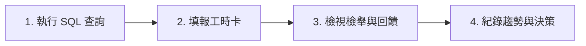

# 「敢不敢揪」最小試營運操作手冊 (Pilot Operations Playbook)

> **版本**：v1.0 (2026-09-17)  
> **適用範疇**：單一校區、少數活動、共同時段之最小驗證  
> **核心目標**：以最低運維負擔，驗證校園匿名活動配對之真實需求與持續維持之可行性。不增加新模式，不膨脹系統架構，嚴格保護個人隱私。

---

## 一、試營運定義與範疇 (Scope Definition)

為了避免使用者與時段過度稀釋，試營運嚴格收斂在以下範圍：

| 維度 | 設定範圍 | 選擇理由 |
| :--- | :--- | :--- |
| **校區** | **NYCU 陽明交大光復校區** | 校內活動據點集中（體育館、浩然圖書館、二餐/女二餐廳），學生步行 5–10 分鐘內可達，履約阻力最低。 |
| **活動** | **羽球** (2–4 人)<br>**咖啡 / 吃飯** (2–4 人) | 1. **羽球**：校內既有高頻運動需求，湊人數門檻低。<br>2. **咖啡/吃飯**：時間彈性高、無體能等級包袱、破冰阻力小。 |
| **共同時段** | **平日傍晚** (18:00 – 21:00)<br>**週五傍晚** (17:00 – 20:00) | 避開白天上課與深夜，鎖定學生下課後用餐、運動的自然交集時段。 |

> [!CAUTION]
> **操作邊界與授權提醒**  
> 本手冊與相關程式僅建立最小觀測與內部運維能力。**在未獲得負責人明確授權前，嚴禁擅自對外宣傳、發送校園信件、在校園社群（Dcard/PTT/Threads）發文，或正式啟動實體招募。**

---

## 二、現有資料能力盤點與未知邊界 (Data Capability Audit & UNKNOWN Boundaries)

依專案規範與真實資料保真原則，系統能回答與無法回答之項目清冊如下：

| 評估問題 | 現有資料能否回答？ | 資料來源與計算方式 | 限制與未知 (UNKNOWN) 標示 |
| :--- | :---: | :--- | :--- |
| **1. 多少需求成團、等待多久？** | **可回答**（成團部分）<br>**部分未知**（取消部分） | - 成團數：`match_request.status = 'MATCHED'`<br>- 成團等待時長：`activity.created_at - match_request.created_at`<br>- 逾時等待時長：`match_request.latest_start - match_request.created_at` | - **主動取消之等待時長**：資料庫無 `cancelled_at` 欄位，無法計算取消前等待多久，**標示為 UNKNOWN**。 |
| **2. 成團後是否實際出席？** | **嚴格界線**<br>（有打卡/回報可回答，其餘未知） | - 實徵出席證據 A：`activity_member.arrived_at IS NOT NULL`（成員在現場點擊「我到了」）<br>- 實徵出席證據 B：`user_reliability_event.event_type = 'ATTENDED'`（透過結算回報法定人數確認） | - **關鍵守則**：超時 fallback 結案（A4：24 小時後自動轉 COMPLETED，無人回報或未達法定人數）之活動，**絕對不可將成團當成出席，必須嚴格標記為未驗證／未知出席 (unverified_completion_members, UNKNOWN)**。 |
| **3. 是否再次參與？** | **可回答** | - 查詢統計區間內活躍的使用者，分別計算「實際活動參與留存」（歷史累積加入活動 $\ge 2$ 次）與「需求發起留存」（歷史累積發起需求 $\ge 2$ 次）。 | - 僅輸出彙整計數（區分活動參與留存：`unique_activity_participants`, `repeat_activity_participants`, `repeat_activity_participation_rate`，與需求留存：`unique_request_users`, `repeat_request_users`, `repeat_request_rate`），**絕不揭露任何個別使用者 ID**。 |
| **4. 取消、失敗與人工處理原因？** | **部分可回答** | - **需要人工處理之原因**：`report` 表完整記錄類別（`SPAM`, `HARASSMENT`, `OTHER`）與狀態（`PENDING`/`REVIEWED`）；`feedback` 表記錄自由文字與關聯活動。 | - **取消原因**：`cancel_request` 未收集主觀理由，**標示為 UNKNOWN**。<br>- **通知失敗原因**：Push 遇到 404/410 會自動清理訂閱，但使用者在作業系統層關閉通知或離線無法被被動記錄，**標示為 PARTIALLY_UNKNOWN**。 |
| **5. 每週維護花多少時間？** | **無法回答**<br>（標示未知） | - 系統與資料庫無工時表。 | - **標示為 UNKNOWN**。需由維護者於每週檢視時以輕量「每週維護工時記錄卡」手動記錄。 |

---

## 三、保護隱私之觀測 RPC

系統已佈署管理員專用觀測 RPC `get_pilot_operational_metrics`（僅授予 `service_role`，一般帳號與訪客無法執行）。

### 呼叫指令 (SQL Editor / Script)
```sql
-- 檢視過去 7 天 NYCU 光復校區之試營運指標
select get_pilot_operational_metrics(
  p_school => 'NYCU',
  p_campus => '光復',
  p_since  => now() - interval '7 days',
  p_until  => now()
);
```

### 回傳結構範例 (零 PII，數值聚合)
```json
{
  "scope": {
    "school": "NYCU",
    "campus": "光復",
    "since": "2026-09-10T12:00:00Z",
    "until": "2026-09-17T12:00:00Z"
  },
  "demand": {
    "total_requests": 14,
    "matched_requests": 8,
    "expired_requests": 4,
    "cancelled_requests": 2,
    "avg_wait_to_match_minutes": 22.4,
    "median_wait_to_match_minutes": 16.0,
    "cancelled_wait_minutes": "UNKNOWN",
    "cancelled_reasons": "UNKNOWN"
  },
  "attendance": {
    "total_activities": 4,
    "completed_activities": 3,
    "cancelled_activities": 1,
    "ongoing_or_matched_activities": 0,
    "verified_attended_members": 6,
    "unverified_completion_members": 2,
    "no_show_members": 0,
    "unverified_note": "A4 timeout completion without arrival check-in or settlement is marked as UNKNOWN"
  },
  "retention": {
    "unique_activity_participants": 11,
    "repeat_activity_participants": 4,
    "repeat_activity_participation_rate": 0.364,
    "unique_request_users": 14,
    "repeat_request_users": 6,
    "repeat_request_rate": 0.429
  },
  "issues_and_workload": {
    "total_reports": 1,
    "pending_reports": 0,
    "reports_by_category": {
      "SPAM": 0,
      "HARASSMENT": 0,
      "OTHER": 1
    },
    "feedbacks_count": 2,
    "notification_delivery_failures": "PARTIALLY_UNKNOWN (only invalid push subscriptions 404/410 tracked via cleanup)",
    "weekly_maintenance_hours": "UNKNOWN (manual log required)"
  }
}
```

---

## 四、每週 15 分鐘輕量檢視流程 (Weekly Review Runbook)

維護者每週僅需花費 15 分鐘執行以下四步，即可掌握健康度與維護成本：



### 步驟 1：執行觀測查詢（2 分鐘）
在 Supabase SQL Editor 或後端維護腳本中執行 `get_pilot_operational_metrics`，取得本週數據。

### 步驟 2：填報本週維護工時記錄卡（3 分鐘）
將本週耗費之人工時間記錄於維護日誌中：
```markdown
### 試營運每週工時卡 (範本)
- **週次**：2026-W38 (2026-09-15 ~ 2026-09-21)
- **檢舉與爭議審查工時**：15 分鐘
- **使用者回饋閱讀工時**：10 分鐘
- **系統狀態巡檢工時**：10 分鐘
- **本週總維護工時**：35 分鐘 (< 1 小時，維護負荷良好)
```

### 步驟 3：檢視待處理之檢舉與回饋（5 分鐘）
```sql
-- 查看待處理檢舉
select id, reporter_id, reported_user_id, category, detail, created_at
from report
where status = 'PENDING'
order by created_at asc;

-- 查看本週最新回饋
select id, message, created_at
from feedback
where created_at >= now() - interval '7 days'
order by created_at desc;
```

### 步驟 4：趨勢比對與決策紀錄（5 分鐘）
對照上週數字，檢視是否有異常暴增之檢舉、成團等待時間是否過長，或再次參與率是否有延續。

---

## 五、問題處理標準作業程序 (Incident Response SOP)

### 1. 檢舉案件處理 SOP（重大安全與騷擾）
- **觸發條件**：`report` 表出現 `category = 'HARASSMENT'` 或 `SPAM`。
- **處理流程**：
  1. 在 Supabase Studio 檢視檢舉詳情與關聯活動成員。
  2. 若查證屬實為重大騷擾、言語霸凌、騷擾電話或商業廣告：
     - 在 `app_user` 執行停權：
       ```sql
       update app_user set suspended_until = now() + interval '14 days' where id = '<reported_user_id>';
       ```
     - 或視情況永久停權：
       ```sql
       update app_user set suspended_until = '2099-12-31 23:59:59+00' where id = '<reported_user_id>';
       ```
  3. 將檢舉標記為已審核：
     ```sql
     update report set status = 'REVIEWED' where id = '<report_id>';
     ```

### 2. 出席爭議處理 SOP
- **觸發條件**：使用者透過反饋反應「我明明到了但被記缺席」或「對方沒到卻自動結案」。
- **處置原則**：
  - 目前系統已具備現場打卡（`arrived_at`）防禦；若使用者有現場打卡時間戳，該打卡記錄即為最客觀依據。
  - 若係結算誤記且未達 3 次停權門檻，說明目前機制為「多次滾動計算」，單次事件不影響正常使用權限。
  - 若因誤記導致連續 3 次而被系統自動處以 `suspended_until` 7 天，維護者核實後手動清除停權：
    ```sql
    update app_user set suspended_until = null where id = '<user_id>';
    ```

### 3. 通知障礙處理 SOP
- **觸發條件**：使用者反應未收到成團通知。
- **排除步驟**：
  1. 提示使用者檢查瀏覽器是否已封鎖通知權限（網址列左側設定）。
  2. 檢查 `user_push_subscription` 是否有該使用者的端點：
     ```sql
     select count(*) from user_push_subscription where user_id = '<user_id>';
     ```
  3. 提醒使用者系統具備「平靜等待室」與「我的活動」主動刷新機制，即使無背景推播，回到畫面亦能即時同步最新狀態。

---

## 六、繼續／調整／暫停判斷框架 (Go / Iterate / Pause Framework)

> [!IMPORTANT]
> **拒絕虛假門檻（No-Fake-KPI Rule）**  
> 在尚未積累實際校園基準數據前，**絕不捏造「成團率需達 80%」等虛構 KPI**。判斷一律依據「真實發生的實徵行為」與「維護負擔是否能輕鬆維持」進行相對比較。

```mermaid
decisionTree
  開始每週評估 --> 實徵需求與出席評估
  實徵需求與出席評估 --> 有真實出席且每週維護小於2小時 --> 繼續試營運
  實徵需求與出席評估 --> 需求多但逾時多或未出席偏高 --> 調整時段與指引
  實徵需求與出席評估 --> 連續兩週零需求或維護負擔過重或重大安全問題 --> 暫停試營運
```

### 1. 繼續 (Go) 的判斷依據
- **真實動能**：區間內有實際的 `verified_attended_members > 0`（羽球或咖啡確實在校園內成團且有人打卡見面）。
- **留存信號**：出現自然再次參與者（`repeat_participants > 0`）。
- **可輕鬆維持**：每週人工維護工時合計 $\le 2$ 小時；檢舉均屬偶發且能依 SOP 迅速排除。

### 2. 調整 (Iterate / Tune) 的判斷依據
- **狀況 A：需求多但逾時多（`expired_requests` 比例高）**
  - **診斷**：時段被切得太碎，或使用者發起的時間無人重疊。
  - **因應方案**：進一步收窄推薦時段（例如僅推薦週五 18:00–20:00），或在發起表單加強共同推薦時段之引導。
- **狀況 B：成團多但未驗證出席多（`unverified_completion_members` 比例高）**
  - **診斷**：成員成團後不知道要打卡、地點不明確，或太晚成團來不及前往。
  - **因應方案**：檢查地點預設集合點是否清楚；檢視成團前置時間（提前在活動前 30 分鐘截止配對）。
- **狀況 C：主動取消多**
  - **因應方案**：評估是否需在取消流程中加入可選的一鍵簡要原因選單（例如「時間臨時有衝突」、「等太久了」），消除「取消原因未知」之缺口。

### 3. 暫停 (Pause) 的判斷依據
- **信號 1（零動能）**：連續 2 週校區自然發起之 `total_requests = 0`，代表目前宣傳方式或產品心智尚未契合校園日常，繼續無端空轉浪費伺服器資源。
- **信號 2（維持負擔超標）**：每週人工處理糾紛、客訴或異常工時持續 $> 5$ 小時，違背「能輕鬆維持」之初衷。
- **信號 3（重大安全與信任危機）**：發生嚴重的校園安全事件或惡意騷擾，現有機制無法有效遏止時，立即停權相關帳號並暫停撮合引擎。
