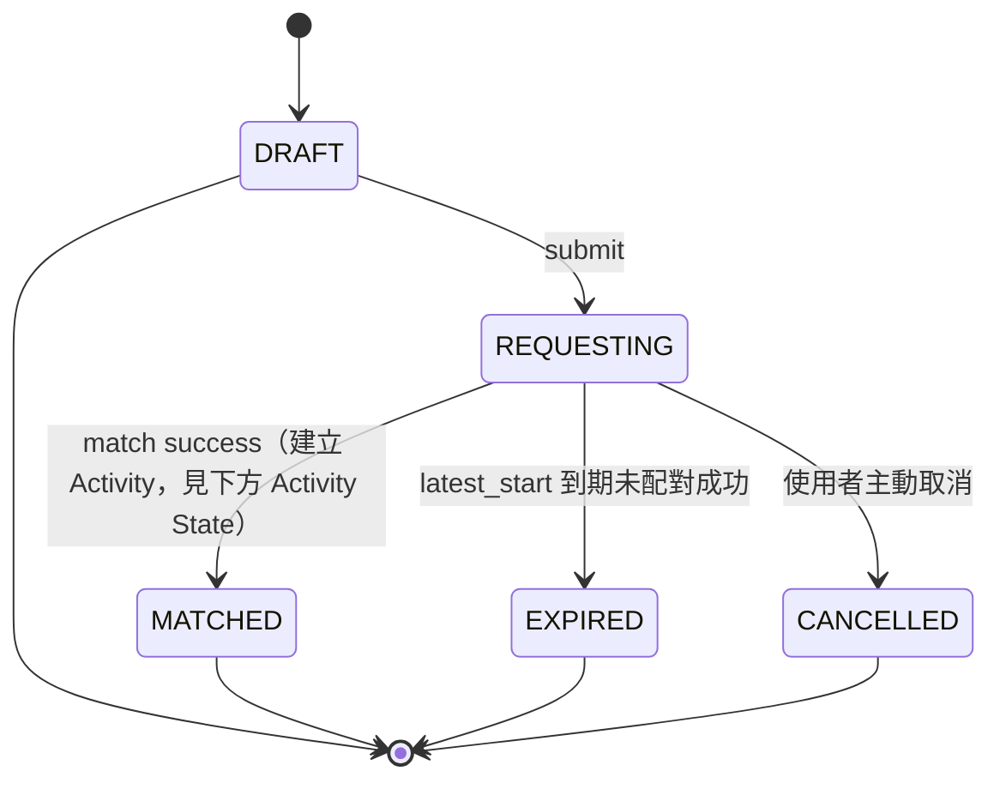
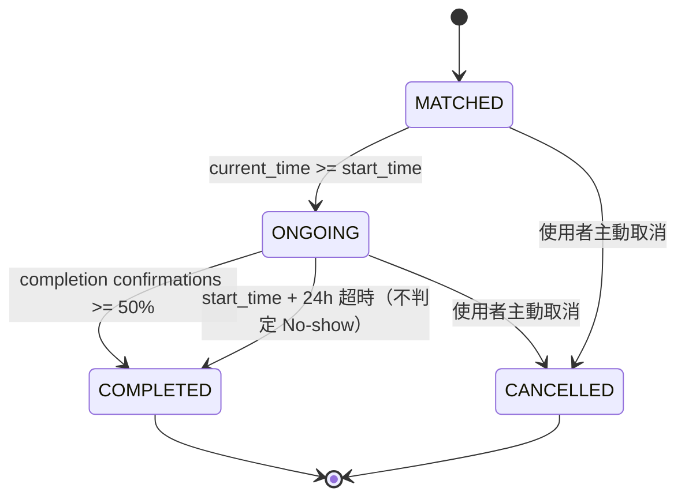

# 校園活動配對 App — 產品規格書 (Spec v1.18 / Repo 首版)

> 本文件用途：作為 repo 的第一份文件，是團隊所有產品／資料模型決策的唯一真相來源（single source of truth）。後續 ERD 圖、State Machine 圖、API endpoint spec 都應該從這份文件推導，不應該與本文件衝突；若有衝突，先回來改這份文件，再改下游文件。
>
> 標記說明：🟢 已拍板決策　🔴 仍開放、不卡 schema、可平行進行

> **v1.1 變更紀錄**（畫 ERD 前的 schema 微調，不改產品邏輯）：
> 1. `MatchRequest.member_ids[]` 拆成獨立的 `RequestMember` join table（見第 6 節）
> 2. `Activity.matched_request_ids[]` / `final_member_ids[]` 拆成獨立的 `ActivityMember` join table（見第 9 節）
> 3. State Machine 拆成 `MatchRequest` 與 `Activity` 兩張獨立的狀態圖，不再混用（見第 9 節）
> 4. Reliability 新增 `UserReliabilityEvent` 事件表作為資料來源，分數改為即時 query、不直接存欄位（見第 12 節）
> 5. 修正 `contact_visible_until` 的起算點：以 **Activity** 的 `created_at` 為準，不是來源 `MatchRequest` 的 `created_at`（見第 9 節）

> **v1.2 變更紀錄**（服務範圍擴至清交雙校，核心模型不動）：
> 1. MVP 範圍：僅限 NYCU → **NYCU + NTHU**（見第 1 節）
> 2. `User` 新增 `school` 欄位（`NYCU`/`NTHU`），由信箱網域自動判定、不讓使用者自選（見第 2 節）
> 3. Matching：MVP 配對池以 `school` 隔離，跨校配對保留為 future feature（見第 7 節）
> 4. `Location` 增加 `school` 歸屬，地點清單依校分列（見第 1、16 節）

> **v1.3 變更紀錄**（個人資料補充欄位）：
> 1. `User` 新增 `bio`（自我介紹）欄位，**選填**，純展示用、不進配對邏輯、不卡註冊門檻（見第 2 節）

> **v1.4 變更紀錄**（小人數活動安全機制 + 學制欄位）：
> 1. `User` 新增 `department`（科系，選填，僅展示）、`degree_level`（學制：大學部／碩士班／博士班，**註冊時強制下拉**，僅展示）；明確**不**新增 `grade_year`（年級/屆數）——理由見第 2 節
> 2. `required_total ≤ 2` 的配對新增 **`PENDING_CONFIRMATION`** 中間態：Matching Engine 盲配成功後，雙方需在 `CONFIRM_WINDOW = 10 分鐘` 內對稱雙向確認，才正式生成 Activity；任一方不確認或超時 → 靜默解散、不歸因，處理原則比照第 8 節 Downgrade（見第 12.1、第 9 節）
> 3. 新增配對冷卻（Match History Avoidance）：曾進入 `PENDING_CONFIRMATION` 但未成立的使用者配對，7 天內軟性降權，非永久拉黑（見第 12.1 節）
> 4. 新增小人數活動「安全資訊卡」：`required_total ≤ 2` 進入 `PENDING_CONFIRMATION` 時展示有限資訊（含 `department`/`degree_level`/Reliability），明確不含聯絡方式（見第 12.1 節）
> 5. 既有「New 等級不可直接參加 ≤2 人活動」規則併入第 12.1 節，與上述機制整合成同一節，不再分散重複
> 6. 第 13 節補充背景排程機制（Supabase pg_cron），統一說明所有「時間到自動轉移」的實作方式

> **v1.5 變更紀錄**（邀請連結取代好友系統、人數彈性化）：
> 1. 新增邀請連結機制：`MatchRequest` 新增 `invite_token`（唯一，生命週期依附 Request 本身的狀態與 24 小時邊界，不另存到期時間）與 `revoked_at`（owner 可主動撤銷連結）；已完成身份驗證的使用者透過連結**直接加入**，不經 owner 二次審核，v1 沒有 Friend entity、不存任何朋友關係資料（見第 6.1 節）
> 2. `required_total` 拆成 `min_participants`/`max_participants`（皆計入 owner 本人），`ActivityType` 新增對應的 `default_min_participants`/`default_max_participants`（fallback 2/6，比照 `default_duration` 的 admin 設定模式）；UI 不直接暴露 min/max 字眼，改用選項卡對應（見第 6 節）
> 3. Matching Engine 明確採用「達到 `min_participants` 立即成局」的貪婪策略，不等待湊到 `max_participants`（見第 7 節）；Downgrade 觸發條件相應改為「連 `min_participants` 都湊不到」（見第 8 節）
> 4. 新增 `known_member_count`：**不新增儲存欄位**，由查詢即時算出（同一 Activity 內與自己 `source_request_id` 相同的 `ActivityMember` 人數），見第 9 節
> 5. 第 12.1 節准入/確認判準明確區分兩個時間點：發起/加入當下用 `min_participants ≤ 2` 把關新人資格，配對當下用**實際撮合人數** ≤ 2 觸發 `PENDING_CONFIRMATION`（機制本身不變，只是判準基準從固定數字換成動態欄位後需要重新說清楚）

> **v1.6 變更紀錄**（UI 人數標籤語意修正 + `ActivityType` 新增 `group_size_step`）：
> 1. v1.5 的 UI 選項設計讓使用者選「不含自己的同伴人數」，系統再 +1 換算成 `min_participants`/`max_participants`，實測發現這個換算本身造成語意落差；v1.6 改為 UI 標籤直接顯示總人數（含自己），不再做「不含自己」的換算敘述（見第 6.2 節）
> 2. `ActivityType` 新增 `group_size_step`（nullable int）：非 null 時前端依 `default_min_participants`~`default_max_participants`、以 `group_size_step` 為間隔生成離散人數選項；null 時代表連續區間，不做離散化。把「該找幾人」的決定權交給活動類型本身，維持第 5 節「使用者新增類型 → admin 審核通過 → 立即可用」的既有路徑完整，新增類型不需要改前端程式碼（見第 5 節）
> 3. 明確不新增 `group_size_mode` 欄位：`group_size_step` 是否為 null 已完整表達離散/連續兩種模式，另開欄位會造成兩欄位需彼此保持一致的重複真相問題，與 `invite_token` 不另存 `expire_at`、`known_member_count` 不額外儲存同一精神（見第 5 節）
> 4. `min_participants`/`max_participants` 欄位本身、Matching Engine 貪婪成局策略、Downgrade 觸發條件皆不變
> 5. 第 6.1 節拆分為「6.1 Invite Link（邀請連結）」與「6.2 人數選項呈現」，原本混在同一標題下的邀請連結行為與 UI 對照表分開陳述；下游引用舊「第 6.1 節 UI 對照表」處（含第 12.1.1 節）同步改指向第 6.2 節

> **v1.7 變更紀錄**（活動進行中鎖定 Request + 拒絕/晚取消冷卻期；`submit_request` 檢查順序定案）：
> 1. 🟢 **推翻 v1.5 之前的既有決定**：第 6 節原寫「同一使用者同時只能有一個 `REQUESTING` 狀態的 Request；`MATCHED` 之後不受此限制（已非等待中的資源）」，v1.7 起改為**同一使用者名下若有任何 `MATCHED`/`ONGOING` 狀態的 Activity，在該 Activity 轉為 `COMPLETED`/`CANCELLED` 之前，不能建立或送出新的 MatchRequest**。這不是新增限制，是推翻「配對成立後不受限制」這個舊結論——範圍從「配對階段」延伸到「整個活動生命週期」，理由是防止使用者同時腳踏多個活動、變相比較挑選，與產品核心「盲配不挑人」精神一致（見新增第 6.3 節）
> 2. 新增**配對冷卻**機制：主動拒絕候選配對（`respond_pending_confirmation` 傳 `confirm=false`）或活動確定後才取消（`cancel_activity_participation` 觸發 `LATE_CANCEL`）者，30 分鐘內不能送出新 Request，防止「允許反悔」被濫用成變相重抽（見新增第 6.3 節）
> 3. `app_user` 新增 `next_request_allowed_at`（nullable timestamptz），供上述冷卻機制使用（見 ERD.md）
> 4. 🟢 `respond_pending_confirmation` 的行為澄清：**允許反悔**（10 分鐘確認窗口內可改變心意，不視為錯誤），API.md 第 4 節先前列出的 `ALREADY_RESPONDED` 錯誤碼從未真正實作過，v1.7 正式從文件移除，避免文件承諾不存在的行為
> 5. `submit_request` 的驗證順序正式定案為固定序列，見第 6.3 節；此前 API.md 雖列出部分檢查項目但未定義順序、且 `USER_SUSPENDED`/`PROFILE_INCOMPLETE` 兩項實際上只在 `create_request` 檢查、`submit_request` 從未真正檢查過，v1.7 一併補上，避免「文件寫一套、程式碼另一套」
> 6. 🔴 **修正一個影響所有 RPC 的既有 bug**：所有 migration 內的 `raise exception using errcode = '<CODE>', message = '<...>'` 寫法無效——PL/pgSQL 的 `errcode` 只接受標準 5 碼 SQLSTATE 或內建 condition name，塞入 `'UNAUTHORIZED'` 這類自訂字串會在 `raise` 當下直接拋出 `unrecognized exception condition`，蓋掉原本要回傳的錯誤，代表 API.md 記載的所有錯誤碼實際上從未真正生效過。v1.7 順帶修正全部 6 個 RPC migration 檔案共 65 處呼叫，統一改為 `raise exception using message = '<CODE>'`（需要更細節的子原因時加 `detail = '<...>'`），詳見 API.md §0

> **v1.8 變更紀錄**（新增 `app_config` 系統可調運營參數表）：
> 1. 新增 `app_config`（`key`/`value`/`description`/`updated_at`）：把原本寫死在 RPC function 裡的時間參數抽出成可調整的設定值，方便冷啟動階段與系統穩定後採用不同數值，不需重新部署即可調整（見新增第 13.1 節）
> 2. 初始 seed 值沿用目前 SPEC 定案的數值，這次僅將寫死改為可調，不改變數值本身：`cooldown_minutes = 30`（第 6.3 節）、`confirm_window_minutes = 10`（第 12.1.2 節）、`downgrade_consent_window_minutes = 10`（第 8 節，目前尚無 RPC 建立 `downgrade_request`，此值先 seed 供未來使用）
> 3. MVP 階段不新增管理用的 API/RPC，直接透過 Supabase Dashboard 的 Table Editor 調整（見第 13.1 節）

> **v1.9 變更紀錄**（補齊 GRANT 遺漏 + `respond_downgrade`/`leave_request` 實作 + 移除設計遺留的 `join_request`）：
> 1. 🔴 **修正一個影響所有 PostgREST 直讀端點的 bug**：`supabase/migrations/` 從第一份 migration 開始就沒有任何 `grant` 陳述式——RLS policy 都正確定義，但 Postgres 的資料表權限系統是 RLS 之外**獨立的一層外層閘門**，沒有底層 SELECT/UPDATE 授權，RLS 根本不會被求值，直接 403（`permission denied`）。Supabase 平台過去會在建立新專案時自動幫所有表補上 `grant all ... to anon, authenticated, service_role`，這個自動行為後來被平台取消，此 repo 從未跟著補上手動 GRANT，導致 API.md 內每一個標 `(PostgREST)` 的端點對 `anon`/`authenticated`/`service_role` 全部悄悄回 403，只有 `SECURITY DEFINER` 的 RPC（以 function owner 身分執行，不受呼叫者角色的表權限限制）不受影響。新增 `20260724120800_grants.sql`：依每張表既有的 RLS policy 集合精確授權（有 `for select` policy 才 `grant select`，以此類推），不是無差別 `grant all`；`pending_confirmation`/`match_history_avoidance`（刻意不開 SELECT policy）與 `app_config`（刻意不啟用 RLS，Dashboard-only）維持不授權
> 2. 新增 `rpc: respond_downgrade(downgrade_request_id, agree)`（第 8 節）：第 8 節與 ERD 設計備註 21 定案已久，但這個使用者回應 endpoint 從未真正實作過，功能對使用者來說形同不存在。行為依 STATE_MACHINE.md「Downgrade 子流程」：任一人 `DISAGREE` 立即 `REJECTED`，全員 `AGREE` 才 `APPROVED`；重複回應回 `ALREADY_RESPONDED`（此碼在第 5 節 error table 從未被移除，跟第 4 節 `respond_pending_confirmation` 的「允許反悔」是不同的既有設計）。**範圍限定**：只補使用者回應這一半，`downgrade_request` 的建立仍是背景任務（第 9 節「Request 過期」排程）的職責，尚未實作
> 3. 新增 `rpc: leave_request(request_id)`（第 6 節）：透過邀請連結（6.1 節）加入別人 Request 的非 owner 成員，先前完全沒有任何方式可以退出——`cancel_request` 嚴格限定 owner_id，非 owner 成員呼叫只會得到 `NOT_FOUND`。owner 呼叫 `leave_request` 回 `FORBIDDEN`（應改用 `cancel_request`，語意上「換 owner」不在本次範圍內）；配對成立後不可再用此 endpoint 退出（改走第 9 節 `cancel_activity_participation`，維持兩張狀態圖分界）
> 4. 🔴 **移除設計遺留的 `join_request(request_id)`**（非邀請連結版本的直接加入）：產品自 v1.5 邀請連結機制上線後，就沒有任何「瀏覽/挑選他人 Request」的 UI 路徑（v1.5 變更紀錄第 1 條：「v1 沒有 Friend entity、不存任何朋友關係資料」），加入他人 Request 的唯一合法方式是 `join_request_by_token`（6.1 節）。這條端點是 v1.5 之前的設計遺留、從未有對應 UI 路徑會呼叫它，不是遺漏的實作——與更早移除 `create_request` 的 `invited_user_ids` 參數是同一個理由。API.md 第 3 節編號不遞補（3.4 空缺、3.5 起維持原編號），避免牽動其他文件的既有交叉引用

> **v1.10 變更紀錄**（`activity_type.description` + `location` 審核機制 + `pending_review` view）：
> 1. `activity_type` 新增 `description`（nullable text）：前端「?」按鈕顯示的玩法說明文字，審核新增類型時由 admin 在 Supabase Dashboard 跟 `default_duration_minutes`/`default_min_participants`/`default_max_participants`/`group_size_step` 一併設定，不進 `propose_activity_type` 的參數。順帶 seed 一筆官方預設類型「先聚了再說」（`status='APPROVED'`，不走使用者提案審核）：`default_duration_minutes=90`、`default_min_participants=5`、`default_max_participants=20`、`group_size_step=null`——依「沒有固定活動形式」的性質評估，時長取中等、人數用連續區間不設步階，上限明顯寬於其他類型以容納鬆散的大型聚會
> 2. `location` 新增審核機制，比照 `activity_type`：新增 `status`（復用既有 `activity_type_status` enum）與 `created_by`（FK to `app_user`，nullable，官方預先 seed 的地點為 null）。**`status` 預設 `APPROVED`，與 `activity_type` 預設 `PENDING` 刻意相反**——`location` 的正常寫入路徑是 admin 直接維護固定清單，`PENDING` 只在使用者提案（新增 `rpc: propose_location(name, school)`，第 2 節）這條旁支路徑出現；`activity_type` 則反過來，使用者提案才是常態路徑（ERD 設計備註 25）。§2.4 `GET location` 查詢加上 `status=eq.APPROVED` 過濾條件，確保未審核通過的地點不出現在下拉選單。**`propose_location` 不做關鍵字黑名單預檢**：地點名稱塞入違規字眼的難度本來就比活動類型高，且稽核發現 `propose_activity_type` 文件宣稱的黑名單預檢從未真正實作過（既有落差，本次不動），與其比照一個不存在的機制，MVP 真正的把關就是第 3 點的 `pending_review` view
> 3. 新增 `pending_review` view（不是新 admin API/介面）：UNION `activity_type`/`location` 兩表目前 `status='PENDING'` 的項目（欄位：類型、名稱、`created_by`、`created_at`），admin 在 Supabase Studio 查這一張 view 就能看到所有排隊中的提案，手動改對應原表的 `status` 完成審核。刻意不對 `anon`/`authenticated` grant 任何權限——這是 MVP 階段唯一的審核渠道，不新建任何 admin 專屬 API 或前端頁面

> **v1.11 變更紀錄**（Matching Engine 空間維度重構：精確地點匹配 → 校區範圍匹配 + Activity Location 投票機制）：
> 1. 🟢 **地理事實修正（本輪前提）**：陽明交通大學校區橫跨新竹（光復/博愛/六家）、台北（陽明/北門）、台南（歸仁）三個城市，`school`（NYCU/NTHU）本身不足以代表「距離夠近」。`location` 新增 `campus`（text，不開 enum、不另開 Campus 表——校區清單隨地點清單擴充，屬於資料而非程式碼的範圍，比照 `location.name` 既有純文字慣例）。
> 2. 🟢 **兩階段地點決策**：`match_request` 移除精確地點 `campus_location_id`，改成 `school` + `campus`（Matching Scope，建立時選、不再指定精確地點）；`fn_run_matching_engine` 的 merge 條件從「`campus_location_id` 完全相同」改成「`(school, campus)` 相同」，其餘規則（時間窗重疊、類型相同）不變。配對成立後才透過投票決定精確的 **Activity Location**（`activity.activity_location_id`，nullable，見第 9.1 節）——撮合前彼此並未預先對齊到同一精確地點，這裡是真實的偏好分歧，適合用投票解決，跟先前討論過的「集合位置投票」不是同一件事：集合位置是同一地點內部的資訊同步，Activity Location 是「去哪個地點」本身的分歧。
> 3. 🟢 **投票機制借用既有基礎設施**：候選地點僅限該 `(school, campus)` 範圍內、`location` 表既有已核准的地點（不開放自由輸入，延續「固定清單」原則）；任何活動成員可提案新候選或對既有候選投票，可改票；截止時間直接復用 `activity.start_time`，鎖定動作與 `MATCHED → ONGOING` 轉移合併在同一個背景任務 `fn_start_activities()` 裡完成，不另開排程；得票同分時最早提案者勝出；只有一個候選時排序邏輯自然選中它，不需要特判計票。`fn_start_activities()` 是這輪第一次真正把 §13 背景任務表「Activity 開始」這一列落地成 SQL——先前只有文件描述，沒有對應函式（見 `app/lib/rpc/RPC_COVERAGE.md`）。跟其他背景任務（Matching Engine、PENDING_CONFIRMATION 清理）的既有慣例一致，這輪只做成 callable function，不掛 `pg_cron.schedule`。
> 4. 🟢 **零候選地點不代替使用者決定**：`activity_location_id` 允許保持 `NULL`——若到 `start_time` 時仍沒有任何候選地點，`fn_start_activities()` 不會自動選一個地點頂上（避免「讀書活動最後鎖定南大門」這種荒謬結果）。新增背景任務 `fn_remind_missing_location_candidates()`：`start_time` 前 `app_config.location_reminder_lead_minutes`（預設 30 分鐘，比照 §13.1 既有「時間參數抽成可調值」慣例）仍零候選時，向全體成員發送新通知事件 `LOCATION_NOT_YET_PROPOSED` 催促提案；去重靠查詢既有 `notification` 表本身是否已發過，不額外加欄位（比照 `known_member_count`/Reliability 分數不落地存欄位的既有原則）。
> 5. 🔴 **前瞻性設計原則（Meeting Point 尚未實作）**：即使 `activity_location_id` 為 `NULL`，未來實作「集合地點」（Meeting Point，讓成員自由文字描述實際集合點，如「光復北大門」）這類協調工具時，必須設計成**獨立於 `activity_location_id` 是否鎖定**，不能讓「正式候選地點沒投出結果」變成「系統內沒有任何協調工具可用，只能靠外部私訊」。這是這輪 `activity_location_id` 可為 `NULL` 設計下必須配套的前瞻原則，先寫進文件，供未來正式設計 Meeting Point 時遵守；本輪不新增任何 Meeting Point 相關 schema。
> 6. 🟢 **移除 `match_request.acceptable_location_ids[]`**：v1.5 起這個欄位的定位是「v1 只填 1 個精確地點，欄位預留未來多選」，但新模型下 Request 建立時根本不指定精確地點，這個欄位的語意已經跟新模型直接衝突——是**語意不存在**而不是「deprecated 保留」，故直接移除，不留欄位造成誤導。
> 7. 🟢 **新錯誤碼 `INVALID_CAMPUS_SCOPE`**：語意是「學校正確，但該校區在 DB 裡沒有任何已核准的地點」，跟既有 `SCHOOL_LOCATION_MISMATCH`（學校本身不對，用於 `join_request_by_token` 的跨校加入檢查）刻意分開，不沿用舊碼。`campus` 打字錯誤風險不加額外 DB 層約束（UNIQUE/lookup 表）：`create_request` 的存在性檢查已經能擋掉使用者端輸入錯誤，剩餘的「admin 手動維護地點清單打字不一致」風險屬於操作紀律問題，不是 schema 該解決的問題。
> 8. `propose_location` 加 `p_campus` 參數：核准後的地點需要 `campus`（現在是 `NOT NULL`）才能參與任何撮合，不補這個參數會產生無法使用的死地點。
> 9. 實際地點清單內容（含每筆地點的 `campus` 標注）仍是 SPEC §16 開放問題 4 的一部分，本輪只完成 schema 與 RPC 改動，清單本身另外補 insert。

> **v1.11.1 變更紀錄**（Meeting Point / Meeting Hint 正式落地成 schema + 修正 `activity_member` RLS 遞迴 bug）：
> 1. 🟢 **這輪才是「正式實作」，跟 v1.11 §9.1 的前瞻性文件定案區分開**：v1.11 只寫了一條原則（Meeting Point 必須獨立於 `activity_location_id` 是否鎖定），沒有對應的 table/RPC；v1.11.1 才真正把 Meeting Point（集合地點）與 Meeting Hint（見面提示）落地成 schema，見新增第 9.2 節。
> 2. 🟢 **Meeting Point 用 append-only 記錄表**（`activity_meeting_point_update`），不做「只存最新一筆」的設計，也不刪舊資料——「目前集合點」＝依 `created_at` 取最新一筆，歷史展示＝取最近 N 筆，跟 `known_member_count`/Reliability 分數「不額外存欄位，查詢時算」是同一個精神。**2 分鐘修改冷卻**同樣不開獨立欄位，直接查詢這張表「該使用者對該活動最近一次更新是否在冷卻窗口內」；冷卻時間走既有 `app_config`（新增第 4 筆 `meeting_point_update_cooldown_minutes = 2 minutes`，見第 13.1 節）。
> 3. 🟢 **Meeting Hint 是 `activity_member` 的一個 nullable 欄位**（`meeting_hint`，`CHECK (char_length(meeting_hint) <= 30)`）——每人在每個 Activity 只有一個提示，沒有歷史需求，不需要獨立表。
> 4. 🟢 **邊界判斷（COMPLETED/CANCELLED 之後不可再修改）**：兩支 RPC（`update_meeting_point`/`update_meeting_hint`）都限制 `activity.status in ('MATCHED', 'ONGOING')`，刻意**不**限定在 `MATCHED`——活動當天（`ONGOING`）仍可能需要修正集合點，這是規格明確要求放寬的部分。`COMPLETED`/`CANCELLED` 之後協調動作已經沒有實質對象（`COMPLETED` 沒有人還要去集合；`CANCELLED` 活動根本不會發生），繼續允許修改只會產生沒有意義的通知，也讓活動記錄在事後被繼續竄改，故擋下（`ACTIVITY_NOT_ACTIVE`）。
> 5. 🟢 每次成功更新 Meeting Point 都通知全體成員（新增 `notification_event_type` = `MEETING_POINT_UPDATED`），沿用既有通知機制；Meeting Hint 是個人化欄位，不觸發通知。
> 6. 🟢 RLS 公開透明給活動全體成員，比照 §9.1 的 `ActivityLocationOption`/`ActivityLocationVote`，不比照 `pending_confirmation` 的刻意不歸因設計——集合點協調是良性的群體資訊同步，不是需要隱藏的敏感情境。
> 7. 🔴 **修正一個既有、範圍比這次功能更大的 bug（撰寫本輪 RLS 測試時發現）**：`activity_member` 的 SELECT RLS policy 從 `20260724120000_init.sql` 起就寫成自我參照（`exists (select 1 from activity_member me where ...)`），PostgreSQL 對「同一張表在自己的 policy 裡查詢自己」會直接判定為無限遞迴並報錯——不是效能問題，是直接炸掉。範圍不只影響這次新增的 Meeting Point：`activity` 的 SELECT policy 也會 join `activity_member`，間接觸發同一個遞迴，等於**任何 `authenticated` 角色對 `activity`/`activity_member` 的直接查詢，先前都會 500**。過去沒被抓到是因為所有既有 pgTAP 測試都用 postgres superuser 連線做設置/斷言（略過 RLS），前端也只透過 `SECURITY DEFINER` RPC 存取這兩張表，從未真的以 `authenticated` 角色直接 SELECT 過。修法：新增 `fn_is_activity_member(activity_id, user_id)`（`SECURITY DEFINER`，比照 `fn_get_config_interval` 的既有 helper function 慣例），把判斷邏輯包進去，內部查詢以 function owner 身份執行、不會再觸發呼叫者的 RLS policy，因此不遞迴；`activity_member` 的 SELECT policy 改呼叫這個 function。

> **v1.12 變更紀錄**（§9 八個背景任務第一次系統性盤點完成度，補齊此前完全沒有對應函式的四個，外加兩處既有函式缺漏的通知觸發點）：
> 1. 🟢 **盤點結果**：`fn_run_matching_engine`/`fn_cleanup_pending_confirmations`/`fn_start_activities`/`fn_remind_missing_location_candidates` 此前已真正落地；「Request 過期」「Downgrade 超時」「Activity 超時完成」「結束提醒」四個此前完全沒有對應函式，只有 §9 表格的文件描述；`respond_downgrade` 從未發過 `DOWNGRADE_RESULT`、`fn_cleanup_pending_confirmations` 從未發過「配對未成立」通知。這輪一次補齊全部六項，見 API.md §9 逐列更新。
> 2. 🟢 **`fn_expire_requests()`（新，對應 R4 + Downgrade 發起）**：`target_size` 算法 = `greatest(2, 該 Request 目前實際 JOINED 人數)`，呼應第 7 節貪婪策略的精神——不發明武斷數字，直接問「現在實際到場的這幾個人，你們願不願意就這樣成局」；`downgrade_request.target_size` 本身有 DB CHECK `>= 2`，`greatest(2, ...)` 自然處理「只有 owner 一人」的邊界，若原本 `min_participants` 已經是下限 2，算出的 target 不可能低於它，自然落入不提供 downgrade 的分支，不需要額外特判第 8 節「`target_size` 必須低於原 `min_participants` 才有意義」這條規則。
> 3. 🟢 **時間窗判斷改成「deadline 過去多久」而非「距離未來還剩多少」**：第 8 節原文語境是排程搶在 `latest_start` 之前跑（剩餘時間 < 10 分鐘就不問）；這輪掃描條件本身就是 `latest_start < now()`（deadline 已過），故改為 `now() - latest_start < app_config.downgrade_consent_window_minutes`——剛過期不久（在一個 consent window 的寬限期內）才提供這次機會，超過寬限期視為錯過時機，直接 `EXPIRED`，不再重新評估；已經問過一次（不論 `REJECTED`/`TIMEOUT`）也不再問第二次。
> 4. 🟢 **EXPIRED 分支刻意不發通知**：EXPIRED 是「什麼都沒發生」的被動結果，不是需要打斷使用者的失敗事件，使用者下次查詢自己的 Request 狀態會自然看到；這輪也沒有為此新增 `notification_event_type` 值的預算。STATE_MACHINE.md 舊版 R4 文字「發通知告知未成團」是從未真正實作過的舊描述，這輪已同步更新，明確記錄這個決定。
> 5. 🟢 **`fn_complete_activities()`（新，對應 A4）不需要重算法定人數門檻**：`submit_completion_report` 一旦達標，當下就已經在同一個 transaction 內把 `status` 轉成 `COMPLETED`（第 10 節），任何在這裡仍是 `status='ONGOING'` 的列，必然是「尚未達標」，兩條路徑天然互斥。轉移本身是靜默 fallback，不做 No-show 判定、不記事件、不發通知。
> 6. 🟢 **`fn_remind_completions()`（新，對應「結束提醒」）去重比照 `fn_remind_missing_location_candidates` 的既有模式**：查 `notification` 表本身是否已對同一活動發過 `COMPLETE_CONFIRMATION`，不另存欄位。
> 7. 🟢 **新增 `notification_event_type` 值 `MATCH_NOT_FORMED`**：`fn_cleanup_pending_confirmations()` 補上此前只有文件描述、從未真正發過的「配對未成立」無差別通知，不歸因原則比照 ERD 備註 16——payload 只帶收件者自己的 `request_id`，不透露對方是誰、拒絕還是超時。
> 8. 🟢 **`respond_downgrade` 補上 `DOWNGRADE_RESULT` 通知**：任一人 `DISAGREE` 立即發（`status=REJECTED`）；全員 `AGREE` 的那一刻才發（`status=APPROVED`），部分同意時不提前發，比照 `respond_pending_confirmation` 只在最終 PC1/PC2 轉移時才通知的既有模式。
> 9. 🔴 **已知、刻意不在這輪處理的既有落差**：`downgrade_request.status = 'APPROVED'` 之後「Matching Engine 以 `target_size` 重新撮合」（第 8 節、STATE_MACHINE.md）目前沒有任何程式碼實際消費 `target_size`——這是 `respond_downgrade` 原有註解就已承認的既有落差，這輪讓 `APPROVED` 狀態第一次真的可能被產生出來，但沒有一併補上撮合引擎讀取 `target_size` 的邏輯，留給未來獨立評估。

> **v1.13 變更紀錄**（新增「活動開始前提前提醒」背景任務，可調多時間點）：
> 1. 🟢 **新增 `notification_event_type` 值 `ACTIVITY_UPCOMING`**：跟既有 `ACTIVITY_REMINDER`（活動「已經」開始，A2 轉移時發送）刻意區分——`ACTIVITY_UPCOMING` 是活動「快」開始（`start_time` 尚未到），文案與產品意圖都不同，不能共用同一個事件類型。
> 2. 🟢 **`app_config` 新增 `activity_reminder_lead_minutes_list`，值存成 Postgres array literal 文字**（預設 `'{30,10}'`，代表 30 分鐘前 + 10 分鐘前兩個提醒點）：這是 `app_config` 第一次需要存「多個時間點」而不是單一數值，跟既有 `cooldown_minutes`/`confirm_window_minutes`/`downgrade_consent_window_minutes`/`location_reminder_lead_minutes` 都是單一數值不同。評估過逗號分隔字串、jsonb array、拆成多筆 key 三種替代方案後選擇 Postgres array literal：讀取端新增 `fn_get_config_int_array(p_key)`，內部就是 `value::int[]` 一行轉型，跟既有 `fn_get_config_interval` 的 `value::interval` 寫法完全對稱，是同一套「`value` 欄位存文字、讀取端依語意 cast」慣例的自然延伸；不需要 `string_to_array` 或 jsonb 解析這些額外步驟，也不用像「拆成多筆 key」那樣自創一個沒人明講的命名規則（`activity_reminder_lead_1`/`_2`……）。
> 3. 🟢 **`fn_remind_upcoming_activities()`（新）**：掃描 `status='MATCHED'` 且 `start_time` 落在任一個設定時間點內的 Activity，向全體 `JOINED` 成員發送 `ACTIVITY_UPCOMING`，payload 帶 `lead_minutes` 供前端動態組文案。對每個設定時間點各自獨立掃描、獨立去重——去重比照 `fn_remind_missing_location_candidates` 的既有模式（查 `notification` 表本身，不另存欄位），差別在於去重鍵是 `(activity_id, lead_minutes)` 這一組，而不是單純 `activity_id`，因為同一個活動的 30 分鐘提醒與 10 分鐘提醒是兩則不同的通知，必須能各自獨立觸發。
> 4. 🟢 **文案定案**（第一次在文件裡正式記錄任何通知文案，`ACTIVITY_REMINDER` 沿用既有行為不變）：
>    - `ACTIVITY_UPCOMING`：標題「活動快開始了」，內文「還有 {lead_minutes} 分鐘，記得看一下活動地點跟集合地點」（`{lead_minutes}` 依 payload 動態帶入）
>    - `ACTIVITY_REMINDER`：標題「活動開始了」，內文「時間到囉，記得看一下活動地點跟集合地點再出發」
>    完整 `NotificationEvent` 事件清單與文案仍是第 16 節開放問題 5 的一部分，這輪只定案這兩則。
> 5. 跟既有背景任務慣例一致：只做成 callable function，不掛 `pg_cron.schedule`。

> **v1.14 變更紀錄**（帳號刪除功能——Apple/Google 上架硬性規定，第 16 節開放問題 6 隱私權政策文件的阻斷項之一）：
> 1. 🟢 **架構決定：`app_user` row 保留、去識別化，不做真正的 `DELETE`**：`app_user.id` 對 `auth.users(id)` 掛的是 `on delete cascade`（見 init migration），若真的 `DELETE FROM auth.users` 或 `DELETE FROM app_user`，會立刻撞上 13 張子表（`match_request.owner_id`、`activity_member.user_id` 等）沒有 `on delete cascade` 的 FK；若改成先清空子表，又會讓其他使用者依賴的 reliability／得票數／集合點等共用資料連帶失真。保留 row、id 不變、只清空識別欄位，是唯一不需要動任何子表 FK、也不影響其他使用者資料完整性的方案。`app_user` 新增 `deleted_at`（nullable timestamptz）作為判斷依據；不新增 `deleted_reason`——目前只有使用者自行發起這一條刪除路徑，不為不存在的 admin/GDPR 代刪路徑預先開欄位。
> 2. 🟢 **唯一偏離「純 SQL RPC」慣例之處：新增 Edge Function `delete-auth-user`**：查證 Supabase 官方文件確認，刪除 `auth.users` 那一列（含正確清理 GoTrue 內部的 sessions/refresh_tokens/identities）只有官方 Admin API `auth.admin.deleteUser(id, shouldSoftDelete: true)` 有維護保證，而這支 API 強制要求 `service_role`/`supabase_admin` 角色的 JWT（`GOTRUE_JWT_ADMIN_ROLES`），這把 key 不能進 Flutter client。新增的 Edge Function 是唯一持有這把 key 的地方，職責僅止於「驗證呼叫者自己的 JWT → 呼叫官方 Admin API」，不做任何業務資料清理。`shouldSoftDelete` 明確傳 `true`：官方原始碼與文件都確認這個參數預設 `false`（backward compatibility），不明確傳會變成真正 hard delete、意外撞上上一點的 cascade。
> 3. 🟢 **`delete_account()` RPC（新）**：負責 `public` schema 全部業務資料清理，冪等（`deleted_at is not null` 直接 no-op），不檢查 `suspended_until`（停權是懲罰性狀態，帳號刪除權不該被拿來當懲罰籌碼）。逐表判斷結果——仍在進行中的 `match_request`（自己是 owner）強制轉 `CANCELLED`、（自己是非 owner 成員）轉 `LEFT`；仍在進行中的 `activity_member` 轉 `CANCELLED`（刻意不寫 Reliability 事件、不觸發冷卻，因為這是「離開平台」不是失信行為）；純屬自己的 `notification` 收件匣與涉及自己的 `match_history_avoidance` pair 直接硬刪除；其餘 9 張子表（`activity_type`/`location.created_by`、`activity_location_option`/`vote`、`activity_meeting_point_update`、`downgrade_consent`、`completion_report`、`user_reliability_event`、`rematch_vote`）維持原樣不動——全部是其他成員仍在依賴的共用資料（得票數/集合點/同意計票/結算稽核/可信度都是即時查詢，不會因為 `app_user` 的識別欄位被清空而變化）或純粹是無 PII 的歸屬 FK。**特別查證並修正一個原本的直覺誤解**：`user_reliability_event` 的可信度計算（`fn_reliability_tier`/`fn_is_new_user`）實際上只 `where user_id = p_user_id`，純粹自己查自己，不存在「別人的可信度依賴我的事件」這種跨人聚合，故這張表不需要任何去識別化處理。
> 4. 🟢 **`app_user` 去識別化欄位**：`email` 改成 `'deleted+' || id`（不再偽造符合雙校網域格式的假信箱，且需要同步放寬 `email` 格式 CHECK 與 `school_matches_email` CHECK，兩者都補上 `deleted_at is not null or ...` 短路條件）；`display_name`/`avatar_url`（NOT NULL 門檻）改固定佔位字串／空字串；`gender`/`bio`/`department`/`contact_ig`/`contact_discord` 清空為 `NULL`；`contact_line` 留一項佔位值以滿足 `at_least_one_contact` CHECK（至少一項非 NULL）；`degree_level`/`school` 刻意保留不清——粗粒度分類（3 選 1／2 選 1），去掉姓名/照片/聯絡方式後不具單獨識別力，且 `school` 被 `school_matches_email` CHECK 綁死要跟新 `email` 一致，清空反而要拆 CHECK，不划算。
> 5. 🟢 **21 支身分驗證類 RPC 全數補上 `ACCOUNT_DELETED` 檢查**（新增錯誤碼）：`complete_profile`、`get_my_reliability`、`propose_activity_type`、`create_request`、`submit_request`、`cancel_request`、`get_or_create_invite_link`、`join_request_by_token`、`revoke_invite_link`、`get_activity_contacts`、`cancel_activity_participation`、`get_pending_confirmation_status`、`respond_pending_confirmation`、`submit_completion_report`、`rematch_vote`、`leave_request`、`propose_location`、`propose_activity_location`、`vote_activity_location`、`update_meeting_point`、`update_meeting_hint`、`respond_downgrade`——逐一核對所有 `auth.uid()`-driven RPC 得出的完整清單，排除 `search_activity_type`（不使用 `auth.uid()`，純公開搜尋）。**`complete_profile` 特別納入的理由**：帳號刪除後、access token 尚未自然過期的殘留視窗內，同一個身分若重新呼叫這支 onboarding 入口，`on conflict (id) do update` 會直接把已清空的識別欄位覆寫回真實資料，等同繞過整個刪除機制「復活」帳號；加了檢查後，已刪除帳號重新呼叫會被擋下。
> 6. 🟢 **Flutter 端流程與已驗證的真實限制**：`deleteAccountFlow()` 依序呼叫 `delete_account()` RPC（先清業務資料）→ Edge Function（2 次重試，1 秒/3 秒 backoff）→ 不論 Edge Function 結果一律本地登出。**用本地環境實測（非假設）**：`auth.admin.deleteUser` 本身對已 soft-delete 的帳號重複呼叫確認冪等（no-op），但 Edge Function 自己會先用呼叫者的 JWT 呼叫 `getUser()` 解析身分，這一步在帳號已被刪除後會直接回 401——代表「重複呼叫這支 Edge Function」不是「兩次都 200」，而是「第一次 200，之後每次 401」，這正是重試設計本來就能正確處理的情況，不影響最終收斂到本地登出。已知殘留風險：soft delete 不會讓已核發、尚未自然過期的 access token 立刻失效（JWT 特性），但屆時業務資料已經清空、`ACCOUNT_DELETED` 檢查也已生效，風險視窗內不會有任何實質影響。

> **v1.15 變更紀錄**（Matching Engine 核心邏輯修正：舊版純兩兩配對演算法改成 N 方累積演算法，使用者診斷 + 覆核發現的核心缺陷，優先於其他新功能處理）：
> 1. 🟢 **根因**：舊版 `fn_run_matching_engine()` 每個 Request 只用 `limit 1` 找一個相容對象就 `commit_match` 並提交，沒有「持續累積第三、第四筆 Request」的邏輯；`commit_match` 也從未檢查 `min_participants`，只用寫死的 `v_total > 2` 判斷分支。實際後果：N 個各自 1 人、想找 N 人局（如 6 人籃球）的陌生人，只會被拆成兩兩配對，且每組都會因為暫時人數=2 誤觸發 `PENDING_CONFIRMATION`（該流程設計給近似一對一的低人數場景，不是給大團體的暫時中間態）。舊版 pgTAP 測試「>2 人撮合」案例是用 raw SQL 塞假成員讓單一 Request 自己有 5 人，從來不是「N 個獨立陌生人逐步累積成團」這個真實情境，掩蓋了這個缺陷。
> 2. 🟢 **另一個獨立發現的 bug（覆核過程中發現，非原始診斷範圍）**：舊版外層 `for v_req_a in (select ...) loop` 是 PL/pgSQL cursor，snapshot 在迴圈開始時就固定，不會反映同一次函式執行中自己下的 UPDATE。若同組有 A/B/C/D 互相相容，A 配 B 成 `PENDING_CONFIRMATION` 後，外層 cursor 仍會把 B 當作下一個種子（因為它的固定快照還是舊的 REQUESTING 狀態），導致 B 又被拿去跟 C 配對，同一筆 Request 出現在兩筆 `pending_confirmation` 裡。修法：改用「每次都重新 `select` 目前仍是 REQUESTING、且本次執行還沒試過的最早一筆」的迴圈，取代固定快照的 cursor；`commit_match`/`fn_create_activity_from_requests` 也各自補上防禦性狀態檢查（前者要求兩筆都是 `REQUESTING`，後者要求全部是 `REQUESTING` 或 `PENDING_CONFIRMATION`），直接對應這個 bug 的根因。
> 3. 🟢 **新演算法**：同組（同一個 `activity_type_id`/`school`/`campus`）內，以目前仍 REQUESTING、本次執行還沒當過種子的最早一筆為種子，依 `created_at` 順序逐一嘗試把其他相容的 REQUESTING Request 併入候選集合：候選必須跟目前累積集合有共同時間交集（N 方交集——每加入一個候選都重算整體上下界，不是只跟種子兩兩比較，因為 A-B 重疊、B-C 重疊不代表 A-C 有共同交集）、跟累積集合裡每一個 owner 都沒有 `match_history_avoidance` 冷卻記錄（owner-only，沿用既有慣例）、且候選自己的 `[min_participants, max_participants]` 跟種子的區間存在重疊（詳見第 4 點）。累積人數達到種子 `min_participants` 且候選數 ≥2 即停止（貪婪達標）；候選若整筆併入會讓總人數超過種子 `max_participants`，跳過該候選繼續看下一個（不整批停止掃描，可能還有更小的候選塞得下）。掃描完仍未達標：不做任何狀態變更，全部維持 REQUESTING，留到下次執行重試——即使種子自己既有成員數已達到/超過自己的 `min_participants`（例如透過邀請連結已經湊滿的多人團），也不會單獨成局，仍需要至少 1 筆外部候選才能轉成 Activity（沿用現有架構本來就有的限制，這輪不擴充新功能）。候選掃描順序維持 `created_at asc`，沿用既有「先到先得」慣例，不引入未經驗證效益的新排序策略；同一次執行內會對同一組嘗試多個種子（而非一次只處理一個），因為修正第 2 點的 cursor bug 本來就需要「處理前重新確認狀態」的機制，兩者工程成本相近，選擇使用者體感等待更短的版本。
> 4. 🟢 **候選人數區間篩選（存在至少一個雙方都能接受的人數）**：`(種子 max_participants is null or 候選 min_participants <= 種子 max_participants) and (候選 max_participants is null or 種子 min_participants <= 候選 max_participants)`。**已知殘留邊界情況（記錄為開放問題，不在這輪解決）**：這只保證「候選加入當下」跟種子有重疊，不保證種子持續累積到最終人數時，仍落在候選自己原始預期的區間內——例如候選自己設 `max_participants=4`（不想要人數超過 4 的活動），但種子後續繼續累積到 8 人才達標，候選還是被併入了 8 人局。這是刻意的簡化（不做完整的 N 方人數約束滿足求解器），先簡單上線、用真實數據看發生頻率再決定要不要做更嚴謹的版本，見第 16 節開放問題 13。
> 5. 🟢 **MATCHED vs PENDING_CONFIRMATION 分支判準：維持「實際累積人數」，不是改用種子的靜態 `min_participants` 欄位**。這裡有一個曾經考慮過、後來被推翻的方向，值得把新舊理由都記下來，避免未來誤以為理由被「改掉」：
>    - 舊理由（v1.0 起就有，這輪覆核後確認依然成立，沒有被推翻）：此判準依**實際成局人數**，不是 Request 的靜態欄位，因為最終成局人數要到 Matching Engine 實際組隊當下才知道。
>    - 曾考慮但推翻的方向：既然新演算法只在「累積人數 ≥ 種子 min_participants」時才會 commit，一度以為可以直接改用「種子 min_participants > 2」當分支判準（兩者在 commit 當下看似恆等價）。**覆核後推翻**：這個等價證明只證到「累積集合恰好是 2 筆 Request」（`array_length=2`），沒有證到「實際人數 ≤2」——若種子 `max_participants` 為 `null`（無上限，這在 `max_participants` 為 `NULL` 時該如何處理仍是第 16 節開放問題 9 這個既有未定案狀態下，是資料庫層面合法可能發生的情況），且第一個被接受的候選本身透過邀請連結已經是 3 人團，會出現 `array_length=2` 但實際人數 =1+3=4 的情況——若分支判準只看種子的靜態欄位，會把這個實際上 4 人的合併送進 `PENDING_CONFIRMATION`，讓一個原本設計給「近似一對一、需要安全確認」場景的機制套用在明顯已經是多人團體的合併上，違背這個安全機制存在的初衷。
>    - 最終結論：分支判準維持沿用「實際累積人數 >2 → 直接建 Activity，否則走 `commit_match` 的 `pending_confirmation` 分支」，只是現在這個判準第一次變得可信——因為新演算法保證只有在真正達到目標人數才會 commit，不再像舊版純兩兩配對那樣，实际人数永远只是「暫時湊到 2 人」這種跟真正目標脫節的假象。`commit_match(uuid,uuid)` 這個相容性介面（供 02/08 測試與新演算法的低人數分支直接呼叫）內部沿用同一套 `v_total>2` 判準，可證明「實際人數 ≤2」時累積集合必然剛好是 2 筆 Request（每筆 Request 至少 1 人，≥3 筆必然 ≥3 人，矛盾），故可安全傳給這個二元介面。
> 6. 🟢 **新增 `fn_create_activity_from_requests(uuid[])` 取代 `(uuid,uuid)` 版本**：支援 N 筆 Request 一次合併；`start_time` 從「兩筆 Request 的 `earliest_start` 取大」推廣成「全體 `earliest_start` 取大」，並防禦性檢查確實 `<=` 全體 `latest_start` 取小（呼叫端的 N 方交集檢查理論上已保證這點）。`commit_match(uuid,uuid)` 簽章維持不變（相容介面）。
> 7. 🟢 **pgTAP 新增 `15_matching_engine_nway.test.sql`**：涵蓋 N 個獨立陌生人真實累積成團（同時重寫 `01_happy_path_and_concurrency.test.sql` 原本用假成員繞過的 >2 人測試案例）、時間窗兩兩重疊但整體無共同交集不應誤合併、上述第 2 點 double-commit bug 的回歸測試、第 5 點 null `max_participants` 邊界情況的修正驗證。全套 pgTAP（01-15，149 個斷言）確認無回歸。

> **v1.14.1 變更紀錄**（API.md 錯誤碼表 vs. 實際 RPC 行為全面校對，見 `app/lib/rpc/RPC_COVERAGE.md`；不新增任何產品決策，純粹是文件與實作對齊）：
> 1. 🟢 **`cancel_activity_participation` 補上 `ACTIVITY_NOT_ACTIVE` 閘門**：STATE_MACHINE.md A5/A6 本來就只定義 `MATCHED`/`ONGOING` 兩個來源狀態，但 RPC 從未實際檢查 `activity.status`，對一個已 `COMPLETED`/`CANCELLED` 的活動仍可呼叫，會誤記一次 `LATE_CANCEL` 事件並觸發冷卻——這是真正的驗證缺口，不是文件問題。重用 6.6/6.7 既有的 `ACTIVITY_NOT_ACTIVE`（同一個「`status not in (MATCHED, ONGOING)`」條件），不新造一個從未實作過的 `ACTIVITY_ALREADY_ENDED`。
> 2. 🟢 **`submit_completion_report` 補上兩個閘門**：① 活動必須是 `ONGOING` 才能提交完成回報（`ACTIVITY_NOT_ENDED`）——此前完全沒有任何時間點/狀態檢查，`MATCHED`（還沒開始）或 `COMPLETED`/`CANCELLED`（已經結束/取消）的活動都能被提交，後者還會讓結算迴圈重跑一次、重複寫入 `user_reliability_event`，這個閘門一併堵上。② `absent_user_ids` 必須全部是該活動的實際成員（`INVALID_ABSENT_TARGET`）——此前完全沒有成員資格檢查。兩者都是 SPEC §10 早已明訂、只是 RPC 層從未真正落實的規則。
> 3. 🟢 **API.md 錯誤碼表校對，如實反映既有的合理替代行為**：`INVITE_LINK_REVOKED`（`join_request_by_token` 對缺失/撤銷/過期的 token 一律回 `INVITE_LINK_EXPIRED`，呼叫端不需要分辨三者，區分沒有實質意義）、`INVALID_PENDING_CONFIRMATION`（實際回 `NOT_FOUND` detail `PENDING_CONFIRMATION_NOT_FOUND`，跟其他所有 lookup RPC 同一慣例）、`CONTACT_EXPIRED`（`get_activity_contacts` 用 `members[].contacts == null` 表達逾期，讓 client 不必為一個常態情境寫例外處理）——三者從文件移除，不回頭補一個從未被需要過的錯誤碼。`NAME_BLACKLISTED`（`propose_activity_type` 的黑名單預檢從未實作）維持不動，是已知、明確延後處理的落差，不在本輪範圍內。
> 4. 🟢 **API.md 補上 3 個「有 raise、文件沒寫」的錯誤碼**：`INVALID_INPUT`（`create_request`/`propose_activity_type`/`propose_location`/`rematch_vote` 共用的輸入格式錯誤 catch-all）、`INVALID_MIN_PARTICIPANTS`/`INVALID_MAX_PARTICIPANTS`（`create_request` 的人數範圍檢查）、`FORBIDDEN` detail `NOT_PARTY_TO_CONFIRMATION`（`respond_pending_confirmation` 擋非當事人）。
> 5. 🟢 **API.md 第 2 行的 ERD.md/STATE_MACHINE.md 版本引用修正**：原文標注「ERD.md v1.7」是好幾輪前遺留、從未跟著後續改版同步更新的過期編號；改為如實引用兩份文件目前的實際版本（v1.14，本輪未變動兩者內容，故版本沿用不動）。

> **v1.16 變更紀錄**（`create_request` 修正實作偏離原始意圖的架構調整：時段桶換算邏輯移回前端，backend 只保留範圍合法性驗證；不是產品邏輯變動）：
> 1. 🟢 **根因**：第 4 節原文早就定案「桶是 UI 層包裝，選完仍換算成具體 `earliest_start`/`latest_start`」，但實作把 `'NOW'/'TODAY'/'TONIGHT'/'TOMORROW_AM'` 這組寫死的封閉集合直接焊在 `create_request` 內部用 if/elsif 換算時間戳，等於把「UI 要提供哪些桶選項、要不要支援自由範圍」這個前端關注點綁死在 RPC 層——之後前端想改成 5 個桶（早上/中午/下午/傍晚/晚上）＋動態顯示＋多選收斂＋詳細時間範圍模式，backend 都要跟著改。這輪把換算邏輯移回前端，backend 只驗證前端算好、傳進來的時間戳範圍是否合法。
> 2. 🟢 **簽章變更**：`p_bucket text` → `p_earliest_start timestamptz, p_latest_start timestamptz`。backend 保留三項驗證：① `p_latest_start <= p_earliest_start` → `INVALID_INPUT` detail `LATEST_START_MUST_BE_AFTER_EARLIEST_START`；② `p_latest_start > now() + 24 小時` → `WINDOW_EXCEEDS_24H`（沿用既有錯誤碼，不新造）；③ `p_latest_start < now()` → `INVALID_INPUT` detail `LATEST_START_IN_PAST`。`p_earliest_start` 刻意不做下限檢查——Matching Engine 本來就用 `greatest(earliest_start, ...)` 決定實際 `start_time`，過早的 `earliest_start` 不影響正確性，前端夾好即可。
> 3. 🟢 **`submit_request` 既有的 `latest_start > created_at + 24h` 二次檢查維持不動**：檢查時機不同（建立當下 vs 提交當下），但兩者邏輯上恆為同一個布林值（`latest_start`/`created_at` 都在建立當下就已固定），不會互相打架，且不在本次修正範圍內。
> 4. 🟢 **呼叫點檢查**：`join_request_by_token`/`propose_location` 等其他 RPC 皆未引用桶換算邏輯，範圍僅限 `create_request`；`app/lib/rpc/match_request_rpc.dart` 的 `createRequest()` 連帶同步（拿掉 `RequestBucket` enum，改收 `earliestStart`/`latestStart` 兩個 `DateTime`），僅做參數綁定的機械性替換，不涉及任何桶選單/多選/UI 邏輯（那些留待前端後續處理）。

> **v1.17 變更紀錄**（使用者主動封鎖，見新增第 12.1.5 節）：
> 1. 🟢 **新增 `user_block` 表（`blocker_id`/`blocked_id`/`reason`/`created_at`，`unique(blocker_id, blocked_id)`）**：單方面生效、永久（不到期）、可被封鎖方自行 `unblock_user` 解除。**刻意不與既有 `match_history_avoidance`（第 12.1.4 節）共用同一張表**——後者是系統自動寫入、7 天到期、正規化成無方向性的 pair（`user_a_id < user_b_id`，見 ERD 設計備註 15）；`user_block` 是使用者主動、永久、有方向性（誰封鎖誰有語意差異）。獨立建表避免牽動既有核心撮合邏輯的風險。
> 2. 🟢 **新增 `rpc: block_user(p_blocked_id, p_reason)` / `rpc: unblock_user(p_blocked_id)`**：兩者皆冪等。`block_user` 拒絕自我封鎖（`INVALID_INPUT` detail `CANNOT_BLOCK_SELF`）與不存在的對象（`NOT_FOUND` detail `BLOCKED_USER_NOT_FOUND`）。封鎖清單查詢直接用 PostgREST（`GET user_block?blocker_id=eq.<self>`），不另開查詢用 RPC。
> 3. 🟢 **RLS 只開放封鎖方自己看得到**（`blocker_id = auth.uid()`）：被封鎖方永遠不會、也不該知道自己被封鎖，這是功能設計的核心前提。
> 4. 🟢 **Matching Engine 新增獨立檢查**：候選 owner 與目前累積集合裡任一成員 owner，任一方向存在 `user_block` 記錄就跳過該候選（`fn_run_matching_engine`，見 20260724124300 migration）。與 12.1.4 節既有的 `match_history_avoidance` 檢查各自獨立、不共用程式碼，只影響未來配對，不影響任何進行中的活動。

> **v1.18 變更紀錄**（檢舉機制）：
> 1. 🟢 **新增 `report` 表（`reporter_id`/`reported_user_id`/`reported_activity_id`/`category`/`detail`/`status`/`created_at`）**：檢舉對象是使用者或活動，`reported_user_id`/`reported_activity_id` 皆 nullable 但 CHECK 至少一項非 null。`category` 為 `SPAM`/`HARASSMENT`/`OTHER`；`status` 為 `PENDING`/`REVIEWED`。
> 2. 🟢 **新增 `rpc: submit_report(category, reported_user_id?, reported_activity_id?, detail?)`**：兩個檢舉對象皆缺時回 `INVALID_INPUT` detail `REPORT_TARGET_REQUIRED`。
> 3. 🟢 **審核走 Supabase Studio 人工查詢 `status='PENDING'`**，比照既有 `pending_review` view（第 5 節、ERD 設計備註 27）的審核慣例，不新建 admin API/介面。人工判斷後可視情況手動更新對應使用者既有的 `suspended_until`（第 10 節）——不新增獨立的懲罰機制，沿用既有停權欄位。
> 4. 🟢 **RLS 只開放檢舉發起人自己看得到**（`reporter_id = auth.uid()`）。

---

## 0. 產品原則（所有取捨的判準）

> 所有 MatchRequest 必須在建立後 24 小時內開始。產品專注於解決「臨時想做一件事卻找不到人」的問題，而非活動規劃或長期揪團。任何超過 24 小時的活動需求，應由 LINE 群組、社團、Google Calendar 等工具處理，而不是本產品要解決的問題。

補充原則：
- **找一起做事的人，不是找對象。** 活動先發生，關係自然形成；認識人是副產品，不是目的。
- 不做站內聊天室、不做好友系統、不做性別篩選導向設計。
- MVP 階段，產品最大風險是「有沒有人用」，不是「scale 撐不撐得住」——所有技術選型以「快速驗證」為最高優先。
- 🟢 **邀請連結（第 6.1 節）不是好友系統的例外**：v1 沒有 Friend entity，不存任何朋友關係資料；連結只是 Request 生命週期內「已完成身份驗證的使用者直接加入」的入口，用完即與該次 Request 的狀態一起結束，不留下任何跨 Request 的關係紀錄。

---

## 1. MVP 範圍

| 項目 | 範圍 |
|---|---|
| 學校 | NYCU（陽明交大）+ NTHU（清大）；配對池同校隔離，跨校配對為 future feature（見第 7 節） |
| 活動類型 | 預設 4 種起（籃球🏀／咖啡☕／散步🚶／讀書📚），使用者可新增，見第 5 節 |
| 身份驗證 | 學校專屬網域信箱（`@nycu.edu.tw` / `@nthu.edu.tw`，非泛用 `.edu.tw` 後綴；`school` 依網域自動判定）+ OTP（不做正式 CAS 串接） |
| 個人資料門檻 | 頭像照片 + `degree_level`（學制下拉）+ 至少 1 項外部聯絡方式（IG/LINE/Discord 擇一）**註冊時強制必填**，未填無法發起/加入 Request（見第 2 節） |
| 人數設定 | 不開放自由輸入人數，改用選項卡對應到 `min_participants`/`max_participants`（皆含 owner 本人），見第 6 節 |
| 小人數活動准入與確認 | `min_participants ≤ 2`：🔴 New 等級不可發起/加入；盲配成功後若**實際撮合人數** ≤ 2，需雙方於 10 分鐘內對稱確認（`PENDING_CONFIRMATION`）才生成 Activity，見第 12.1 節 |
| 邀請連結 | Request 可產生 `invite_token`，已完成身份驗證的使用者點擊即直接加入，不經 owner 二次審核；owner 可隨時撤銷，見第 6.1 節 |
| 地點 | 固定下拉清單，依 `school` 分列（NYCU/NTHU 各自清單），不開放自由輸入（清單內容平行填充，不卡 schema） |
| 聯絡方式 | Activity 生成即顯示，24 小時後失效（起算點是 Activity 的建立時間，不是 Request 的），雙方按「再約」才永久保留 |
| 好友系統 | 無 Friend entity。「再約」機制取代長期關係留存，邀請連結取代臨時揪團傳播 |
| 聊天室 | 無 |

---

## 2. 使用者與身份驗證

- v1：驗證信箱網域為 **`@nycu.edu.tw` 或 `@nthu.edu.tw`**（僅檢查 `.edu.tw` 後綴並不足夠——台灣多所大專院校信箱都是 `xxx.edu.tw`，學校名稱通常接在 `edu` 之前；須完整比對雙校專屬網域，避免其他學校信箱誤通過驗證）+ OTP
- 🟢 **`school` 欄位（`NYCU`/`NTHU`）由信箱網域自動判定，不讓使用者自選**：`nycu.edu.tw → NYCU`、`nthu.edu.tw → NTHU`。學校身份是驗證的產物，不是使用者輸入的資料
- 未來：視用量評估是否申請串接學校 CAS（Apereo CAS），MVP 階段不作為前提
- 🟢 **個人資料硬性門檻**：頭像照片 + 至少 1 項外部聯絡方式（IG/LINE/Discord 擇一即可）皆改為**註冊時強制必填**，不是配對成功後才補——未填寫者無法發起或加入 Request。理由：舊設計是配對成功才顯示聯絡方式，若那時才發現對方什麼都沒填，配對已經成立、太尷尬也太晚；提前卡在門檻能篩掉「什麼都不留」的空殼帳號
- 此門檻僅作**基礎過濾**（擋掉完全不想留任何聯絡方式的人），不是主要安全防線；真正的安全防線是第 12 節的 Reliability 分級配對資格限制，因為「有沒有留 IG」是填了就算數、無法驗證真假的資訊，「有沒有真的出席過活動」才是扎實信號
- 性別欄位：保留、僅作個人資料展示與安全感資訊，**不進入配對核心邏輯**（不可用於篩選）
- 🟢 **`bio`（自我介紹）欄位，選填**：短文字，讓對方在配對成立後多一點資訊判斷「這是不是我想約的人」（例如「研究所碩一，平常喜歡打球、看電影」）。跟性別欄位同等級——僅展示，**不進入配對核心邏輯**，也不列入註冊硬性門檻（不像頭像/聯絡方式會卡住 Request 發起/加入）
- 🟢 **`department`（科系）欄位，選填**：僅展示，不進配對核心邏輯，作為配對成立後的破冰資訊之一
- 🟢 **`degree_level`（學制）欄位，註冊時強制下拉（大學部／碩士班／博士班），不開放自由輸入**：與 `bio`/性別欄位同等級，僅展示、**不進入配對核心邏輯**，不可用於 Matching Engine 的任何篩選或加權邏輯
- 🟢 **明確不新增 `grade_year`（年級/屆數）欄位**：年級會引入階級感／心理距離（例如「大四」對「大一」、「碩一」對「博士生」容易觸發學歷圈層比較心態），與產品核心「我現在想找一個人一起幹嘛」的平等出發點衝突，故不採用；`degree_level` 已滿足「哪個學制」的展示需求，精確到年級沒有必要也有風險

---

## 3. 核心流程總覽

```
使用者建立 MatchRequest（選預設時段桶，非自由時間選擇器）
        ↓
進入對應 ActivityType 的 Queue
        ↓
Matching Engine 定期掃描，依時間窗重疊 + 地點相同 + 類型相同 做 Merge
        ↓
達成條件（候選池達到 min_participants 立即成局，不等待湊到 max_participants，見第 7 節）
        ├─ 實際撮合人數 > 2 → 直接生成 Activity（聯絡方式立即顯示，24h 後失效）
        └─ 實際撮合人數 ≤ 2 → 進入 PENDING_CONFIRMATION（雙方對稱確認，10 分鐘窗口，見第 12.1 節）
                ├─ 雙方皆確認 → 生成 Activity（聯絡方式立即顯示，24h 後失效）
                └─ 任一方不確認或超時 → 靜默解散，回到 Queue 重新配對
        ↓
start_time 到 → ONGOING
        ↓
完成確認（多數決）或 24h 超時 → COMPLETED
        ↓
雙方可選「再約」→ 永久保留聯絡方式；Reliability 依出席／取消／No-show 更新
```

---

## 4. 預設時段桶

不開放自由時間選擇器，改用固定桶，理由：(1) 24 小時的產品邊界本身就在防止滑向長期揪團；(2) 集中流動性到離散時段，同一桶內的人天然聚在同一配對池，配對成功率比連續時間軸上的自由選擇高。

| 桶 | 換算區間 |
|---|---|
| 🔥 現在 | now ~ now+30分鐘 |
| ⏰ 今天 | now ~ min(今日23:59, created_at+24h) |
| 🌙 今晚 | 今日 18:00 ~ 24:00 |
| 🌅 明天上午 | 明日 06:00 ~ 12:00 |

- 桶依建立當下時間**動態顯示**：與「現在」重疊不足 30 分鐘的桶不顯示（如晚上 11 點開 App，「今晚」自動隱藏）
- 桶是 UI 層包裝，選完仍換算成具體 `earliest_start`/`latest_start`，Matching Engine 邏輯不變

---

## 5. ActivityType（活動類型）

- 使用者可新增類型，流程：**關鍵字黑名單預檢 → PENDING → admin 審核 → APPROVED 才公開**（先防爆炸，避免違規詞彙哪怕短暫上線就造成截圖傷害）
- 已上線（APPROVED）的類型仍保留事後檢舉機制：Report → Review → Remove/限制帳號
- 新增類型前做**既有類型的模糊比對/autocomplete 提示**（如「羽球」vs「羽毛球」），減少重複類型稀釋配對池，MVP 不用做重，能擋掉大部分重複即可
- `default_duration` 由 admin 審核通過時設定；**null 時 fallback = 60 分鐘**（SYSTEM_DEFAULT_DURATION），之後依資料調整
- 🟢 `default_min_participants`/`default_max_participants` 同樣由 admin 審核通過時設定，供第 6.2 節人數選項卡動態生成選項時取用；**null 時 fallback = 2 / 6**，比照 `default_duration` 的 fallback 模式
- 🟢 `group_size_step`（nullable int）由 admin 審核通過新增類型時一併設定，決定第 6.2 節人數選項卡是否離散化：非 null 時依 `default_min_participants`~`default_max_participants`、以此為間隔生成固定人數選項（例：籃球 `default_min_participants=6`／`default_max_participants=12`／`group_size_step=2` → 選項為 6/8/10/12 人）；null 時代表連續區間，不離散化（例：咖啡 2~4 人區間）。**`group_size_step` 只要被設定為非 null 值（包含 1），前端一律按離散選項渲染；null 才代表連續區間。不存在「連續區間但同時設了 step」的中間狀態，避免 `step=1` 這類邊界值造成解讀歧義。** 這個欄位存在的意義是讓「使用者新增活動類型 → admin 審核通過 → 立即可用」（本節既有流程）保持完整——人數選項的離散/連續邏輯完全由資料決定，新增一個類型不需要另外改前端程式碼；🔴 明確不新增 `group_size_mode` 欄位，理由見 ERD.md 設計備註

```
ActivityType
- id, name, default_duration (nullable), default_min_participants (nullable), default_max_participants (nullable), group_size_step (nullable), status(PENDING/APPROVED/REJECTED), created_by, created_at
```

---

## 6. MatchRequest

🟢 **`member_ids[]` 不直接存成 array。** Supabase PostgreSQL 雖然支援 array，但後續查詢（「哪些 Request 還缺 N 人」「某使用者參加過哪些 Request」）在 array 上會很痛，改用 join table：

```
MatchRequest
- id
- owner_id
- activity_type_id
- school                      # 從 owner 帶入，非使用者參數（v1.11）
- campus                      # Matching Scope，建立時選、不再指定精確地點（v1.11，取代 campus_location_id）
- earliest_start, latest_start   # 硬約束：≤ created_at + 24h，UI 層擋掉超範圍輸入
- flexible_minutes           # v1 固定 0，欄位預留
- min_participants            # 含 owner 本人的活動總人數下限，CHECK >= 2
- max_participants            # 含 owner 本人的活動總人數上限，nullable = 不設上限（fallback 至 activity_type.default_max_participants）
- invite_token                 # nullable，唯一；生命週期依附本 Request 的 status/24h 邊界，不另存到期時間
- revoked_at                   # nullable，owner 主動撤銷邀請連結的時間
- allow_downgrade(bool)
- status(DRAFT/REQUESTING/MATCHED/EXPIRED/CANCELLED)   # ONGOING/COMPLETED 移到 Activity，見第 9 節
- created_at

RequestMember              # 取代 member_ids[]；含透過邀請連結加入的使用者，不做獨立關係表
- id
- request_id
- user_id
- role(owner/member)
- status
- created_at
```

拆成 join table 後，owner consent（第 8 節 `DowngradeConsent`）、member consent、Reliability 事件、CompletionReport 的參與者都能溯源到這裡，不用另外猜資料從哪來。

🟢 **`min_participants`/`max_participants` 皆代表活動總人數，包含 owner 本人**——這是後端欄位的計數基準，UI 選項卡標籤直接顯示這兩個欄位的實際數值，不做任何「不含自己」的換算（見第 6.2 節）。

**限制**：
- 同一使用者同時只能有一個 `REQUESTING` 狀態的 Request（以 `owner_id` 判定）
- 🟢 **（v1.7 推翻）同一使用者名下若有任何 `MATCHED`/`ONGOING` 狀態的 Activity，在該 Activity 轉為 `COMPLETED`/`CANCELLED` 之前，不能建立或送出新的 Request**——v1.6 及之前版本認為「`MATCHED` 之後不受此限制（已非等待中的資源）」，v1.7 起推翻此結論，細節與理由見第 6.3 節
- 🟢 **（v1.11）`campus` 必須屬於 owner 的 `school` 底下至少一筆已核准的地點**——這是配對池同校隔離（第 7 節）的落地點，取代 v1.10 及之前版本「`campus_location_id` 必須屬於 owner 的 `school`」的精確地點檢查；不合法時回 `INVALID_CAMPUS_SCOPE`

### 6.1 Invite Link（邀請連結）

已完成身份驗證的使用者透過邀請連結加入 Request，不經 owner 二次審核——點擊連結並通過 `.edu` 驗證本身就是確認，v1 沒有 Friend entity、不重新檢查雙方是否有任何既有關係。

- 連結對應 `match_request.invite_token`，生命週期依附 Request 本身：Request 離開 `REQUESTING`（配對成功/取消/過期）連結自然失效，不另存一個獨立的到期時間欄位
- owner 可隨時將 `revoked_at` 設為現在時間，主動撤銷連結（例如連結外流到非預期對象），不用等 Request 自然離開 `REQUESTING` 或等 24 小時到期
- 🟢 **連結有效 = `match_request.status = 'REQUESTING'` 且 `revoked_at IS NULL`**
- 🔴 **不新增 `used_at`**：連結設計上是多人可重複使用（owner 分享到群組，多個不同使用者各自點擊加入），單一時間戳無法表達「多人各自使用」；若未來需要追蹤使用記錄，應另開 per-use 日誌表，MVP 不做
- 撤銷連結的操作入口由 API.md 後續補齊，本節先定義行為，不現在設計 API
- 🟢 **等待室（`REQUESTING` 狀態）不提供編輯活動類型/時段/人數等核心欄位的功能，發起人決定這次要做什麼，受邀者只有加入或不加入的選擇權，不能加入後再修改參數。這是刻意設計，非漏做：一方面 Request 送出後隨時可能已被 Matching Engine 列為候選對象，臨時編輯核心欄位會製造新的競態風險；另一方面若想法真的不同，重新建立一個新 Request 成本很低，不需要為了省這個小成本換取編輯功能的複雜度與風險。**

### 6.2 人數選項呈現

🟢 **UI 選項卡的標籤直接等於 `min_participants`/`max_participants` 的實際數值（含自己）**，不再做「不含自己」的文字換算。選項組合依 `activity_type` 動態生成，依據該類型的 `default_min_participants`/`default_max_participants`/`group_size_step`（第 5 節）：

- **`group_size_step` 非 null（離散模式）**：前端在 `[default_min_participants, default_max_participants]` 區間內以 `group_size_step` 為間隔生成一組固定人數選項；使用者選擇其中一個數字，`min_participants` 與 `max_participants` 皆設為該數字（精確成團人數，無彈性區間）。例：籃球 `default_min_participants=6`、`default_max_participants=12`、`group_size_step=2` → 選項為「6 人」「8 人」「10 人」「12 人」
- **`group_size_step` 為 null（連續模式）**：前端提供落在 `[default_min_participants, default_max_participants]` 的區間選擇，使用者選定的上下界直接寫入 `min_participants`/`max_participants`，允許彈性區間。例：咖啡 `default_min_participants=2`、`default_max_participants=4` → 使用者可選「2~4 人」這類區間，對應 `min_participants=2`、`max_participants=4`
- 🟢 `group_size_step` 語意定義見第 5 節；null = 連續區間，非 null（含 1）= 離散選項，不存在中間狀態

### 6.3 配對進行中鎖定與拒絕冷卻（v1.7）

`respond_pending_confirmation` 已確認**允許反悔**（10 分鐘確認窗口內可改變心意，不視為錯誤，見第 12.1.2 節）。但「允許反悔」若沒有配套的冷卻機制，會被濫用成變相的「重抽」——配到不喜歡的人就拒絕、馬上重新發起新 Request 換人選，實質上繞過了「盲配不挑人」的核心設計。以下兩條規則補上這個缺口：

**規則一：活動進行中鎖定（v1.7 推翻 v1.6 決定，見第 6 節）**
- 同一使用者名下若有任何 `MATCHED`/`ONGOING` 狀態的 Activity，在該 Activity 轉為 `COMPLETED`/`CANCELLED` 之前，不能建立或送出新的 MatchRequest
- 檢查點：`submit_request`（見下方驗證順序）
- 錯誤碼：`ACTIVE_ACTIVITY_IN_PROGRESS`

**規則二：拒絕/晚取消觸發 30 分鐘冷卻**
- 適用範圍（僅限「主動造成配對/活動未成立」的情況）：
  - `respond_pending_confirmation` 主動傳 `confirm=false`（主動拒絕候選配對）
  - `cancel_activity_participation` 觸發 `LATE_CANCEL`（活動確定後、開始前 <1 小時取消，或活動開始後取消）
- 明確排除、不觸發冷卻的情況：
  - `respond_pending_confirmation` 因超時被背景任務標記 `TIMEOUT`（雙方都沒回應，不能歸咎任何一方）
  - `cancel_activity_participation` 觸發 `EARLY_CANCEL`（提前 ≥1 小時取消，屬於既有政策允許的正常改行程）
- 冷卻期長度：🟢 **30 分鐘**（比 `PENDING_CONFIRMATION` 的 10 分鐘確認窗口稍長，足以形成有意義的等待成本，但不至於讓使用者因一次正當的臨時取消就長時間用不了這個 App）
- 落地欄位：`app_user.next_request_allowed_at`（nullable timestamptz），觸發時寫入 `now() + interval '30 minutes'`（見 ERD.md）
- 檢查點：`submit_request`（見下方驗證順序）
- 錯誤碼：`REQUEST_COOLDOWN_ACTIVE`

**`submit_request` 驗證順序（定案，deterministic）**

🟢 `submit_request` 累積了多道門檻檢查，過去文件未明確定義先後順序，導致「同一使用者同時違反兩條規則時回傳哪個錯誤碼」不確定。以下順序正式定案，**任何未來的 RPC 重構都不能打亂這個順序**，理由是讓錯誤訊息盡量對應使用者真正的處境（越貼近「根本原因」的檢查排越前面）：

1. `UNAUTHORIZED`（未登入）
2. `USER_SUSPENDED`（連續 No-show 停權中）
3. `PROFILE_INCOMPLETE`（個人資料未完成必填門檻）
4. *（結構性檢查，非業務規則，不編號但順序固定於此：載入 Request 本體）* `NOT_FOUND` / `REQUEST_NOT_OPEN`
5. `ACTIVE_ACTIVITY_IN_PROGRESS`（名下有 `MATCHED`/`ONGOING` 的活動——排在冷卻檢查之前，因為「活動還沒結束」是問題的根源，不該先被冷卻期這個不相干的檢查擋下來；冷卻期檢查的前提是「你剛退出了什麼」，跟「你現在正卡著」是不同階段的問題）
6. `REQUEST_COOLDOWN_ACTIVE`（冷卻期未過）
7. `ALREADY_REQUESTING`（單一 REQUESTING 限制）
8. `WINDOW_EXCEEDS_24H`（時間窗超過 24 小時）
9. `NEW_USER_LOW_HEADCOUNT`（新人低人數限制）

🔴 **與既有實作的落差（v1.7 一併修正）**：`USER_SUSPENDED`/`PROFILE_INCOMPLETE` 此前只在 `create_request` 檢查，`submit_request` 從未真正檢查過這兩項（儘管 API.md 舊版文字已提及「profile 門檻」）；v1.7 起 `submit_request` 也補上這兩項檢查，理由是 Draft 建立後到送出前這段時間，使用者狀態可能已經改變（例如剛建立 Draft 就被停權），送出當下應該重新驗證，不能只依賴建立當下的檢查結果。

---

## 7. Matching Engine 規則

| 規則 | 說明 |
|---|---|
| 時間窗重疊 | 兩個 Request 的 `[earliest_start, latest_start]` 有交集即可 merge |
| 地點 | 🟢 **（v1.11）必須 `(school, campus)` 相同**——不再要求精確地點完全相同，取代 v1.10 及之前版本的「`campus_location_id` 完全相同」；精確地點（Activity Location）改成配對成立後才由參與者投票決定，見第 9.1 節 |
| 類型 | 必須相同 `activity_type_id` |
| 學校 | 🟢 MVP 配對池以 `school` 隔離，僅同校可 merge；由「`campus` 必屬 owner 的 `school`」+「`(school, campus)` 必須相同」兩條規則天然保證，引擎不需額外判斷 |
| 成局時機 | 🟢 **貪婪策略：候選池一旦達到 `min_participants` 立即成局生成 Activity，不等待湊到 `max_participants`**；超過 `min_participants` 但尚未到 `max_participants` 的候選不會被刻意保留等待 |
| 人數超額 | 若候選組合超過 `max_participants`，只取前 `max_participants` 人成局；多出的人保留原 Request，繼續進入下一輪撮合 |
| 未湊滿 | 到 `latest_start` 仍未達 `min_participants` → 若 `allow_downgrade=true` 觸發降門檻流程（見第 8 節）；否則 → `EXPIRED` |
| 新人配對資格 | `min_participants ≤ 2` 的 Request，🔴 New 等級使用者不能發起也不能加入；細節與理由見第 12 節 |

🟢 **為什麼採貪婪「達 min 即關」而不是「盡量湊到 max」**：(1) 與整份 spec「降低等待時間、任何環節都不能被無限期卡住」的哲學一致；(2) 讓 Downgrade 語意維持乾淨——Downgrade 存在的意義正是「連 `min_participants` 都湊不到才需要」，若改採「盡量等到 max」策略，會多出一段「已達 min、未達 max、也還沒到 `latest_start`」的曖昧期，需要額外設計使用者能否主動喊停的機制，MVP 不做這個複雜度。

🔴 **已知簡化**：貪婪策略下，連續模式（`group_size_step` 為 null，見第 6.2 節）的選項只要 `min_participants < max_participants`，達到 `min_participants` 就會立即成局，不會實際等到湊滿 `max_participants`——相同 `min_participants` 但不同 `max_participants` 的選項，在成局當下行為完全相同、無法區分（見第 16 節開放問題），先接受，待有實際使用數據反饋「沒等到更多人」的落差後，再考慮加權重或差異化處理。

架構上用 **Queue**（依 activity_type 分流）解耦候選池與配對演算法，未來換演算法不需動 Request/Activity 結構。

**跨校配對 = future feature，不關死但 MVP 不開**：清交不是一般的兩間大學——同一生活圈、本來就大量跨校活動，「臨時想做一件事找不到人」在雙校情境其實更成立，所以長期不把跨校關死（候選形態：跨校 fallback matching，同校池找不到人時才擴大範圍）。但 MVP 不一次打開跨校時間、跨校地點、安全感、配對權重四個變數——v1 先同校池，拿雙校的冷啟動優勢，不炸開核心模型。

---

## 8. Downgrade（降門檻）流程

- 觸發條件：到 `latest_start` 前，候選池**連 `min_participants` 都湊不到**且 `allow_downgrade=true`（呼應第 7 節貪婪策略——只要曾經達到 `min_participants` 就已經直接成局，走不到 Downgrade）
- **owner 一人不能決定**：若 Request 有多個 `RequestMember`，需 owner + 所有已確認成員同意
- 同意窗口 `CONSENT_WINDOW = 10 分鐘`，超時未回應 = 視為拒絕
- **拒絕或超時 → Request 退回 `REQUESTING` 重新進池**（用原本 `min_participants`/`max_participants` 繼續找人），不是直接 `CANCELLED`
- **若剩餘時間 < 10 分鐘窗口，不發起降門檻詢問**，直接讓 Request 自然流向 `EXPIRED`（避免兩個計時器互相打架）
- `downgrade_request.target_size` 驗證：必須低於原 `min_participants` 才有意義（等於或高於原 `min_participants` 代表根本不需要降門檻）

```
DowngradeRequest
- id, request_id, target_size, expire_at, status(PENDING/APPROVED/REJECTED/TIMEOUT)

DowngradeConsent
- downgrade_request_id, user_id, response(agree/disagree/no_response), responded_at
# 需要同意的成員名單 = 該 request_id 對應的 RequestMember（第 6 節），不用另外維護一份
```

---

## 9. Activity 與 State Machine

🟢 **`matched_request_ids[]` / `final_member_ids[]` 也不存 array，理由同第 6 節。** 而且未來一定會問「小明是從哪個 Request 併進來的」（例如 A request 3 人 + B request 2 人 merge 成 Activity 5 人，需要知道每個人的來源），array 答不了這個問題，改用 join table：

```
Activity  （僅 merge 成功時產生）
- id, activity_type_id,
  school, campus (Matching Scope 快照，撮合當下就有，取代 v1.10 及之前版本的
                  campus_location_id，v1.11),
  activity_location_id (nullable；配對成立後才由參與者投票決定的精確地點，
                         見第 9.1 節，v1.11),
  start_time,
  estimated_end_time (= start_time + activity_type.default_duration),
  status(MATCHED/ONGOING/COMPLETED/CANCELLED),
  contact_visible_until (= 【本 Activity 的】created_at + 24h),
  created_at

ActivityMember              # 取代 matched_request_ids[] / final_member_ids[]
- activity_id
- user_id
- source_request_id         # 追溯這個人是從哪個 MatchRequest 併進來的
- status
```

🟢 **`contact_visible_until` 修正**：起算點是 **Activity 自己的** `created_at`，不是來源 `MatchRequest` 的 `created_at`。Activity 是 match 成功後才產生的，如果誤用 Request 的 `created_at`，一個放了 20 小時才配對成功的 Request，聯絡方式就只剩 4 小時可見，不符合「配對成立後聯絡方式完整可見 24 小時」的產品意圖。

🟢 **`known_member_count`：不新增儲存欄位，查詢即時算出**——對 Activity 內的某位使用者，其值 = 同一 `activity_id` 下與該使用者 `source_request_id` 相同的其他 `ActivityMember` 人數。用途是讓使用者在人數較多、由多個 Request merge 而成的 Activity 裡，知道「有幾個人是跟我同一個 Request 進來的」（含透過邀請連結加入者），區分於 Matching Engine 額外併入的陌生 Request 成員。不存欄位的理由與 Reliability 等級（第 12 節）相同：避免資料跟來源事實不同步。

### 9.1 Activity Location（配對成立後的地點決策，v1.11）

配對成立時（第 7 節），Request 只對齊到 `(school, campus)` 範圍，尚未對齊到同一個精確地點——這是真實的偏好分歧，用投票解決：

- **候選範圍**：僅限該 Activity 的 `(school, campus)` 內、`location` 表既有 `status='APPROVED'` 的地點，不開放自由輸入，延續「固定清單」原則。這輪明確**不**做「候選地點依 `activity_type` 的 `category` 過濾」——`location.category` 目前不存在（跟 v1.10 討論中一度誤以為已定案不同，這輪確認未新增），日後若補上也僅供 UI 分組/搜尋用，不做為規則限制，避免過度設計。
- **提案與投票**：任何活動成員可提案新候選（等同於自動投給自己提的候選）或對既有候選投票，可改票（一人一票，upsert）。
- **截止時間**：直接復用 `activity.start_time`，不新增獨立的投票倒數欄位。鎖定候選地點的動作與 `MATCHED → ONGOING` 轉移（見 State Machine A2）合併在同一個背景任務裡完成，不另開排程。
- **計票規則**：得票最高者勝出；同票取最早提案（`created_at`）者勝出，沿用「先到先得」而非再次投票的精簡原則；只有一個候選時，這條排序邏輯自然選中它，不需要為此特判計票邏輯。
- 🟢 **零候選地點不代替使用者決定**：若到 `start_time` 時仍沒有任何候選地點，`activity_location_id` 維持 `NULL`，系統不自動選一個地點頂上（避免像「讀書活動最後鎖定南大門」這種跟活動性質無關的荒謬結果）。改成另開一個提醒任務：`start_time` 前 `app_config.location_reminder_lead_minutes`（預設 30 分鐘）仍零候選時，向全體成員發送 `LOCATION_NOT_YET_PROPOSED` 通知催促提案。
- 🔴 **前瞻性設計原則（Meeting Point 尚未實作）**：即使 `activity_location_id` 為 `NULL`，未來實作「集合地點」（Meeting Point，成員自由文字描述實際集合點，例如「光復北大門」）這類協調工具時，必須設計成**獨立於 `activity_location_id` 是否鎖定**才能使用——不能讓「正式候選地點沒投出結果」等於「系統內沒有任何協調工具可用，只能靠外部私訊」。這條原則先寫進文件供未來遵守，本輪不新增任何 Meeting Point 相關 schema。

```
ActivityLocationOption
- id, activity_id, location_id, proposed_by, created_at
# unique(activity_id, location_id)：同一地點只能被提案一次

ActivityLocationVote
- activity_id, user_id, location_id, voted_at
# 複合 PK (activity_id, user_id)：一人一票，改票 = update 這筆
```

得票數不落地存欄位，查詢 `ActivityLocationVote` 即時算出，理由與 `known_member_count`/Reliability 分數相同：避免資料跟來源事實不同步。RLS 上，候選與得票對該 Activity 全體成員公開透明——跟 `PENDING_CONFIRMATION` 的刻意不歸因設計相反：地點偏好分歧是真實分歧，不是需要隱藏的個人選擇，公開透明才符合「大家一起選」的精神。

### 9.2 Meeting Point / Meeting Hint（集合地點與見面提示，v1.11.1 正式落地）

第 9.1 節的 Activity Location 決定的是「去哪個 `location`」，這裡的 Meeting Point 是「在那個地點的哪裡集合」的自由文字補充（例如 Activity Location 選定「浩然圖書館」，Meeting Point 可以是「一樓大廳的自動門旁邊」）。兩者刻意分開：Activity Location 是投票決定的正式候選地點，Meeting Point 是任何人隨時可補充的自由文字資訊。

- **獨立於 `activity_location_id` 是否鎖定**：Meeting Point/Hint 只要求 `activity_id` 存在即可使用，不要求 `activity_location_id` 已鎖定、也不要求投票已有結果——延續第 9.1 節定下的前瞻原則，避免「正式候選地點沒投出結果」變成「系統內沒有任何協調工具可用，只能靠外部私訊」。
- **Meeting Point 是 append-only 記錄，不是「只存最新一筆」**：任何活動成員可隨時新增一筆新的集合點描述；「目前集合點」＝依 `created_at` 取最新一筆，歷史展示＝取最近幾筆，不刪除舊記錄。
- **2 分鐘修改冷卻**：同一人對同一活動的連續修改需間隔 `app_config.meeting_point_update_cooldown_minutes`（預設 2 分鐘，見第 13.1 節）——直接查詢這張記錄表本身「該使用者最近一次更新是否在冷卻窗口內」判斷，不另開欄位存冷卻狀態。
- **每次成功更新通知全體成員**：新增通知事件 `MEETING_POINT_UPDATED`，沿用既有 `notification` 機制。
- **Meeting Hint 是每人一則、最多 30 字的個人化提示**（例如「穿紅色外套，帶著筆電」），不是 append-only 記錄——不需要歷史，直接覆寫即可，存在 `ActivityMember` 上。
- **可修改邊界**：`activity.status in ('MATCHED', 'ONGOING')` 時皆可修改（活動當天仍可修正集合點）；`COMPLETED`/`CANCELLED` 之後不可再修改（`ACTIVITY_NOT_ACTIVE`）——協調動作在活動結束/取消後已無實質對象。

```
ActivityMeetingPointUpdate
- id, activity_id, updated_by, description, created_at
# append-only；「目前集合點」= 依 created_at 取最新一筆

ActivityMember（沿用第 9 節既有表，新增一個欄位）
- ...（既有欄位不變）
- meeting_hint (nullable text，CHECK char_length <= 30)
```

RLS 上，集合點記錄對該 Activity 全體成員公開透明，跟 `ActivityLocationOption`/`ActivityLocationVote` 同一個精神。

### State Machine

🟢 **拆成兩張獨立的狀態圖，不再混用**：原本 `MatchRequest` 的狀態（DRAFT/REQUESTING/…）和 `Activity` 的狀態（MATCHED/ONGOING/COMPLETED）混在同一張圖裡，但它們是兩個不同的東西——`MatchRequest` 只代表「找人的流程」，`Activity` 才代表「實際發生的活動」。

**MatchRequest State**（找人的流程）：



**Activity State**（實際活動）：



兩者的銜接：`MatchRequest.REQUESTING` 配對成功時，`MatchRequest.status` 定格在 `MATCHED`（找人流程結束），同時建立一筆 `Activity`（狀態從 `MATCHED` 開始跑自己的生命週期）。配對成立後的取消/進行中/結束，都是 `Activity` 的狀態變化，不再回頭改 `MatchRequest`。

**轉移觸發條件**：
- `MATCHED → ONGOING`：時間觸發，`current_time ≥ start_time`，不用人工按開始；同一次觸發（`fn_start_activities()`，v1.11 第一次落地成 SQL）**先**鎖定 Activity Location（見第 9.1 節），**再**轉 `ONGOING`
- `ONGOING → COMPLETED`：完成確認回報達 ≥50% 參與者（法定人數門檻）即轉；若一直沒人回報，`start_time + 24h` 自動轉 COMPLETED 且不做任何 No-show 判定

---

## 10. 完成確認與 No-show 判定

放棄「雙方互相 Check-in」（判定權落在使用者手上、易操縱），改為：

- 活動結束後跳出三選一：✅ 有順利進行／❌ 對方沒來（需指認）／⚪ 我自己取消了
- **法定人數門檻**：≥50% 參與者回報，判定才生效；未達門檻不判定任何人
- 被半數以上回報「沒來」→ 記 1 次 No-show
- **2 人活動特例**：雙方互咬（各說對方沒來）→ 不判，雙方都不計入記錄

處罰分級：
| 行為 | 定義 | 處罰 |
|---|---|---|
| 提前取消 | 開始前 ≥1 小時主動取消 | 不計入記錄 |
| 臨時取消 | 開始前 <1 小時取消 | 記 1 次「取消」 |
| No-show | 完全沒出現（多數決判定） | 記 1 次，權重更重 |

連續 3 次 No-show → 停權 7 天。

```
CompletionReport
- activity_id, reporter_id, result(went_well/reported_absent/self_cancelled), absent_user_ids[]
# reporter_id / absent_user_ids 皆限定在該 activity_id 對應的 ActivityMember（第 9 節）名單內
```

---

## 11. 聯絡方式交換

- 各參與者的 IG/LINE/Discord 已於**註冊時強制填寫**（見第 2 節，至少 1 項），配對成立前不對外顯示；Activity 生成即顯示（各自選擇公開哪個）
- 24 小時後自動從 App 內失效
- 活動結束後雙方都按「👍 再約」→ 永久保留

```
RematchVote
- activity_id, from_user_id, to_user_id, voted_at
```

---

## 12. Reliability（可信度）

- 不顯示百分比、不做五星評價、不做留言評論
- 分級顯示：🟢 Trusted　🟡 Normal　🔴 New
- 底層用近 30 天赴約/取消/No-show 資料計算，展示層收斂成三級
- 冷啟動平滑：樣本數 <5 次顯示「New」，達門檻後依滾動資料判定等級

🟢 **資料來源新增 `UserReliabilityEvent` 事件表，分數不直接存欄位、改成即時 query。** 原本 `CompletionReport`（第 10 節）只記錄「結果」，答不了「誰取消、提前多久」這種需要 audit 的問題；`UserReliabilityEvent` 補上這一層：

```
UserReliabilityEvent
- id, user_id, activity_id
- event_type(ATTENDED/EARLY_CANCEL/LATE_CANCEL/NO_SHOW)
- created_at
```

Reliability 等級（🟢/🟡/🔴）由近 30 天的 `UserReliabilityEvent` 即時 query 算出，不另外存一個分數快取欄位（避免資料跟事件來源不同步）。第 12.1 節「尚未完成過任何一次活動」= 該使用者沒有任何 `ATTENDED` 事件。

### 12.1 小人數活動准入與確認機制（`min_participants ≤ 2` 准入 / 實際撮合人數 ≤ 2 觸發確認）

人少的場合（如一對一散步）社交壓力與安全風險都比多人局更高。以下四道機制共同構成低人數場合的安全防線，整合放在同一節，不分散在文件不同段落。

#### 12.1.1 新人配對資格限制

這個防線**不另外發明新機制**，直接把既有的 Reliability 分級多用一層：

- 🟢 **🔴 New 等級（尚未完成過任何一次活動）的使用者，不能直接發起或加入 `min_participants ≤ 2` 的 Request**；第一次活動必須是多人局（如籃球 6 人局）
- 完成至少 1 次多人活動、累積出席紀錄後，才解鎖 1 對 1 配對資格；同時等級也會依表現有機會晉升為 🟡 Normal
- 設計理由：安全把關不能靠「有沒有留 IG 這種填了就算數、無法驗證真假的東西」（見第 2 節個人資料門檻，那只是基礎過濾），而要靠「這個人有沒有真的出席過、被別人驗證過是真人」這種更扎實的信號——這正是 Reliability 系統本來就在算的東西，不用重造
- 🔴 `min_participants ≤ 2` 的門檻定義為「低人數」的具體切點，可能需依實際新人事故率調整，見第 16 節開放問題
- **與 Downgrade 流程的邊界**：此限制只在 Request **建立/加入當下**檢查 `min_participants`；若一個多人 Request 事後透過 Downgrade（見第 8 節）縮編到 ≤2 人，池中原本合規加入的 New 等級成員不會被追溯剔除，避免懲罰已經照規矩排隊的使用者
- 🟢 **與 12.1.2 的判準差異**：本節在 Request 建立/加入當下用 `min_participants ≤ 2` 把關新人資格（min 代表 owner 明確接受的人數下限）；12.1.2 的 `PENDING_CONFIRMATION` 觸發用的是配對當下的**實際撮合人數**，兩者判準基準不同但不衝突——依第 6.2 節動態生成的人數選項，只有當使用者選擇的選項使 `min_participants=2` 時（例如離散模式最小選項恰為 2 人，或連續模式選了下限 2 人），才可能同時命中兩個判準；`min_participants≥3` 的選項，結構上不可能觸發任一判準

#### 12.1.2 PENDING_CONFIRMATION：對稱雙向確認

🟢 Matching Engine 盲配成功（第 7 節規則）後，若**本次實際撮合的人數 ≤ 2**（近似 1 對 1 的低人數場景，社交壓力顯著更高——此判準依實際成局人數，不是 Request 的 `min_participants`/`max_participants` 靜態欄位，因為最終成局人數要到 Matching Engine 實際組隊當下才知道），不直接生成 Activity，而是先進入 **`PENDING_CONFIRMATION`** 中間態：

- 雙方各自收到通知，有 `CONFIRM_WINDOW = 10 分鐘` 決定是否「確認參加」
- 雙方都確認 → 生成 Activity（照第 9 節規則顯示聯絡方式、`MatchRequest` 定格在 `MATCHED`）
- 任一方明確不確認，或超時未回應 → 配對**靜默解散**，`MatchRequest` 退回 `REQUESTING` 重新進池
- 🟢 **關鍵原則：機制必須對稱、雙向，不能設計成其中一方審核/批准另一方。** 雙方看到的結果都只是「此次配對未成立」，不透露是誰沒確認、是主動拒絕還是超時——處理方式與第 8 節 Downgrade「超時視為拒絕、不追究」的邏輯一致，複用同一套不歸因原則，不另外發明一套「審核」語言或 UI

#### 12.1.3 安全資訊卡

- 實際撮合人數 `> 2`（多人局）：維持第 11 節既有規則，配對成功前不展示對方任何資訊
- 實際撮合人數 `≤ 2`：進入 `PENDING_CONFIRMATION` 時展示「小人數安全資訊卡」：
  - **包含**：頭像、姓名、`school`、`department`、`degree_level`、Reliability 等級、已完成活動次數
  - **明確不包含**：IG/LINE/Discord 等任何外部聯絡方式——理由是配對此時尚未確認成立，若在這個階段就曝露聯絡方式，會重新打開第 15 節已知風險「聯絡方式收割」的漏洞

#### 12.1.4 配對冷卻（Match History Avoidance）

- 若同一對使用者曾進入 `PENDING_CONFIRMATION` 但最終未成立（任一方未確認），近 7 天內 Matching Engine 對這一對使用者應**降低**（不是禁止）再次被配成同一組的權重
- 這是軟性降權，不是永久或硬性拉黑，避免「只是當時時間不合」被永久排除

#### 12.1.5 使用者主動封鎖（v1.17）

跟 12.1.4 的配對冷卻是**互補、不是重複**的兩套機制——冷卻是系統自動、暫時、雙向對稱（不區分是誰造成配對失敗）；這裡是使用者主動、永久、單方面：

- 🟢 **單方面生效，不需對方同意、不通知對方**：被封鎖方永遠不會、也不該知道自己被封鎖，避免封鎖行為本身引發對立或報復
- 🟢 **只影響未來配對，不影響任何進行中的活動**：已經成局的 Activity 不會因為之後有一方封鎖對方而受影響
- 🟢 **可自行解除**（`unblock_user`），不像配對冷卻是時間到自動失效，也不像帳號停權需要等待或人工介入
- 封鎖清單查詢、封鎖/解除封鎖入口見 `docs/UI_PLAN.md`

#### 12.1.6 檢舉機制（v1.18）

跟 12.1.5 封鎖是同一批安全工具的另一半：封鎖是「我不想再遇到這個人」的私人決定，檢舉是「這件事需要平台知道」的公開通報，兩者互不取代：

- 檢舉對象可以是使用者或一次活動；審核由人工在 Supabase Studio 查詢 `status='PENDING'` 的記錄處理，不做自動化懲罰
- 人工判斷後可視情況手動更新對應使用者的 `suspended_until`（第 10 節既有停權欄位），不為此新增獨立的懲罰機制
- 檢舉記錄只有發起人自己看得到，其餘使用者（含被檢舉方）皆不可見

---

## 13. 技術架構

| 層 | 選型 |
|---|---|
| 行動端 | Flutter |
| 後端 | Supabase（Auth / PostgreSQL / Realtime / Storage） |
| 背景排程 | Supabase pg_cron |
| 通知 | Firebase Cloud Messaging |
| 地圖 | Google Maps API |

MVP 階段不自建後端；等真實用量起來（校園爆量、Realtime connection 成本可觀測）再評估是否拆分。

🟢 **背景排程機制**：spec 中至少三處狀態轉移依賴「時間到了自動觸發」——`REQUESTING → EXPIRED`（第 9 節，到 `latest_start`）、`ONGOING → COMPLETED`（第 9 節，`start_time + 24h` fallback）、`PENDING_CONFIRMATION → REQUESTING`（第 12.1.2 節，`CONFIRM_WINDOW` 超時）。這類轉移統一用 **Supabase pg_cron** 定期（例如每分鐘）掃描相關資料表、觸發對應轉移邏輯。這是**邏輯層**的排程任務，不需要在 ERD 新增資料表——ERD 裡各個已有 timeout 欄位的表（`match_request.latest_start`、`downgrade_request.expire_at`、`pending_confirmation.confirm_window_expire_at`）本身已足夠支撐 pg_cron 查詢「哪些記錄已經超時該轉移」。

🟢 **v1.11 新增兩個背景任務**（第 9.1 節）：`fn_start_activities()`（`MATCHED → ONGOING` 觸發點，同時鎖定 Activity Location）與 `fn_remind_missing_location_candidates()`（`start_time` 前零候選提醒）。跟既有背景任務一致，這輪只做成 callable function，不掛 `pg_cron.schedule`——排程本身的落地是另一個獨立、目前刻意擱置的任務（見 `app/lib/rpc/RPC_COVERAGE.md`）。

🟢 **v1.12 補齊 API.md §9 表格裡此前完全沒有對應函式的四個背景任務**：`fn_expire_requests()`（Request 過期 R4 + Downgrade 發起）、`fn_expire_downgrades()`（Downgrade 超時）、`fn_complete_activities()`（Activity 超時完成 A4）、`fn_remind_completions()`（結束提醒）。至此 §9 表格列出的八個背景任務全數落地成 SQL callable function；同跟既有慣例一致，這輪一樣不掛 `pg_cron.schedule`。

🟢 **v1.13 新增「活動開始前提前提醒」背景任務** `fn_remind_upcoming_activities()`：發送新事件 `ACTIVITY_UPCOMING`，跟 A2 轉移時發送的 `ACTIVITY_REMINDER`（活動已經開始）刻意區分。提醒時間點是**多個值**（預設 30 分鐘前 + 10 分鐘前），第一次讓 `app_config` 需要存一個值列表而不是單一數值，見下方 13.1 節 `activity_reminder_lead_minutes_list` 的存法說明。跟既有背景任務一致，只做成 callable function，不掛 `pg_cron.schedule`。

### 13.1 系統可調運營參數（`app_config`，v1.8）

部分時間參數（冷卻時間、確認窗口）原本寫死在 RPC function 內，v1.8 起改為讀取 `app_config`（`key`/`value`/`description`/`updated_at`）設定表，冷啟動階段與系統穩定後可用不同數值，不需重新部署即可調整。

| key | 初始值 | 用途 |
|---|---|---|
| `cooldown_minutes` | `30 minutes` | 拒絕候選配對（`respond_pending_confirmation` 的 DECLINED 分支）或 `LATE_CANCEL`（`cancel_activity_participation`）後的請求冷卻時間（第 6.3 節） |
| `confirm_window_minutes` | `10 minutes` | `PENDING_CONFIRMATION` 的確認窗口時長（第 12.1.2 節） |
| `downgrade_consent_window_minutes` | `10 minutes` | Downgrade 同意窗口時長（第 8 節）；`fn_expire_requests()`（v1.12）建立 `downgrade_request` 時使用，也用來判斷「deadline 過去多久內仍值得提供 downgrade」的寬限期 |
| `location_reminder_lead_minutes` | `30 minutes` | `fn_remind_missing_location_candidates()` 的提前量：`start_time` 前多久仍零候選就發送 `LOCATION_NOT_YET_PROPOSED`（第 9.1 節，v1.11，先前遺漏補列於此表） |
| `meeting_point_update_cooldown_minutes` | `2 minutes` | `update_meeting_point` 同一使用者對同一活動連續修改的冷卻時間（第 9.2 節，v1.11.1） |
| `activity_reminder_lead_minutes_list` | `{30,10}` | 🟢 **v1.13**：`fn_remind_upcoming_activities()` 的提前量清單（分鐘）——第一次需要存**多個**時間點而不是單一數值，值直接存成 **Postgres array literal 文字**（`value::int[]` 一行轉型，讀取端 `fn_get_config_int_array()`），對稱既有 `fn_get_config_interval` 的 `value::interval` 寫法，不需要 `string_to_array`/jsonb 解析等額外步驟 |

**MVP 階段透過 Dashboard 直接調整，未來量大後可評估是否需要獨立的 admin 介面。** 不新增管理用的 API/RPC——這是給團隊內部調整用的運營參數，不是使用者可見或可操作的功能。

---

## 14. KPI

1. Match Success Rate（配對成功率）
2. Time to Match：中位數（典型體驗）+ P90（最差 10% 使用者等多久，量夠大後設為主要 KPI）
3. No-show Rate
4. Repeat Match Rate（30 天內再次建立 Request 的比例，驗證「配對後真的還想再約」）

---

## 15. 已知風險（先接受，不在 v1 解決）

1. 聯絡方式收割：有心人持續加入配對拿聯絡方式後不出現，唯一防線是連續 3 次 No-show 停權，防不住頻繁切換小號行為
2. 小群體多數決操縱：如 3 人活動中 2 人合謀誤判 1 人，法定人數門檻能緩解但不能杜絕

---

## 16. 開放問題（不卡 schema，可平行進行）

1. 新增活動類型的審核 SOP 細節（黑名單詞庫、admin 角色分工）
2. Realtime 並發上限與成本——需實測，非討論可定
3. 冷啟動種子使用者渠道（社團/系學會/校內二手拍平台合作）
4. 實際地點清單內容，依校分列且需標注 `campus`（v1.11 起地點的 school 已不足以判斷距離，見 SPEC v1.11 變更紀錄第 1 點；NYCU：光復籃球場／工程館／浩然／女二／竹湖…；NTHU：風雲球場…）
5. NotificationEvent 完整事件清單（已知會用到：MATCH_SUCCESS／DOWNGRADE_REQUEST／DOWNGRADE_RESULT／ACTIVITY_REMINDER／COMPLETE_CONFIRMATION／LOCATION_NOT_YET_PROPOSED（v1.11），細節待補）
6. 隱私權政策文件（收集資料種類、聯絡方式用途、第三方服務 Supabase 揭露）—— 上架前必須補齊；🟢 **刪除帳號流程本身已於 v1.14 實作完成**（`delete_account()` RPC + `delete-auth-user` Edge Function，見上方 v1.14 變更紀錄與 [PRIVACY_POLICY.md](PRIVACY_POLICY.md) 第五節），此項開放問題範圍縮小為文件其餘部分
7. 新人配對資格限制的 `min_participants ≤ 2`「低人數」切點是否需要涵蓋 3 人局，待依實際新人事故率評估調整（見第 12.1 節）
8. 貪婪成局策略下，連續模式（`group_size_step` 為 null）的選項只要 `min_participants < max_participants`，達到 `min_participants` 就會立即成局、不等待湊到 `max_participants`——v1.5 版本「不限，人多熱鬧」的固定選項在 v1.6 UI 重構後已不存在，但此行為特性對任何連續模式選項依然成立，是否需要加權重或其他方式差異化，待有實際使用數據後評估（見第 6.2、7 節）
9. `max_participants` 為 NULL 時是否要在寫入當下就填入 `activity_type.default_max_participants`、還是維持 NULL 由讀取端 fallback，兩種做法對「人數超額」判斷（第 7 節）行為一致但實作路徑不同，待 API 設計階段定案
10. 邀請連結撤銷（`revoked_at`）的操作入口與 API 尚未設計，見第 6.1 節
11. 🔴 **Matching Attributes（活動專屬配對屬性，v2 討論，本輪不進 backend，優先度排在性別偏好項目之前）**：曾討論每個 ActivityType 是否可以定義自己專屬的可選篩選屬性（例如「讀書」類型可選「科目」：微積分／線性代數／離散／機率／不指定；「籃球」類型可選「程度」：Casual／Intermediate／Competitive），讓配對品質更高（例如都在準備同一科考試的人被配在一起，比起純粹「都想讀書」的隨機配對更有共同話題、降低陌生感），這在清交這類升學壓力大、讀書活動占比可能很高的校園環境格外有價值。**設計原則（若未來要做）**：
    - 不做通用 Key-Value + AND/OR 規則引擎——複雜度會讓 Matching Engine 和 UI 一起膨脹，改用每個 ActivityType 各自定義少數專屬屬性（例如 `activity_attribute_definition` 存 activity_type_id/key/datatype，`match_request_attribute` 存 request_id/definition_id/value 這種輕量對應表，不用 JSON 也不用無限制 EAV）
    - 屬性值預設為 NULL（代表「不篩選」，維持跟現在相同的配對行為，等同 wildcard），只有使用者主動選擇了屬性值，才要求完全匹配該屬性值的 Request 才能撮合
    - 🟢 **需要注意的連帶影響（GPT 建議未提及、本輪討論中補上）**：這個功能會與 v1.11 剛完成的 Matching Scope 重構（`school`+`campus` 範圍匹配，刻意放寬地點匹配以增加配對密度）方向相反——加一層屬性篩選等於在同一個校區範圍池子裡再切一刀，可能讓配對池被切碎，抵銷掉放寬地點匹配帶來的密度提升。是否要做、對哪些活動類型開放，必須等有真實使用數據（尤其「讀書」類型的實際佔比與配對密度）後再評估，不宜現在憑直覺預判
    - 不放 v1，先在 SPEC 留這個擴充點記錄，不讓 v1 的資料庫和 RPC 因此變複雜

12. 🔴 **性別是否應作為 Matching Engine 的相容性條件（v2 討論，本輪不進 backend）**：曾討論是否讓使用者為單一 Request 設定「性別偏好」（如「限同性」），以回應部分女性使用者在低人數/高私密性活動（如夜跑、散步、游泳）的安全與舒適度考量。**維持第 2 節既有原則不變**：性別不進入 Matching Engine 的撮合邏輯，本輪不新增任何 backend 欄位或撮合相容性判斷。理由：①這會是對既有原則的一次推翻，需要真實使用數據（尤其女性使用者的具體反饋或流失信號）支持後才評估是否值得投入，不宜現在憑直覺預判；②即使日後要做，也應限定在「環境安全需求」（如「同性優先」）而非「戀愛探索需求」（如「找異性」）的語意框架下設計，避免產品滑向交友導向；③這會直接影響已經穩定驗證過的 `fn_run_matching_engine` 核心撮合邏輯與其 pgTAP 測試，改動成本不低，不應輕率動工。**近期替代方案**：前端規劃一頁獨立的 Q&A／FAQ 頁面，主動說明「為什麼不提供性別篩選（尤其是為什麼不做異性篩選）」的產品立場與考量，讓使用者理解這是刻意設計、不是功能缺失，此頁面不影響 backend，可與現有 SPEC/ERD/STATE_MACHINE/API 平行進行，不卡目前的開發進度。
13. Matching Engine（v1.15 起）候選人數區間篩選只保證「候選加入當下」跟種子的目標區間有重疊，不保證種子後續持續累積到最終人數時仍落在候選自己原始設定的 `max_participants` 內（例如候選設 `max_participants=4`，但種子最終累積到 8 人才達標，候選仍被併入 8 人局）——刻意的簡化，不做完整的 N 方人數約束滿足求解器，待有真實數據看發生頻率、使用者是否反彈後再評估是否需要更嚴謹的版本（見 SPEC v1.15 變更紀錄第 4 點）
14. `min_participants`/`max_participants` 皆已由自己透過邀請連結湊滿（例如 `min=max=2` 且已有 2 人）、但因 v1.15 起 Matching Engine 嚴格檢查候選整筆併入不可超過種子 `max_participants`，導致這個已自足的 Request 永遠找不到合法的第三方可以配對、卡在 REQUESTING 直到 `latest_start`——這是既有「Activity 必須由 ≥2 筆獨立 Request 合併產生」不變量下的極端邊界情況，發生機率極低（需要 `max_participants` 剛好等於既有成員數），暫不處理，待有真實數據評估是否需要為「自足 Request」開一條獨立成局路徑（見 SPEC v1.15 變更紀錄第 3 點）

---

## 17. Roadmap / 下一步

1. ✅ Spec 定案（本文件）
2. ✅ ERD，共 18 張表：User / ActivityType / Location / MatchRequest / RequestMember / Activity / ActivityMember / DowngradeRequest / DowngradeConsent / CompletionReport / UserReliabilityEvent / RematchVote / Notification / PendingConfirmation / MatchHistoryAvoidance / ActivityLocationOption / ActivityLocationVote（v1.11，第 9.1 節）→ [ERD.md](ERD.md)
3. ✅ State Machine diagram（第 9 節核心版本 + 完整轉移觸發條件表）→ [STATE_MACHINE.md](STATE_MACHINE.md)
4. ✅ Supabase migration（enum 來自 State Machine 定案值域）→ [migrations/](migrations/)
5. ✅ API endpoint spec（建立在 ERD 定案之上）→ [API.md](API.md)
6. 🔲（平行進行）地點清單內容、Notification 事件細節、隱私權政策文件
7. 🔲 User Flow + Wireframe
8. 🔲 10–20 位清交學生訪談（兩校都要有），驗證配對流程是否真的比「LINE 群組揪人」更方便
