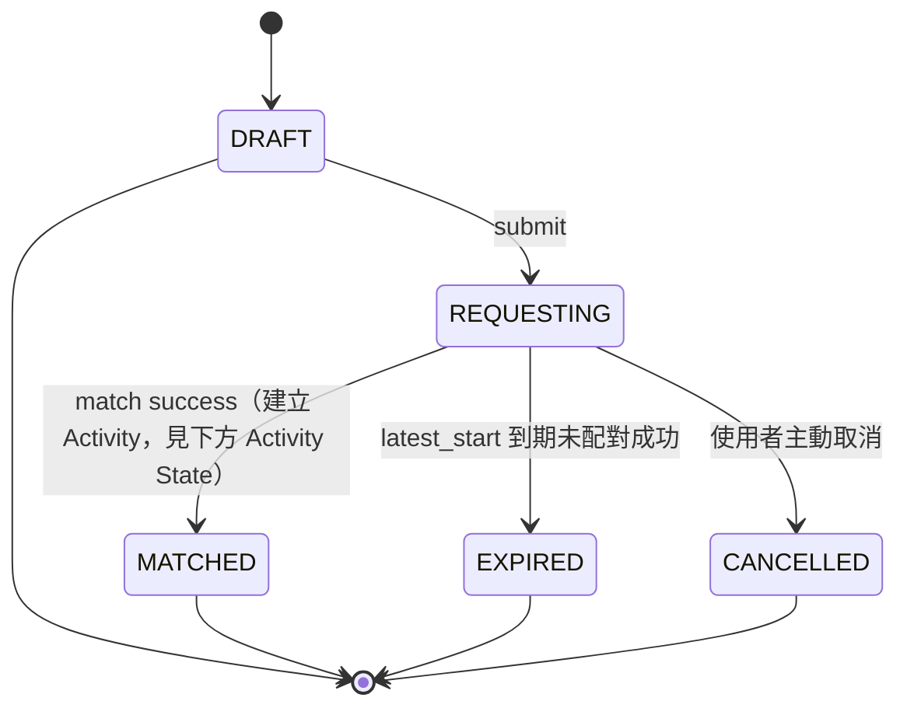
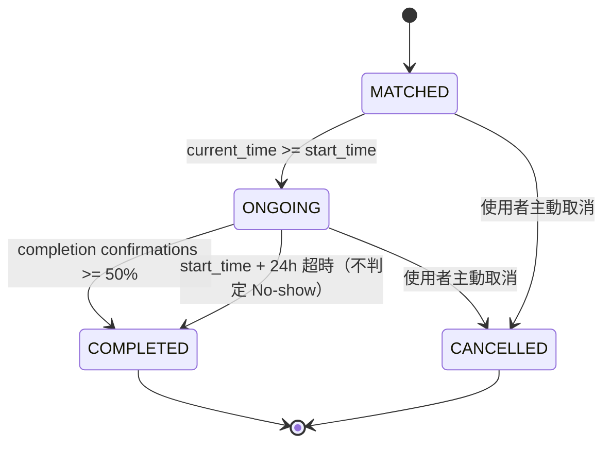

# 校園活動配對 App — 產品規格書 (Spec v1.3 / Repo 首版)

> 本文件用途：作為 repo 的第一份文件，是團隊所有產品／資料模型決策的唯一真相來源（single source of truth）。後續 ERD 圖、State Machine 圖、API endpoint spec 都應該從這份文件推導，不應該與本文件衝突；若有衝突，先回來改這份文件，再改下游文件。
>
> 標記說明：🟢 已拍板決策　🔴 仍開放、不卡 schema、可平行進行

> **v1.1 變更紀錄**（畫 ERD 前的 schema 微調，不改產品邏輯）：
> 1. `MatchRequest.member_ids[]` 拆成獨立的 `RequestMember` join table（見第 6 節）
> 2. `Activity.matched_request_ids[]` / `final_member_ids[]` 拆成獨立的 `ActivityMember` join table（見第 9 節）
> 3. State Machine 拆成 `MatchRequest` 與 `Activity` 兩張獨立的狀態圖，不再混用（見第 9 節）
> 4. Reliability 新增 `UserReliabilityEvent` 事件表作為資料來源，分數改為即時 query、不直接存欄位（見第 12 節）
> 5. 修正 `contact_visible_until` 的起算點：以 **Activity** 的 `created_at` 為準，不是來源 `MatchRequest` 的 `created_at`（見第 9 節）

> **v1.2 變更紀錄**（服務範圍擴至清交雙校，核心模型不動）：
> 1. MVP 範圍：僅限 NYCU → **NYCU + NTHU**（見第 1 節）
> 2. `User` 新增 `school` 欄位（`NYCU`/`NTHU`），由信箱網域自動判定、不讓使用者自選（見第 2 節）
> 3. Matching：MVP 配對池以 `school` 隔離，跨校配對保留為 future feature（見第 7 節）
> 4. `Location` 增加 `school` 歸屬，地點清單依校分列（見第 1、16 節）

> **v1.3 變更紀錄**（個人資料補充欄位）：
> 1. `User` 新增 `bio`（自我介紹）欄位，**選填**，純展示用、不進配對邏輯、不卡註冊門檻（見第 2 節）

---

## 0. 產品原則（所有取捨的判準）

> 所有 MatchRequest 必須在建立後 24 小時內開始。產品專注於解決「臨時想做一件事卻找不到人」的問題，而非活動規劃或長期揪團。任何超過 24 小時的活動需求，應由 LINE 群組、社團、Google Calendar 等工具處理，而不是本產品要解決的問題。

補充原則：
- **找一起做事的人，不是找對象。** 活動先發生，關係自然形成；認識人是副產品，不是目的。
- 不做站內聊天室、不做好友系統、不做性別篩選導向設計。
- MVP 階段，產品最大風險是「有沒有人用」，不是「scale 撐不撐得住」——所有技術選型以「快速驗證」為最高優先。

---

## 1. MVP 範圍

| 項目 | 範圍 |
|---|---|
| 學校 | NYCU（陽明交大）+ NTHU（清大）；配對池同校隔離，跨校配對為 future feature（見第 7 節） |
| 活動類型 | 預設 4 種起（籃球🏀／咖啡☕／散步🚶／讀書📚），使用者可新增，見第 5 節 |
| 身份驗證 | 學校專屬網域信箱（`@nycu.edu.tw` / `@nthu.edu.tw`，非泛用 `.edu.tw` 後綴；`school` 依網域自動判定）+ OTP（不做正式 CAS 串接） |
| 個人資料門檻 | 頭像照片 + 至少 1 項外部聯絡方式（IG/LINE/Discord 擇一）**註冊時強制必填**，未填無法發起/加入 Request（見第 2 節） |
| 新人配對資格 | 🔴 New 等級使用者不能直接發起/加入低人數（`required_total ≤ 2`）的 Request，須先完成 ≥1 次多人活動解鎖（見第 12 節） |
| 地點 | 固定下拉清單，依 `school` 分列（NYCU/NTHU 各自清單），不開放自由輸入（清單內容平行填充，不卡 schema） |
| 聯絡方式 | Activity 生成即顯示，24 小時後失效（起算點是 Activity 的建立時間，不是 Request 的），雙方按「再約」才永久保留 |
| 好友系統 | 無。用「再約」機制取代 |
| 聊天室 | 無 |

---

## 2. 使用者與身份驗證

- v1：驗證信箱網域為 **`@nycu.edu.tw` 或 `@nthu.edu.tw`**（僅檢查 `.edu.tw` 後綴並不足夠——台灣多所大專院校信箱都是 `xxx.edu.tw`，學校名稱通常接在 `edu` 之前；須完整比對雙校專屬網域，避免其他學校信箱誤通過驗證）+ OTP
- 🟢 **`school` 欄位（`NYCU`/`NTHU`）由信箱網域自動判定，不讓使用者自選**：`nycu.edu.tw → NYCU`、`nthu.edu.tw → NTHU`。學校身份是驗證的產物，不是使用者輸入的資料
- 未來：視用量評估是否申請串接學校 CAS（Apereo CAS），MVP 階段不作為前提
- 🟢 **個人資料硬性門檻**：頭像照片 + 至少 1 項外部聯絡方式（IG/LINE/Discord 擇一即可）皆改為**註冊時強制必填**，不是配對成功後才補——未填寫者無法發起或加入 Request。理由：舊設計是配對成功才顯示聯絡方式，若那時才發現對方什麼都沒填，配對已經成立、太尷尬也太晚；提前卡在門檻能篩掉「什麼都不留」的空殼帳號
- 此門檻僅作**基礎過濾**（擋掉完全不想留任何聯絡方式的人），不是主要安全防線；真正的安全防線是第 12 節的 Reliability 分級配對資格限制，因為「有沒有留 IG」是填了就算數、無法驗證真假的資訊，「有沒有真的出席過活動」才是扎實信號
- 性別欄位：保留、僅作個人資料展示與安全感資訊，**不進入配對核心邏輯**（不可用於篩選）
- 🟢 **`bio`（自我介紹）欄位，選填**：短文字，讓對方在配對成立後多一點資訊判斷「這是不是我想約的人」（例如「研究所碩一，平常喜歡打球、看電影」）。跟性別欄位同等級——僅展示，**不進入配對核心邏輯**，也不列入註冊硬性門檻（不像頭像/聯絡方式會卡住 Request 發起/加入）

---

## 3. 核心流程總覽

```
使用者建立 MatchRequest（選預設時段桶，非自由時間選擇器）
        ↓
進入對應 ActivityType 的 Queue
        ↓
Matching Engine 定期掃描，依時間窗重疊 + 地點相同 + 類型相同 做 Merge
        ↓
達成條件 → 生成 Activity（聯絡方式立即顯示，24h 後失效）
        ↓
start_time 到 → ONGOING
        ↓
完成確認（多數決）或 24h 超時 → COMPLETED
        ↓
雙方可選「再約」→ 永久保留聯絡方式；Reliability 依出席／取消／No-show 更新
```

---

## 4. 預設時段桶

不開放自由時間選擇器，改用固定桶，理由：(1) 24 小時的產品邊界本身就在防止滑向長期揪團；(2) 集中流動性到離散時段，同一桶內的人天然聚在同一配對池，配對成功率比連續時間軸上的自由選擇高。

| 桶 | 換算區間 |
|---|---|
| 🔥 現在 | now ~ now+30分鐘 |
| ⏰ 今天 | now ~ min(今日23:59, created_at+24h) |
| 🌙 今晚 | 今日 18:00 ~ 24:00 |
| 🌅 明天上午 | 明日 06:00 ~ 12:00 |

- 桶依建立當下時間**動態顯示**：與「現在」重疊不足 30 分鐘的桶不顯示（如晚上 11 點開 App，「今晚」自動隱藏）
- 桶是 UI 層包裝，選完仍換算成具體 `earliest_start`/`latest_start`，Matching Engine 邏輯不變

---

## 5. ActivityType（活動類型）

- 使用者可新增類型，流程：**關鍵字黑名單預檢 → PENDING → admin 審核 → APPROVED 才公開**（先防爆炸，避免違規詞彙哪怕短暫上線就造成截圖傷害）
- 已上線（APPROVED）的類型仍保留事後檢舉機制：Report → Review → Remove/限制帳號
- 新增類型前做**既有類型的模糊比對/autocomplete 提示**（如「羽球」vs「羽毛球」），減少重複類型稀釋配對池，MVP 不用做重，能擋掉大部分重複即可
- `default_duration` 由 admin 審核通過時設定；**null 時 fallback = 60 分鐘**（SYSTEM_DEFAULT_DURATION），之後依資料調整

```
ActivityType
- id, name, default_duration (nullable), status(PENDING/APPROVED/REJECTED), created_by, created_at
```

---

## 6. MatchRequest

🟢 **`member_ids[]` 不直接存成 array。** Supabase PostgreSQL 雖然支援 array，但後續查詢（「哪些 Request 還缺 N 人」「某使用者參加過哪些 Request」）在 array 上會很痛，改用 join table：

```
MatchRequest
- id
- owner_id
- activity_type_id
- campus_location_id
- acceptable_location_ids[]  # v1 只填 1 個，欄位預留未來多選
- earliest_start, latest_start   # 硬約束：≤ created_at + 24h，UI 層擋掉超範圍輸入
- flexible_minutes           # v1 固定 0，欄位預留
- required_total
- allow_downgrade(bool)
- status(DRAFT/REQUESTING/MATCHED/EXPIRED/CANCELLED)   # ONGOING/COMPLETED 移到 Activity，見第 9 節
- created_at

RequestMember              # 取代 member_ids[]；已組好的朋友直接放同一 Request，不做獨立 FriendGroup 表
- id
- request_id
- user_id
- role(owner/member)
- status
- created_at
```

拆成 join table 後，owner consent（第 8 節 `DowngradeConsent`）、member consent、Reliability 事件、CompletionReport 的參與者都能溯源到這裡，不用另外猜資料從哪來。

**限制**：
- 同一使用者同時只能有一個 `REQUESTING` 狀態的 Request（以 `owner_id` 判定）；`MATCHED` 之後不受此限制（已非等待中的資源）
- `campus_location_id` 必須屬於 owner 的 `school`——這是配對池同校隔離（第 7 節）的落地點

---

## 7. Matching Engine 規則

| 規則 | 說明 |
|---|---|
| 時間窗重疊 | 兩個 Request 的 `[earliest_start, latest_start]` 有交集即可 merge |
| 地點 | 必須 `campus_location_id` 完全相同 |
| 類型 | 必須相同 `activity_type_id` |
| 學校 | 🟢 MVP 配對池以 `school` 隔離，僅同校可 merge；由「地點必屬 owner 的 school」+「地點必須完全相同」兩條規則天然保證，引擎不需額外判斷 |
| 人數超額 | 優先填滿 `required_total`；多出的人保留原 Request，繼續進入下一輪撮合 |
| 未湊滿 | 到 `latest_start` 仍未滿 → 若 `allow_downgrade=true` 觸發降門檻流程（見第 8 節）；否則 → `EXPIRED` |
| 新人配對資格 | `required_total ≤ 2` 的 Request，🔴 New 等級使用者不能發起也不能加入；細節與理由見第 12 節 |

架構上用 **Queue**（依 activity_type 分流）解耦候選池與配對演算法，未來換演算法不需動 Request/Activity 結構。

**跨校配對 = future feature，不關死但 MVP 不開**：清交不是一般的兩間大學——同一生活圈、本來就大量跨校活動，「臨時想做一件事找不到人」在雙校情境其實更成立，所以長期不把跨校關死（候選形態：跨校 fallback matching，同校池找不到人時才擴大範圍）。但 MVP 不一次打開跨校時間、跨校地點、安全感、配對權重四個變數——v1 先同校池，拿雙校的冷啟動優勢，不炸開核心模型。

---

## 8. Downgrade（降門檻）流程

- **owner 一人不能決定**：若 Request 有多個 `RequestMember`，需 owner + 所有已確認成員同意
- 同意窗口 `CONSENT_WINDOW = 10 分鐘`，超時未回應 = 視為拒絕
- **拒絕或超時 → Request 退回 `REQUESTING` 重新進池**（用原本 `required_total` 繼續找人），不是直接 `CANCELLED`
- **若剩餘時間 < 10 分鐘窗口，不發起降門檻詢問**，直接讓 Request 自然流向 `EXPIRED`（避免兩個計時器互相打架）

```
DowngradeRequest
- id, request_id, target_size, expire_at, status(PENDING/APPROVED/REJECTED/TIMEOUT)

DowngradeConsent
- downgrade_request_id, user_id, response(agree/disagree/no_response), responded_at
# 需要同意的成員名單 = 該 request_id 對應的 RequestMember（第 6 節），不用另外維護一份
```

---

## 9. Activity 與 State Machine

🟢 **`matched_request_ids[]` / `final_member_ids[]` 也不存 array，理由同第 6 節。** 而且未來一定會問「小明是從哪個 Request 併進來的」（例如 A request 3 人 + B request 2 人 merge 成 Activity 5 人，需要知道每個人的來源），array 答不了這個問題，改用 join table：

```
Activity  （僅 merge 成功時產生）
- id, activity_type_id, campus_location_id, start_time,
  estimated_end_time (= start_time + activity_type.default_duration),
  status(MATCHED/ONGOING/COMPLETED/CANCELLED),
  contact_visible_until (= 【本 Activity 的】created_at + 24h),
  created_at

ActivityMember              # 取代 matched_request_ids[] / final_member_ids[]
- activity_id
- user_id
- source_request_id         # 追溯這個人是從哪個 MatchRequest 併進來的
- status
```

🟢 **`contact_visible_until` 修正**：起算點是 **Activity 自己的** `created_at`，不是來源 `MatchRequest` 的 `created_at`。Activity 是 match 成功後才產生的，如果誤用 Request 的 `created_at`，一個放了 20 小時才配對成功的 Request，聯絡方式就只剩 4 小時可見，不符合「配對成立後聯絡方式完整可見 24 小時」的產品意圖。

### State Machine

🟢 **拆成兩張獨立的狀態圖，不再混用**：原本 `MatchRequest` 的狀態（DRAFT/REQUESTING/…）和 `Activity` 的狀態（MATCHED/ONGOING/COMPLETED）混在同一張圖裡，但它們是兩個不同的東西——`MatchRequest` 只代表「找人的流程」，`Activity` 才代表「實際發生的活動」。

**MatchRequest State**（找人的流程）：



**Activity State**（實際活動）：



兩者的銜接：`MatchRequest.REQUESTING` 配對成功時，`MatchRequest.status` 定格在 `MATCHED`（找人流程結束），同時建立一筆 `Activity`（狀態從 `MATCHED` 開始跑自己的生命週期）。配對成立後的取消/進行中/結束，都是 `Activity` 的狀態變化，不再回頭改 `MatchRequest`。

**轉移觸發條件**：
- `MATCHED → ONGOING`：時間觸發，`current_time ≥ start_time`，不用人工按開始
- `ONGOING → COMPLETED`：完成確認回報達 ≥50% 參與者（法定人數門檻）即轉；若一直沒人回報，`start_time + 24h` 自動轉 COMPLETED 且不做任何 No-show 判定

---

## 10. 完成確認與 No-show 判定

放棄「雙方互相 Check-in」（判定權落在使用者手上、易操縱），改為：

- 活動結束後跳出三選一：✅ 有順利進行／❌ 對方沒來（需指認）／⚪ 我自己取消了
- **法定人數門檻**：≥50% 參與者回報，判定才生效；未達門檻不判定任何人
- 被半數以上回報「沒來」→ 記 1 次 No-show
- **2 人活動特例**：雙方互咬（各說對方沒來）→ 不判，雙方都不計入記錄

處罰分級：
| 行為 | 定義 | 處罰 |
|---|---|---|
| 提前取消 | 開始前 ≥1 小時主動取消 | 不計入記錄 |
| 臨時取消 | 開始前 <1 小時取消 | 記 1 次「取消」 |
| No-show | 完全沒出現（多數決判定） | 記 1 次，權重更重 |

連續 3 次 No-show → 停權 7 天。

```
CompletionReport
- activity_id, reporter_id, result(went_well/reported_absent/self_cancelled), absent_user_ids[]
# reporter_id / absent_user_ids 皆限定在該 activity_id 對應的 ActivityMember（第 9 節）名單內
```

---

## 11. 聯絡方式交換

- 各參與者的 IG/LINE/Discord 已於**註冊時強制填寫**（見第 2 節，至少 1 項），配對成立前不對外顯示；Activity 生成即顯示（各自選擇公開哪個）
- 24 小時後自動從 App 內失效
- 活動結束後雙方都按「👍 再約」→ 永久保留

```
RematchVote
- activity_id, from_user_id, to_user_id, voted_at
```

---

## 12. Reliability（可信度）

- 不顯示百分比、不做五星評價、不做留言評論
- 分級顯示：🟢 Trusted　🟡 Normal　🔴 New
- 底層用近 30 天赴約/取消/No-show 資料計算，展示層收斂成三級
- 冷啟動平滑：樣本數 <5 次顯示「New」，達門檻後依滾動資料判定等級

🟢 **資料來源新增 `UserReliabilityEvent` 事件表，分數不直接存欄位、改成即時 query。** 原本 `CompletionReport`（第 10 節）只記錄「結果」，答不了「誰取消、提前多久」這種需要 audit 的問題；`UserReliabilityEvent` 補上這一層：

```
UserReliabilityEvent
- id, user_id, activity_id
- event_type(ATTENDED/EARLY_CANCEL/LATE_CANCEL/NO_SHOW)
- created_at
```

Reliability 等級（🟢/🟡/🔴）由近 30 天的 `UserReliabilityEvent` 即時 query 算出，不另外存一個分數快取欄位（避免資料跟事件來源不同步）。第 12.1 節「尚未完成過任何一次活動」= 該使用者沒有任何 `ATTENDED` 事件。

### 12.1 新人配對資格限制（低人數場合的安全防線）

人少的場合（如一對一散步）對安全性的要求比多人局更高。這個防線**不另外發明新機制**，直接把既有的 Reliability 分級多用一層：

- 🟢 **🔴 New 等級（尚未完成過任何一次活動）的使用者，不能直接發起或加入 `required_total ≤ 2` 的 Request**；第一次活動必須是多人局（如籃球 6 人局）
- 完成至少 1 次多人活動、累積出席紀錄後，才解鎖 1 對 1 配對資格；同時等級也會依表現有機會晉升為 🟡 Normal
- 設計理由：安全把關不能靠「有沒有留 IG 這種填了就算數、無法驗證真假的東西」（見第 2 節個人資料門檻，那只是基礎過濾），而要靠「這個人有沒有真的出席過、被別人驗證過是真人」這種更扎實的信號——這正是 Reliability 系統本來就在算的東西，不用重造
- 🔴 `required_total ≤ 2` 的門檻定義為「低人數」的具體切點，可能需依實際新人事故率調整，見第 16 節開放問題
- **與 Downgrade 流程的邊界**：此限制只在 Request **建立/加入當下**檢查 `required_total`；若一個多人 Request 事後透過 Downgrade（見第 8 節）縮編到 ≤2 人，池中原本合規加入的 New 等級成員不會被追溯剔除，避免懲罰已經照規矩排隊的使用者

---

## 13. 技術架構

| 層 | 選型 |
|---|---|
| 行動端 | Flutter |
| 後端 | Supabase（Auth / PostgreSQL / Realtime / Storage） |
| 通知 | Firebase Cloud Messaging |
| 地圖 | Google Maps API |

MVP 階段不自建後端；等真實用量起來（校園爆量、Realtime connection 成本可觀測）再評估是否拆分。

---

## 14. KPI

1. Match Success Rate（配對成功率）
2. Time to Match：中位數（典型體驗）+ P90（最差 10% 使用者等多久，量夠大後設為主要 KPI）
3. No-show Rate
4. Repeat Match Rate（30 天內再次建立 Request 的比例，驗證「配對後真的還想再約」）

---

## 15. 已知風險（先接受，不在 v1 解決）

1. 聯絡方式收割：有心人持續加入配對拿聯絡方式後不出現，唯一防線是連續 3 次 No-show 停權，防不住頻繁切換小號行為
2. 小群體多數決操縱：如 3 人活動中 2 人合謀誤判 1 人，法定人數門檻能緩解但不能杜絕

---

## 16. 開放問題（不卡 schema，可平行進行）

1. 新增活動類型的審核 SOP 細節（黑名單詞庫、admin 角色分工）
2. Realtime 並發上限與成本——需實測，非討論可定
3. 冷啟動種子使用者渠道（社團/系學會/校內二手拍平台合作）
4. 實際地點清單內容，依校分列（NYCU：光復籃球場／工程館／浩然／女二／竹湖…；NTHU：風雲球場…）
5. NotificationEvent 完整事件清單（已知會用到：MATCH_SUCCESS／DOWNGRADE_REQUEST／DOWNGRADE_RESULT／ACTIVITY_REMINDER／COMPLETE_CONFIRMATION，細節待補）
6. 隱私權政策文件（收集資料種類、聯絡方式用途、刪除帳號流程、第三方服務 Supabase 揭露）—— 上架前必須補齊
7. 新人配對資格限制的 `required_total ≤ 2`「低人數」切點是否需要涵蓋 3 人局，待依實際新人事故率評估調整（見第 12.1 節）

---

## 17. Roadmap / 下一步

1. ✅ Spec 定案（本文件）
2. ✅ ERD，共 13 張表：User / ActivityType / Location / MatchRequest / RequestMember / Activity / ActivityMember / DowngradeRequest / DowngradeConsent / CompletionReport / UserReliabilityEvent / RematchVote / Notification → [ERD.md](ERD.md)
3. ✅ State Machine diagram（第 9 節核心版本 + 完整轉移觸發條件表）→ [STATE_MACHINE.md](STATE_MACHINE.md)
4. ✅ Supabase migration（enum 來自 State Machine 定案值域）→ [migrations/](migrations/)
5. ✅ API endpoint spec（建立在 ERD 定案之上）→ [API.md](API.md)
6. 🔲（平行進行）地點清單內容、Notification 事件細節、隱私權政策文件
7. 🔲 User Flow + Wireframe
8. 🔲 10–20 位清交學生訪談（兩校都要有），驗證配對流程是否真的比「LINE 群組揪人」更方便
