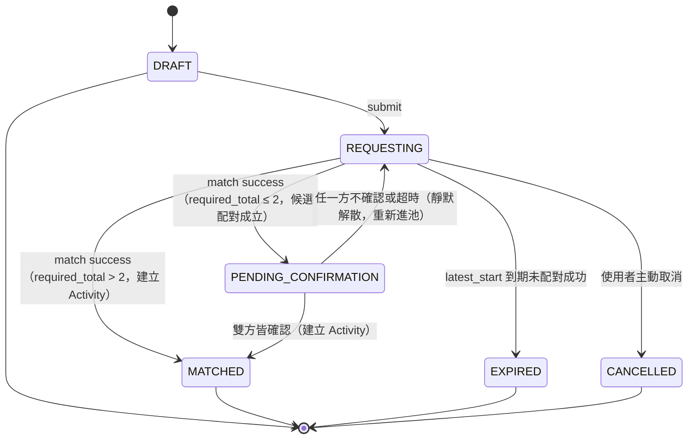
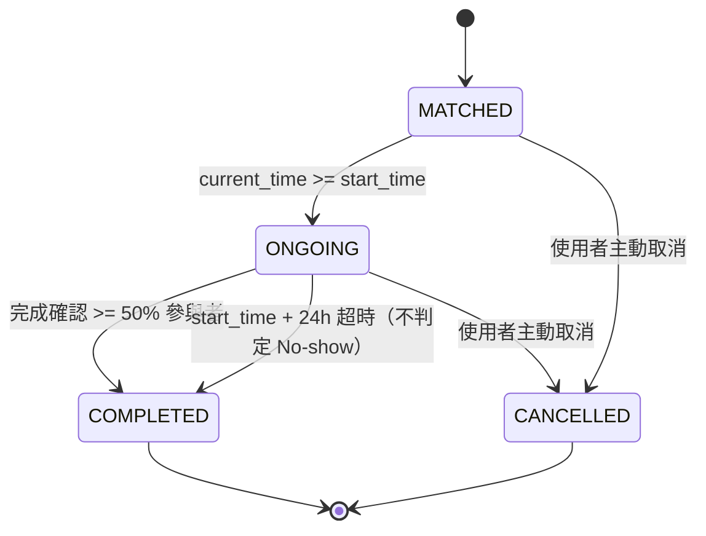

# State Machine — 校園活動配對 App（派生自 SPEC v1.4）

> 本文件由 [SPEC.md](SPEC.md) §9、§12.1 推導。**狀態值域已在 [ERD.md](ERD.md) 定案**（`request_status`、`activity_status`），本文件不新增狀態，價值在於補齊每條轉移的**觸發條件**：誰觸發（使用者／Matching Engine／排程）、什麼條件下觸發、伴隨哪些副作用。

兩張圖的分界（SPEC v1.1 變更 3）：`MatchRequest` 只代表「找人的流程」，`Activity` 才代表「實際發生的活動」。配對成功時 `MatchRequest` 定格在 `MATCHED`，同時建立 `Activity` 跑自己的生命週期，之後不再回頭改 `MatchRequest`。

---

## 1. MatchRequest State（找人的流程）



### 轉移條件表

| # | 轉移 | 觸發者 | 條件 | 副作用 |
|---|---|---|---|---|
| R1 | `[*] → DRAFT` | 使用者 | ① 通過個人資料硬性門檻（頭像 + ≥1 聯絡方式，SPEC §2）② `campus_location_id` 屬於 owner 的 `school`（同校池隔離的落地點，SPEC §6/§7） | 建立 `match_request` + owner 的 `request_member(role=OWNER)` |
| R2 | `DRAFT → REQUESTING` | 使用者按送出 | ① owner 沒有其他 `REQUESTING` 中的 Request（partial unique index 擋）② `latest_start ≤ created_at + 24h` ③ 若 `required_total ≤ 2`：owner 與所有成員皆非 🔴 New 等級（SPEC §12.1，等級由 `user_reliability_event` 即時 query） | Request 進入對應 `activity_type` 的 Queue |
| R3a | `REQUESTING → MATCHED` | Matching Engine（定期掃描） | 時間窗重疊 + `campus_location_id` 相同 + `activity_type_id` 相同的 Request 組合能填滿 `required_total`（SPEC §7；同校隔離由 R1 的地點檢查 + 地點完全相同天然保證，引擎不另判 school），且 `required_total > 2`；或 Downgrade 核准後以 `target_size > 2` 成立 | **建立 `activity`**（狀態從 `MATCHED` 起跑）+ 全體成員的 `activity_member(source_request_id=本 Request)` + 發 `MATCH_SUCCESS` 通知；人數超額時多出的人保留原 Request 繼續下一輪 |
| R3b | `REQUESTING → PENDING_CONFIRMATION` | Matching Engine（定期掃描） | 同 R3a 的配對條件，但 `required_total ≤ 2`（或 Downgrade 核准後 `target_size ≤ 2`）；雙方皆非 🔴 New 等級已於 R2 檢查過，此處不重複擋（SPEC §12.1.1：Downgrade 事後降到 ≤2 人不追溯剔除） | 建立 `pending_confirmation(request_a_id, request_b_id, confirm_window_expire_at = now + 10min CONFIRM_WINDOW)`；向雙方發送確認通知，展示安全資訊卡（SPEC §12.1.3）；**不**建立 Activity |
| PC1 | `PENDING_CONFIRMATION → MATCHED` | 使用者（雙方皆確認） | `pending_confirmation.user_a_response = CONFIRMED` 且 `user_b_response = CONFIRMED` | `pending_confirmation.status → CONFIRMED`；**建立 `activity`**（同 R3a 的建立邏輯）+ 發 `MATCH_SUCCESS` 通知 |
| PC2 | `PENDING_CONFIRMATION → REQUESTING` | 使用者（任一方拒絕）或排程（`confirm_window_expire_at` 超時） | 任一方 `response = DECLINED`，或超時仍有一方 `NO_RESPONSE` | `pending_confirmation.status → DECLINED`/`TIMEOUT`；寫入 `match_history_avoidance(user_a_id, user_b_id, expire_at = now + 7 天)`；雙方皆收到「此次配對未成立」通知，**不透露對方回應內容**（比照 SPEC §8 Downgrade 的不歸因原則）；Request 退回 `REQUESTING` 重新進池 |
| R4 | `REQUESTING → EXPIRED` | 排程（時間觸發） | `current_time > latest_start` 仍未成團，且無進行中的 Downgrade 流程 | 發通知告知未成團；不記任何 Reliability 事件 |
| R5 | `REQUESTING → CANCELLED` | 使用者主動取消 | 無前置條件 | Request 移出 Queue；配對成立**前**取消不寫 `user_reliability_event`（懲罰只針對已成立的活動，見 Activity A4/A5） |

### Downgrade 子流程（掛在 REQUESTING 內部，不是獨立狀態）

Downgrade（SPEC §8）不改變 `match_request.status`——整個詢問期間 Request 停留在 `REQUESTING`：

| 情境 | 行為 |
|---|---|
| 到 `latest_start` 前未滿員且 `allow_downgrade=true` 且剩餘時間 ≥ 10 分鐘 | 建立 `downgrade_request(expire_at = now + 10min)`，向所有 `request_member` 發 `DOWNGRADE_REQUEST` 通知 |
| 全員 `AGREE`（10 分鐘內） | `downgrade_request → APPROVED`，Matching Engine 以 `target_size` 重新撮合 → 依人數走 R3a 或 R3b |
| 任一人 `DISAGREE` | `downgrade_request → REJECTED`，Request 以原 `required_total` 留在池中繼續找人 |
| 超時未全員回應 | `downgrade_request → TIMEOUT`，效果同 REJECTED（超時 = 視為拒絕） |
| 剩餘時間 < 10 分鐘 | **不發起**降門檻詢問，讓 Request 自然走 R4 → `EXPIRED`（避免兩個計時器互相打架） |

---

## 2. Activity State（實際活動）



### 轉移條件表

| # | 轉移 | 觸發者 | 條件 | 副作用 |
|---|---|---|---|---|
| A1 | `[*] → MATCHED` | Matching Engine（= R3a 的另一面）或使用者雙方確認（= PC1 的另一面） | merge 成功且 `required_total > 2` 直接達標，或 `required_total ≤ 2` 經 `PENDING_CONFIRMATION` 雙方確認 | 設定 `contact_visible_until = 本 activity.created_at + 24h`（**不是** Request 的 created_at，SPEC v1.1 變更 5）；聯絡方式立即對成員互相顯示 |
| A2 | `MATCHED → ONGOING` | 排程（時間觸發） | `current_time ≥ start_time`，**不用人工按開始** | 無 |
| A3 | `ONGOING → COMPLETED` | 系統（由回報驅動） | `completion_report` 回報數 ≥ 50% 參與者（法定人數門檻） | 結算多數決：被半數以上回報「沒來」者記 `NO_SHOW`；正常出席者記 `ATTENDED`；**2 人活動互咬特例**：雙方各說對方沒來 → 不判、雙方都不記事件。結算後檢查「連續 3 次 No-show」→ 是則寫 `app_user.suspended_until = now + 7 天` |
| A4 | `ONGOING → COMPLETED` | 排程（時間觸發） | `start_time + 24h` 仍未達回報門檻 | 自動轉 COMPLETED，**不做任何 No-show 判定**、不記任何事件（未達法定人數不判任何人） |
| A5 | `MATCHED → CANCELLED` | 使用者主動取消 | 個別成員取消：`activity_member.status → CANCELLED`；全體取消或人數跌破可成行下限時整個 Activity → `CANCELLED` | 依取消時點記 `user_reliability_event`：開始前 ≥1h → `EARLY_CANCEL`（不計入記錄）；<1h → `LATE_CANCEL`（記 1 次取消） |
| A6 | `ONGOING → CANCELLED` | 使用者主動取消 | 同 A5，發生在進行中 | 同 A5 的 `LATE_CANCEL` 處理（開始後取消必然 <1h 前） |

### 完成確認三選一（SPEC §10）與事件對映

| 回報選項 | `completion_result` | 結算時產生的 `reliability_event_type` |
|---|---|---|
| ✅ 有順利進行 | `WENT_WELL` | 出席者記 `ATTENDED` |
| ❌ 對方沒來（需指認 `absent_user_ids`） | `REPORTED_ABSENT` | 被半數以上指認者記 `NO_SHOW`（權重最重） |
| ⚪ 我自己取消了 | `SELF_CANCELLED` | 依時點記 `EARLY_CANCEL` / `LATE_CANCEL` |

---

## 3. 兩張圖的銜接（唯一的跨圖箭頭）

```
MatchRequest.REQUESTING ──(R3a match success，required_total>2)──► MatchRequest.MATCHED（定格，流程結束）
                                   │
                                   └──► 建立 Activity（A1，從 MATCHED 起跑）

MatchRequest.REQUESTING ──(R3b match success，required_total≤2)──► MatchRequest.PENDING_CONFIRMATION
                                   │
                                   ├──(PC1 雙方確認)──► MatchRequest.MATCHED ──► 建立 Activity（A1）
                                   └──(PC2 任一方拒絕/超時)──► MatchRequest.REQUESTING（重新進池，不歸因）
```

配對成立後的一切變化（取消、進行、結束、完成確認、Reliability 事件）都發生在 `Activity` 側，`MatchRequest` 永遠停在終態。`PENDING_CONFIRMATION` 是 `MatchRequest` 側的暫留態，不屬於 `Activity`——只有 PC1 成功後才建立 `Activity`。這條規則同時是 API 設計的邊界：操作「找人流程」的 endpoint 只動 `match_request`（含 `pending_confirmation`），操作「活動」的 endpoint 只動 `activity`（見 [API.md](API.md)）。
