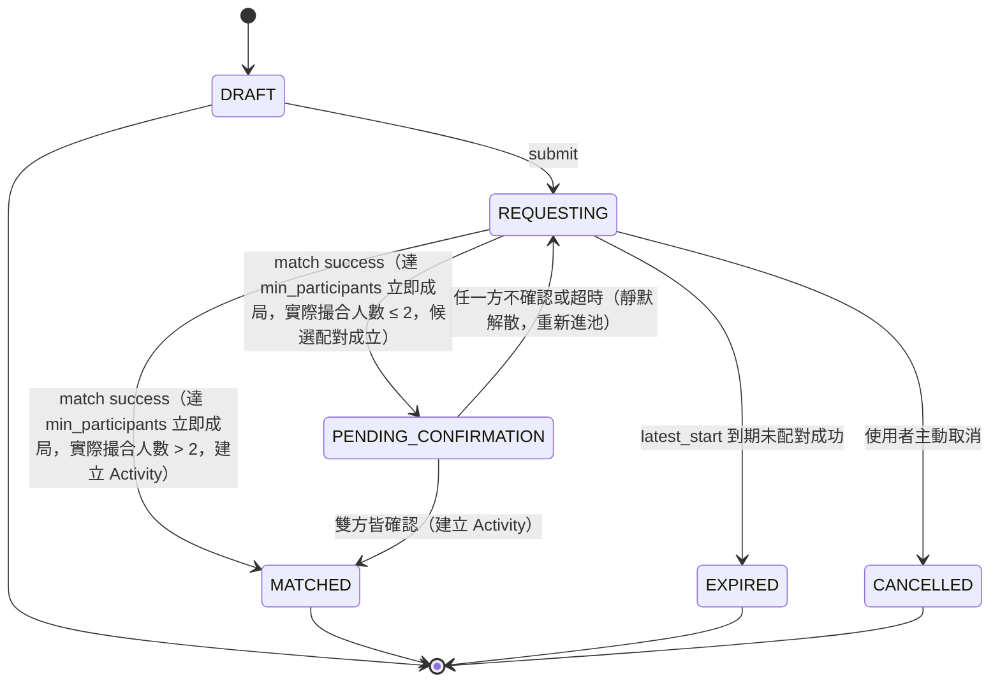
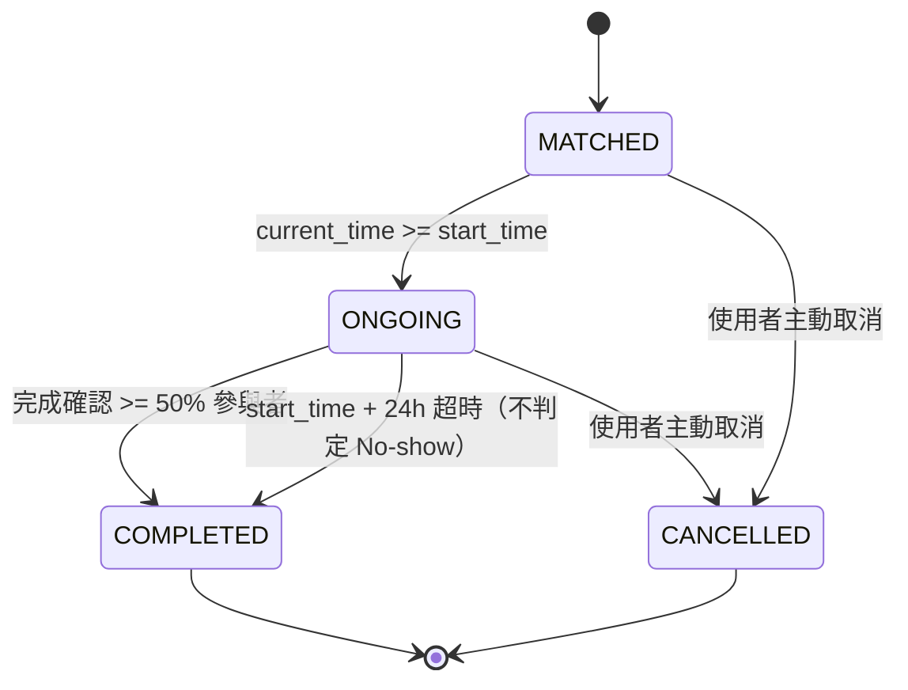

# State Machine — 校園活動配對 App（派生自 SPEC v1.14）

> 本文件由 [SPEC.md](SPEC.md) §6.2、§7、§8、§9、§12.1 推導。**狀態值域已在 [ERD.md](ERD.md) 定案**（`request_status`、`activity_status`），本文件不新增狀態，價值在於補齊每條轉移的**觸發條件**：誰觸發（使用者／Matching Engine／排程）、什麼條件下觸發、伴隨哪些副作用。

兩張圖的分界（SPEC v1.1 變更 3）：`MatchRequest` 只代表「找人的流程」，`Activity` 才代表「實際發生的活動」。配對成功時 `MatchRequest` 定格在 `MATCHED`，同時建立 `Activity` 跑自己的生命週期，之後不再回頭改 `MatchRequest`。

---

## 1. MatchRequest State（找人的流程）



### 轉移條件表

| # | 轉移 | 觸發者 | 條件 | 副作用 |
|---|---|---|---|---|
| R1 | `[*] → DRAFT` | 使用者 | ① 通過個人資料硬性門檻（頭像 + ≥1 聯絡方式，SPEC §2）② **（v1.11）** `campus` 屬於 owner 的 `school` 底下至少一筆已核准的地點（同校池隔離的落地點，SPEC §6/§7；取代 v1.10 及之前版本「`campus_location_id` 屬於 owner 的 `school`」，否則回 `INVALID_CAMPUS_SCOPE`） | 建立 `match_request` + owner 的 `request_member(role=OWNER)` |
| R2 | `DRAFT → REQUESTING` | 使用者按送出 | `submit_request` 依 SPEC §6.3 定案的固定順序檢查：① `UNAUTHORIZED` ② `USER_SUSPENDED` ③ `PROFILE_INCOMPLETE` ④ *(結構性：載入 Request 本體)* `NOT_FOUND`/`REQUEST_NOT_OPEN` ⑤ **owner 名下無任何 `MATCHED`/`ONGOING` 狀態的 Activity**（v1.7 新增，否則 `ACTIVE_ACTIVITY_IN_PROGRESS`）⑥ **`app_user.next_request_allowed_at` 未設定或已過期**（v1.7 新增，否則 `REQUEST_COOLDOWN_ACTIVE`）⑦ owner 沒有其他 `REQUESTING` 中的 Request（partial unique index 擋，否則 `ALREADY_REQUESTING`）⑧ `latest_start ≤ created_at + 24h`（否則 `WINDOW_EXCEEDS_24H`）⑨ 若 `min_participants ≤ 2`：owner 與所有成員皆非 🔴 New 等級（否則 `NEW_USER_LOW_HEADCOUNT`，SPEC §12.1，等級由 `user_reliability_event` 即時 query） | Request 進入對應 `activity_type` 的 Queue |
| R3a | `REQUESTING → MATCHED` | Matching Engine（定期掃描） | 時間窗重疊 + **（v1.11）`(school, campus)` 相同**（取代 v1.10 及之前版本「`campus_location_id` 相同」，不再要求精確地點完全相同）+ `activity_type_id` 相同 + **（v1.34）`skill_level` 相容**（`fn_skill_level_match`：null=wildcard，否則需相等）+ **（v1.35）`study_target_normalized` 相容**（null=wildcard，否則需正規化後完全相同；僅讀書類型會非 null）的 Request 組合，候選池**達到 `min_participants` 立即成局**（貪婪策略，不等待湊到 `max_participants`，見 SPEC §7；同校隔離由 R1 的 campus 檢查 + `(school, campus)` 相同天然保證，引擎不另判 school），且**本次實際撮合人數 > 2**；或 Downgrade 核准後以 `target_size > 2` 成立 | **建立 `activity`**（狀態從 `MATCHED` 起跑，`school`/`campus` 複製自來源 Request，`activity_location_id` 留 `NULL`）+ 全體成員的 `activity_member(source_request_id=本 Request)` + 發 `MATCH_SUCCESS` 通知；超過 `max_participants` 時多出的人保留原 Request 繼續下一輪 |
| R3b | `REQUESTING → PENDING_CONFIRMATION` | Matching Engine（定期掃描） | 同 R3a 的配對條件（候選池達到 `min_participants` 立即成局），但**本次實際撮合人數 ≤ 2**（或 Downgrade 核准後 `target_size ≤ 2`）；雙方皆非 🔴 New 等級已於 R2 檢查過，此處不重複擋（SPEC §12.1.1：Downgrade 事後降到 ≤2 人不追溯剔除） | 建立 `pending_confirmation(request_a_id, request_b_id, confirm_window_expire_at = now + 10min CONFIRM_WINDOW)`；向雙方發送確認通知，展示安全資訊卡（SPEC §12.1.3）；**不**建立 Activity |
| PC1 | `PENDING_CONFIRMATION → MATCHED` | 使用者（雙方皆確認） | `pending_confirmation.user_a_response = CONFIRMED` 且 `user_b_response = CONFIRMED` | `pending_confirmation.status → CONFIRMED`；**建立 `activity`**（同 R3a 的建立邏輯）+ 發 `MATCH_SUCCESS` 通知 |
| PC2 | `PENDING_CONFIRMATION → REQUESTING` | 使用者（任一方拒絕）或排程（`confirm_window_expire_at` 超時） | 任一方 `response = DECLINED`，或超時仍有一方 `NO_RESPONSE` | `pending_confirmation.status → DECLINED`/`TIMEOUT`；寫入 `match_history_avoidance(user_a_id, user_b_id, expire_at = now + 7 天)`；雙方皆收到「此次配對未成立」通知（🟢 v1.12 起真正發送，`notification_event_type = MATCH_NOT_FORMED`，`fn_cleanup_pending_confirmations()` 此前只有文件描述，從未真的發過），**不透露對方回應內容**（比照 SPEC §8 Downgrade 的不歸因原則，payload 只帶收件者自己的 `request_id`）；Request 退回 `REQUESTING` 重新進池；**若是主動 `DECLINED`（非 `TIMEOUT`）：對該使用者寫入 `app_user.next_request_allowed_at = now() + 30 分鐘`**（v1.7 冷卻機制，SPEC §6.3，`TIMEOUT` 不觸發） |
| R4 | `REQUESTING → EXPIRED` | 排程（時間觸發，🟢 v1.12 第一次真正落地成 SQL：`fn_expire_requests()`，先前完全沒有對應函式） | `latest_start` 已過，該 Request 實際 JOINED 人數仍未達 `min_participants`，且沒有可提供的 Downgrade 機會（`allow_downgrade=false`，或已經問過一次 `REJECTED`/`TIMEOUT` 不再問第二次，或已過期太久超過 `downgrade_consent_window_minutes` 的寬限期） | 🟢 **v1.12 決定：不發通知**（跟 v1.11 之前這裡「發通知告知未成團」的文件描述不同——那從未真正實作過；EXPIRED 是被動的「什麼都沒發生」結果，不是需要打斷使用者的失敗事件，使用者下次查詢自己的 Request 會自然看到，這輪也沒有為此新增 `notification_event_type` 值的預算，見 SPEC.md v1.12 變更紀錄）；不記任何 Reliability 事件 |
| R5 | `REQUESTING → CANCELLED` | 使用者主動取消（`cancel_request`），**或 v1.14 帳號刪除**（`delete_account()`，owner 名下仍在 `DRAFT`/`REQUESTING`/`PENDING_CONFIRMATION` 的 Request 一併轉 `CANCELLED`，避免其他已加入成員卡死等一個永遠不會再回應的 owner；owner 若是非 owner 成員身分，則走 `request_member.status → LEFT`，不動 Request 本身） | 無前置條件 | Request 移出 Queue；配對成立**前**取消不寫 `user_reliability_event`（懲罰只針對已成立的活動，見 Activity A4/A5） |

### Downgrade 子流程（掛在 REQUESTING 內部，不是獨立狀態）

Downgrade（SPEC §8）不改變 `match_request.status`——整個詢問期間 Request 停留在 `REQUESTING`：

🟢 **v1.12 起第一次真正落地成 SQL**：發起（下表第一列）由 `fn_expire_requests()` 負責、超時（下表第四列）由 `fn_expire_downgrades()` 負責，此前兩者完全沒有對應函式；`respond_downgrade`（全員同意 / 任一人拒絕兩列）補上此前從未發過的 `DOWNGRADE_RESULT` 通知。注意下表掃描時機的實際落地跟本節文字略有差異：`fn_expire_requests()` 的掃描條件是 `latest_start < now()`（deadline 已過），「剩餘時間」在這裡改成判斷「deadline 過去多久」而非「距離未來還剩多少」——剛過期不久（在一個 `downgrade_consent_window_minutes` 寬限期內）才提供這次機會，詳見 API.md §9「Request 過期」列與 SPEC.md v1.12 變更紀錄。

| 情境 | 行為 |
|---|---|
| `latest_start` 已過，該 Request 實際 JOINED 人數仍未達 `min_participants`，且 `allow_downgrade=true`、算出的 `target_size = greatest(2, 實際 JOINED 人數)` 低於原 `min_participants`、且距離 `latest_start` 過期還在一個 consent window 的寬限期內、且此前從未問過 | 建立 `downgrade_request(expire_at = now + 10min)`，展開 `downgrade_consent`，向所有 `request_member` 發 `DOWNGRADE_REQUEST` 通知 |
| 全員 `AGREE`（10 分鐘內） | `downgrade_request → APPROVED`，向全體發送 `DOWNGRADE_RESULT`（`status=APPROVED`）通知；🔴 **Matching Engine 以 `target_size` 重新撮合 → 依人數走 R3a 或 R3b 目前尚未實作**（`target_size` 沒有任何程式碼實際消費，v1.12 讓 `APPROVED` 狀態第一次真的可能被產生出來，但沒有一併補上撮合引擎讀取 `target_size` 的邏輯，見 SPEC.md v1.12 變更紀錄第 9 條，留給未來獨立評估） |
| 任一人 `DISAGREE` | `downgrade_request → REJECTED`，向全體發送 `DOWNGRADE_RESULT`（`status=REJECTED`）通知，Request 以原 `min_participants`/`max_participants` 留在池中繼續找人 |
| 超時未全員回應 | `downgrade_request → TIMEOUT`（`fn_expire_downgrades()`），向全體發送 `DOWNGRADE_RESULT`（`status=TIMEOUT`）通知，效果同 REJECTED（超時 = 視為拒絕） |
| 已過期超過寬限期才被掃到、或曾經問過一次已 `REJECTED`/`TIMEOUT` | **不（再）發起**降門檻詢問，直接走 R4 → `EXPIRED`（見上方 R4 列） |

---

## 2. Activity State（實際活動）



### 轉移條件表

| # | 轉移 | 觸發者 | 條件 | 副作用 |
|---|---|---|---|---|
| A1 | `[*] → MATCHED` | Matching Engine（= R3a 的另一面）或使用者雙方確認（= PC1 的另一面） | 候選池達到 `min_participants` 貪婪成局後，本次實際撮合人數 `> 2` 直接達標，或 `≤ 2` 經 `PENDING_CONFIRMATION` 雙方確認 | 設定 `contact_visible_until = 本 activity.created_at + 24h`（**不是** Request 的 created_at，SPEC v1.1 變更 5）；聯絡方式立即對成員互相顯示 |
| A2 | `MATCHED → ONGOING` | 排程（時間觸發，`fn_start_activities()`，v1.11 第一次落地成 SQL） | `current_time ≥ start_time`，**不用人工按開始** | 🟢 **v1.11**：轉 `ONGOING` 前重新計算一次 Activity Location 目前得票最高的候選寫入 `activity_location_id`（同票取最早提案者；零候選則維持 `NULL`，不代替使用者決定，見下方「Activity Location 子流程」）；發送 `ACTIVITY_REMINDER` 通知。🟡 **v1.37**：這裡的計票只是保底防禦——`activity_location_id` 已經由 `propose_activity_location`/`vote_activity_location` 持續即時維護，不再是「只在這一刻凍結一次」的動作 |
| A3 | `ONGOING → COMPLETED` | 系統（由回報驅動） | `completion_report` 回報數 ≥ 50% 參與者（法定人數門檻） | 結算多數決：被半數以上回報「沒來」者記 `NO_SHOW`；正常出席者記 `ATTENDED`；**2 人活動互咬特例**：雙方各說對方沒來 → 不判、雙方都不記事件。結算後檢查「連續 3 次 No-show」→ 是則寫 `app_user.suspended_until = now + 7 天` |
| A4 | `ONGOING → COMPLETED` | 排程（時間觸發） | `start_time + 24h` 仍未達回報門檻 | 自動轉 COMPLETED，**不做任何 No-show 判定**、不記任何事件（未達法定人數不判任何人） |
| A5 | `MATCHED → CANCELLED` | 使用者主動取消（`cancel_activity_participation`） | 個別成員取消：`activity_member.status → CANCELLED`；全體取消或人數跌破可成行下限時整個 Activity → `CANCELLED` | 依取消時點記 `user_reliability_event`：開始前 ≥1h → `EARLY_CANCEL`（不計入記錄）；<1h → `LATE_CANCEL`（記 1 次取消，**並對該使用者寫入 `app_user.next_request_allowed_at = now() + 30 分鐘`**，v1.7 冷卻機制，SPEC §6.3，`EARLY_CANCEL` 不觸發）。🟢 **v1.14 帳號刪除**（`delete_account()`）對個別成員觸發同一個 `activity_member.status → CANCELLED`，但**刻意不比照上述寫 `user_reliability_event`、不觸發冷卻**——這是使用者離開平台，不是失信行為，沒有未來需要懲罰或冷卻的對象 |
| A6 | `ONGOING → CANCELLED` | 使用者主動取消 | 同 A5，發生在進行中 | 同 A5 的 `LATE_CANCEL` 處理（開始後取消必然 <1h 前，同樣觸發 30 分鐘冷卻） |

### Activity Location 子流程（掛在 MATCHED 內部，不是獨立狀態，v1.11）

跟 Downgrade（掛在 REQUESTING 內部）同一種設計精神：Activity Location 投票不改變 `activity.status`，整個投票期間 Activity 停留在 `MATCHED`；`activity_location_id` 只是這段期間內逐步被填入候選、最終鎖定的一個 nullable 欄位，不需要另開狀態值域：

| 情境 | 行為 |
|---|---|
| Activity 建立（A1）起，`status in (MATCHED, ONGOING)` 期間 | 任何 `activity_member` 可呼叫 `propose_activity_location`/`vote_activity_location` 提案或投票、可改票（見 API.md 6.4/6.5）。🟡 **v1.37**：不再有「過了某個時間點就整組擋掉」這件事——跟 Meeting Point/Hint（9.2 節）用同一組閘門，`status` 不是 `MATCHED`/`ONGOING`（即 `COMPLETED`/`CANCELLED`）才擋，回 `ACTIVITY_NOT_ACTIVE`（沿用既有碼，不是新碼） |
| 每次提案/投票後 | 🟡 **v1.37**：即時依目前得票數重新計算並覆寫 `activity_location_id`（得票最高者勝出，同票取最早提案 `created_at` 者勝出）——不再是「背景任務在 `start_time` 那一刻凍結寫死一次」的欄位，`ONGOING` 之後仍可能因為改票而換人 |
| `start_time` 到（A2，`fn_start_activities()`） | 依當下得票結果轉 `ONGOING`（若零候選：`activity_location_id` 維持 `NULL`，**不代替使用者決定**），同樣照常轉 `ONGOING` |
| `start_time` 前 `app_config.location_reminder_lead_minutes`（預設 30 分鐘）仍零候選 | 背景任務 `fn_remind_missing_location_candidates()` 向全體成員發送 `LOCATION_NOT_YET_PROPOSED` 通知；去重靠查詢 `notification` 表本身是否已發過，不另存欄位 |

🟢 **Meeting Point / Meeting Hint 已於 v1.11.1 正式實作**（原 v1.11 這裡只寫了前瞻性原則，未落地），見下方子流程；`activity_location_id` 是否鎖定不影響這兩者是否可用。

### Meeting Point / Meeting Hint 子流程（掛在 MATCHED/ONGOING 內部，不是獨立狀態，v1.11.1）

跟 Activity Location 子流程同一種設計精神，但**刻意獨立於 `activity_location_id` 是否鎖定**——不等投票有結果就可以使用：

| 情境 | 行為 |
|---|---|
| Activity 建立（A1）起，`status in (MATCHED, ONGOING)` 期間 | 任何 `JOINED` 成員可呼叫 `update_meeting_point` 新增一筆集合點描述（append-only，見 API.md 6.6）；同一人 2 分鐘內連續呼叫回 `MEETING_POINT_UPDATE_COOLDOWN`（`app_config.meeting_point_update_cooldown_minutes`） |
| 同一期間 | 任何 `JOINED` 成員可呼叫 `update_meeting_hint` 設定/覆寫自己最多 30 字的個人化提示（見 API.md 6.7），沒有冷卻限制（不是 append-only，直接覆寫） |
| 每次 `update_meeting_point` 成功 | 向該活動全體 `JOINED` 成員發送 `MEETING_POINT_UPDATED` 通知；`update_meeting_hint` 是個人化欄位，不觸發通知 |
| `activity.status` 轉為 `COMPLETED`/`CANCELLED` 後 | 兩支 RPC 一律回 `ACTIVITY_NOT_ACTIVE`——協調動作在活動結束/取消後已無實質對象，見 SPEC §9.2 邊界判斷 |

### Arrival Check 子流程（掛在 MATCHED/ONGOING 內部，不是獨立狀態，v1.24）

跟 Meeting Point/Meeting Hint 同一種設計精神，且**同樣獨立於 `activity_location_id` 是否鎖定**：

| 情境 | 行為 |
|---|---|
| Activity 建立（A1）起，`status in (MATCHED, ONGOING)` 期間 | 任何 `JOINED` 成員可呼叫 `mark_arrived` 標記自己已抵達（見 API.md 6.8）；單向，無法清空重來 |
| 已標記過再次呼叫 | 冪等回傳現有 row，不重複發通知 |
| 每次 `mark_arrived` 首次成功 | 向該活動**其餘**（不含自己）`JOINED` 成員發送 `MEMBER_ARRIVED` 通知 |
| `activity.status` 轉為 `COMPLETED`/`CANCELLED` 後 | 回 `ACTIVITY_NOT_ACTIVE`，同 6.6/6.7 的既有閘門 |

`arrived_at` 不參與 A3/A4 的完成確認多數決結算，也不寫 `user_reliability_event`——純即時展示信號，非正式出席判定（SPEC §10 仍是唯一的 No-show/出席判準來源）。

### 完成確認三選一（SPEC §10）與事件對映

| 回報選項 | `completion_result` | 結算時產生的 `reliability_event_type` |
|---|---|---|
| ✅ 有順利進行 | `WENT_WELL` | 出席者記 `ATTENDED` |
| ❌ 對方沒來（需指認 `absent_user_ids`） | `REPORTED_ABSENT` | 被半數以上指認者記 `NO_SHOW`（權重最重） |
| ⚪ 我自己取消了 | `SELF_CANCELLED` | 依時點記 `EARLY_CANCEL` / `LATE_CANCEL` |

---

## 3. 兩張圖的銜接（唯一的跨圖箭頭）

```
MatchRequest.REQUESTING ──(R3a match success，達 min_participants 立即成局，實際撮合人數>2)──► MatchRequest.MATCHED（定格，流程結束）
                                   │
                                   └──► 建立 Activity（A1，從 MATCHED 起跑）

MatchRequest.REQUESTING ──(R3b match success，達 min_participants 立即成局，實際撮合人數≤2)──► MatchRequest.PENDING_CONFIRMATION
                                   │
                                   ├──(PC1 雙方確認)──► MatchRequest.MATCHED ──► 建立 Activity（A1）
                                   └──(PC2 任一方拒絕/超時)──► MatchRequest.REQUESTING（重新進池，不歸因）
```

配對成立後的一切變化（取消、進行、結束、完成確認、Reliability 事件）都發生在 `Activity` 側，`MatchRequest` 永遠停在終態。`PENDING_CONFIRMATION` 是 `MatchRequest` 側的暫留態，不屬於 `Activity`——只有 PC1 成功後才建立 `Activity`。這條規則同時是 API 設計的邊界：操作「找人流程」的 endpoint 只動 `match_request`（含 `pending_confirmation`），操作「活動」的 endpoint 只動 `activity`（見 [API.md](API.md)）。
